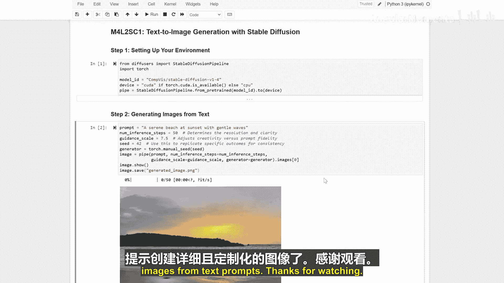

# 023：基于稳定扩散的文本到图像生成 🖼️

在本节课中，我们将学习如何使用稳定扩散模型，根据文本描述生成图像。这是一个强大的工具，能够将文字转化为视觉内容。

## 环境设置 ⚙️

首先，我们需要设置运行环境，安装稳定扩散模型所需的软件包。

以下是安装所需依赖的代码：

```python
# 安装必要的Python包
!pip install diffusers transformers accelerate torch
```

## 从文本生成图像 ✍️➡️🖼️

上一节我们完成了环境设置，本节中我们来看看如何使用稳定扩散模型，根据文本提示生成图像。我们将通过调整几个关键参数来定制输出结果。

以下是生成图像的核心步骤：

1.  **导入模型与管道**：从`diffusers`库中加载预训练的稳定扩散模型。
2.  **定义文本提示**：输入一个描述你希望生成图像的文本。
3.  **设置生成参数**：
    *   **推理步数**：`num_inference_steps`，控制图像生成的精细度，步数越多，细节可能越丰富，但耗时也更长。
    *   **引导尺度**：`guidance_scale`，控制生成图像与文本提示的贴合程度，值越高，图像越遵循提示。
    *   **随机种子**：`seed`，用于控制生成过程的随机性，使用相同的种子可以复现相同的结果。
4.  **执行生成**：调用模型管道，传入提示和参数，生成图像。

以下是生成图像的核心代码示例：

```python
from diffusers import StableDiffusionPipeline
import torch

# 1. 加载预训练模型管道
pipe = StableDiffusionPipeline.from_pretrained("runwayml/stable-diffusion-v1-5", torch_dtype=torch.float16)
pipe = pipe.to("cuda") # 如果有GPU，将模型移至GPU以加速

# 2. 定义文本提示
prompt = "一只在太空中穿着宇航服的柴犬"

# 3. 设置参数并生成图像
image = pipe(
    prompt,
    num_inference_steps=50,   # 推理步数
    guidance_scale=7.5,       # 引导尺度
    generator=torch.Generator("cuda").manual_seed(42) # 随机种子
).images[0]
```

## 显示与保存结果 💾

图像生成完成后，我们需要将其显示出来并保存到本地，以便后续查看或使用。

以下是显示和保存图像的步骤：

1.  **显示图像**：使用图像处理库（如`PIL`或`matplotlib`）在笔记本或界面中展示生成的图片。
2.  **保存图像**：将图像对象保存为常见的图片文件格式，如PNG或JPG。

以下是相关代码：

```python
from PIL import Image

# 显示图像
image.show()

# 保存图像到文件
image.save("generated_astronaut_dog.png")
```

## 总结 📝



本节课中我们一起学习了基于稳定扩散的文本到图像生成全流程。


我们首先设置了必要的软件环境，然后深入探讨了如何使用稳定扩散模型，通过调整**推理步数**、**引导尺度**和**随机种子**等关键参数，从文本提示生成定制化的图像。最后，我们掌握了如何显示并保存生成的结果。

通过掌握这些步骤，你已经能够利用文本提示创建出细节丰富且高度定制化的图像。