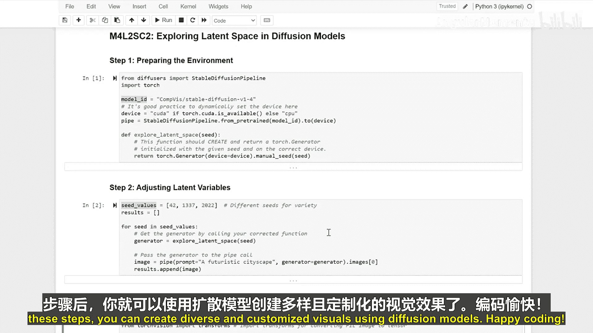
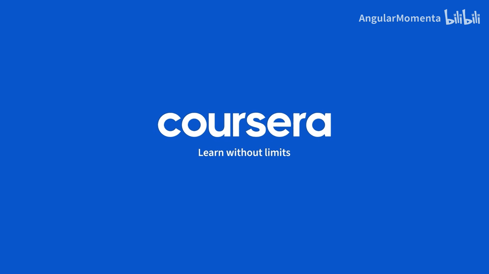

生成式人工智能与大语言模型：P24：探索扩散模型中的潜在空间

在本节课中，我们将学习如何探索扩散模型中的潜在空间。通过调整潜在变量，我们可以生成多样化的图像。我们将从环境设置开始，然后通过改变随机种子来探索不同的输出，最后学习如何通过微调潜在向量来优化生成的图像。

---

上一节我们介绍了扩散模型的基本概念，本节中我们来看看如何实际操作以探索其潜在空间。

首先，我们需要设置编程环境并加载必要的库和模型。

以下是设置步骤：
*   导入 `torch` 和 `diffusers` 库。
*   从 `diffusers` 库加载预训练的 `StableDiffusionPipeline` 模型。
*   将模型设置为使用 GPU 以加速计算（如果可用）。

```python
import torch
from diffusers import StableDiffusionPipeline

# 加载预训练的Stable Diffusion模型
pipe = StableDiffusionPipeline.from_pretrained("runwayml/stable-diffusion-v1-5")
pipe = pipe.to("cuda" if torch.cuda.is_available() else "cpu")
```

---

环境准备就绪后，接下来我们通过调整潜在变量来生成不同的图像。核心方法是使用不同的随机种子。

以下是操作步骤：
*   定义一个文本提示词，例如 `"a scenic mountain landscape at sunset"`。
*   使用 `torch.manual_seed()` 设置不同的随机种子。
*   调用管道并传入提示词以生成图像。

```python
prompt = "a scenic mountain landscape at sunset"

# 使用种子 42 生成图像
torch.manual_seed(42)
image1 = pipe(prompt).images[0]

# 使用种子 123 生成另一张图像
torch.manual_seed(123)
image2 = pipe(prompt).images[0]
```

---

通过改变种子，我们得到了基础的变化。现在，我们学习如何对其中一张生成的图像进行更精细的调整，即通过扰动其潜在向量。

以下是微调步骤：
*   首先，使用一个固定种子生成初始图像并获取其对应的潜在向量。
*   然后，向这个潜在向量添加一个微小的随机噪声（扰动）。
*   最后，使用扰动后的潜在向量再次生成图像，观察变化。

```python
# 生成初始潜在向量
torch.manual_seed(42)
latents = torch.randn((1, 4, 64, 64), device=pipe.device)

# 生成初始图像
image_initial = pipe(prompt, latents=latents).images[0]

# 扰动潜在向量
perturbation = 0.1 * torch.randn_like(latents)
latents_perturbed = latents + perturbation

# 使用扰动后的潜在向量生成图像
image_perturbed = pipe(prompt, latents=latents_perturbed).images[0]
```

---



本节课中我们一起学习了探索扩散模型潜在空间的完整流程。我们首先设置了必要的环境并加载了模型。接着，通过调整随机种子生成了不同的图像，直观感受了潜在空间的多样性。最后，我们通过向潜在向量添加微小扰动，实现了对生成图像的精细微调。掌握这些步骤后，你就能利用扩散模型创造出多样且可定制的视觉内容。




