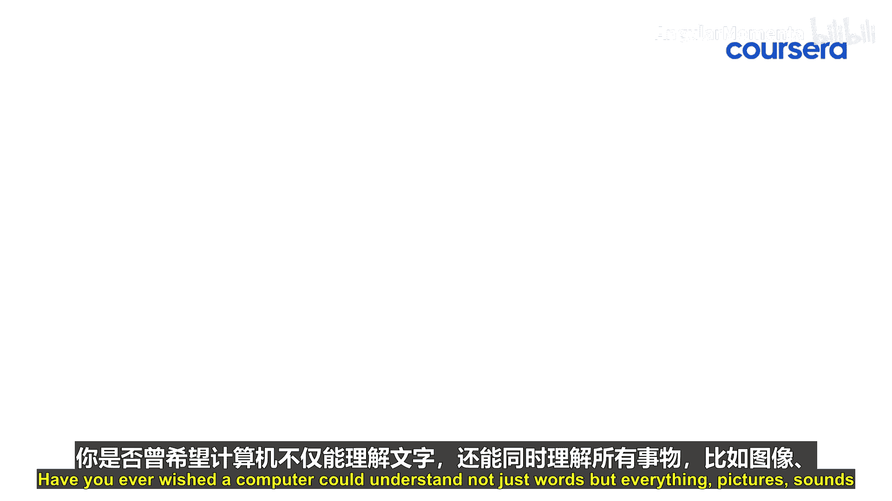

生成式人工智能与大语言模型：26：从文本到万物：多模态革命

在本节课中，我们将要学习多模态人工智能的基本概念，了解它如何整合文本、图像和音频等多种数据形式，以创造更智能、更自然的交互系统。

你是否曾希望计算机不仅能理解文字，还能同时理解图片、声音等一切信息。欢迎来到多模态人工智能的世界，在这里，从文本到声音和图像的一切信息被结合起来，以创建对复杂数据的无缝理解。

多模态人工智能模型通过整合文本、图像和音频，正在改变我们处理信息的方式，它模仿了人类如何使用所有感官来感知世界。想象一个模型，它能同时看到一张狗在公园的图片、听到一声犬吠，并阅读一段关于它一天的故事。这种革命性的方法使人工智能能够获得更丰富的理解和上下文，从而改变搜索引擎、客户服务和辅助工具等领域的交互方式。

在现实世界中，多模态人工智能正掀起巨大波澜。以在线学习平台为例，这些模型可以分析学生的书面问题、解读图表，甚至聆听讲座，从而提供个性化的反馈和支持。电子商务是另一个前沿领域，得益于能够无缝处理视觉、文本和音频输入的能力，虚拟试衣间和智能购物助手现在变得比以往任何时候都更加直观。

然而，开发这些模型并非没有挑战。与专注于单一数据类型的传统单模态系统不同，多模态模型必须统一各种数据类型，这绝非易事。它需要复杂的数据表示对齐和创新的训练技术。但这一切努力是值得的。解决这些挑战能够创造出不仅更智能，而且交互起来更自然的系统。

随着我们站在这场多模态革命的前沿，可能性是无穷无尽的。从丰富虚拟体验到扩展我们对人工智能能力的理解，多模态技术正在开启一个充满机遇的新世界。让我们拥抱这一变革，探索这些强大的工具如何重塑我们与技术以及彼此互动的方式。

本节课中我们一起学习了多模态人工智能的核心思想，它通过融合多种感官数据，旨在构建更全面、更类人的智能系统。请继续探索，因为下一次创新就在眼前。