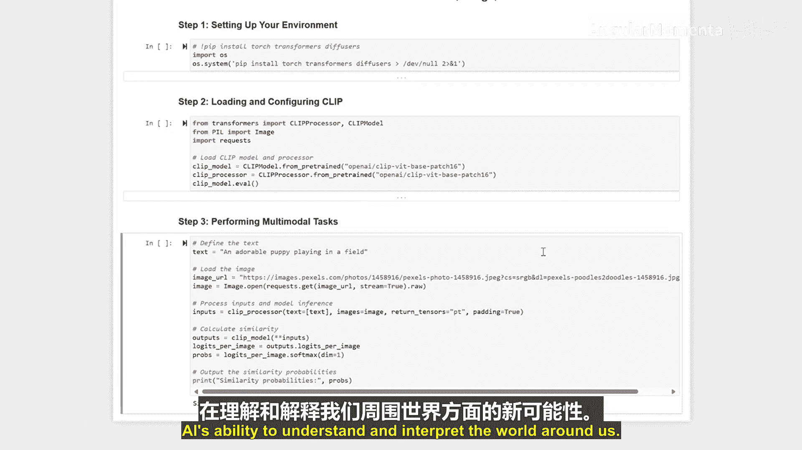

# 027：多模态模型如何整合文本、图像与音频 🧠

在本节课中，我们将学习多模态模型如何整合文本、图像与音频数据，以执行复杂的任务。我们将通过实际操作，了解如何设置环境、加载模型，并利用模型处理多模态输入。

---

上一节我们介绍了多模态模型的基本概念，本节中我们来看看如何具体设置环境并运行一个多模态模型。

首先，我们需要设置Python环境并安装必要的库。以下是需要安装的核心包：

```python
!pip install torch transformers diffusers -q
```
`-q` 参数用于抑制不必要的安装输出，确保在协作环境中的兼容性。

---

环境设置完成后，我们将加载一个具体的多模态模型。这里我们使用 **CLIP** 模型及其对应的处理器。

```python
from transformers import CLIPProcessor, CLIPModel

model = CLIPModel.from_pretrained("openai/clip-vit-base-patch32")
processor = CLIPProcessor.from_pretrained("openai/clip-vit-base-patch32")
```
CLIP模型和处理器能够同时处理文本和图像输入。

---

现在，我们将结合文本和图像输入来执行一个多模态任务。以下是具体步骤：

1.  **准备输入**：我们定义一段文本描述和一张对应的图像。
2.  **处理输入**：使用CLIP处理器将文本和图像转换为模型可理解的格式。
3.  **模型推理**：将处理后的输入传递给模型，获取文本与图像之间的相似度分数。

```python
# 示例：文本和图像输入
text = ["a photo of a cat"]
image = Image.open("path_to_cat_image.jpg") # 请替换为实际图像路径

# 使用处理器处理输入
inputs = processor(text=text, images=image, return_tensors="pt", padding=True)

# 模型推理
outputs = model(**inputs)
logits_per_image = outputs.logits_per_image # 图像到文本的相似度
probs = logits_per_image.softmax(dim=1) # 转换为概率
```
相似度概率张量 `probs` 显示了一个值为 **1.0**，这表明模型确信该文本描述与图像内容完全匹配。

---



通过本节课的学习，我们了解到像CLIP这样的多模态模型，能够通过整合不同类型的数据（如文本和图像）来执行复杂任务。通过设置和使用这些模型，我们可以解锁AI在理解和解释周围世界方面的全新可能性。


**总结**：本节课我们一起学习了多模态模型的基本工作流程，包括环境设置、模型加载以及如何结合文本与图像输入进行推理，从而评估它们之间的关联性。