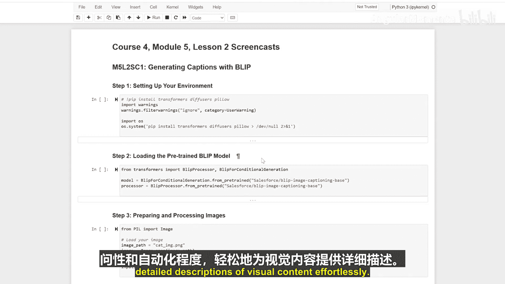

生成式人工智能与大语言模型：P28：使用BLIP为图像生成字幕

在本节课中，我们将学习如何使用BLIP模型为图像自动生成描述性文字，即图像字幕。我们将从环境配置开始，逐步完成加载模型、处理图像到最终生成字幕的全过程。


首先，我们需要准备好运行代码所需的环境。我们将安装几个关键的Python库。

以下是需要安装的库：
*   `transformers`：Hugging Face提供的库，用于加载和使用预训练模型。
*   `diffusers`：同样来自Hugging Face，专注于扩散模型，但安装它有助于确保环境兼容性。
*   `pillow`：Python图像处理库，用于加载和操作图像文件。


上一节我们配置好了环境，本节中我们来看看如何加载预训练的BLIP模型。我们将使用`transformers`库提供的便捷接口。

核心步骤是使用`BlipProcessor`和`BlipForConditionalGeneration`这两个类。`BlipProcessor`负责将图像和文本处理成模型能理解的格式，而`BlipForConditionalGeneration`则是用于生成字幕的模型本身。


现在我们已经加载了模型和处理器，接下来需要准备一张待处理的图像。我们将使用`PIL`（即`pillow`库）来加载图像，并用上一步初始化的处理器对其进行预处理。

这个过程会将图像转换为模型所需的张量格式，为生成字幕做好准备。


经过前面的步骤，图像已处理完毕，模型也已就绪。最后，我们使用BLIP模型来为图像生成描述性文字。



生成字幕的核心代码如下：
```python
# 使用模型生成字幕
outputs = model.generate(**inputs)
# 使用处理器将生成的token解码为可读文本
caption = processor.decode(outputs[0]， skip_special_tokens=True)
```
模型接收处理后的图像输入，通过其内部机制生成一系列代表单词的标记（tokens），最后再将这些标记解码成我们能够理解的自然语言句子。


本节课中我们一起学习了使用BLIP模型为图像生成字幕的完整流程。我们首先配置环境并安装必要库，然后加载了预训练的BLIP处理器和模型，接着使用PIL库加载图像并用处理器进行预处理，最后调用模型生成并解码出最终的字幕。这个强大的工具能够轻松为视觉内容提供详细的描述，从而增强应用的易用性和自动化程度。😊