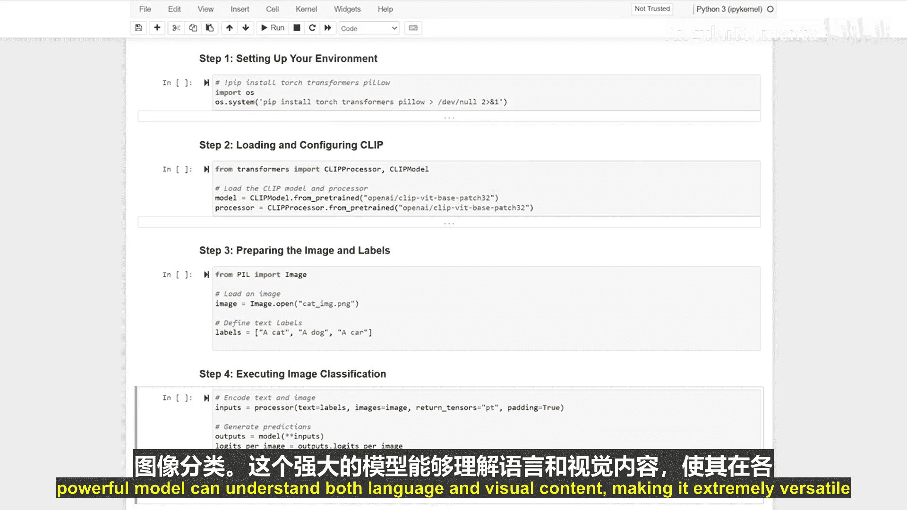

生成式人工智能与大语言模型：P29：基于CLIP的零样本图像分类

在本节课中，我们将学习如何使用CLIP模型进行零样本图像分类。CLIP是一个强大的多模态模型，能够同时理解文本和图像内容，从而无需针对特定任务进行训练即可完成分类。

---

### 环境设置

首先，我们需要设置运行环境。我们将安装必要的库，包括`torch`、`transformers`和`pillow`。为了确保在Colab等环境中的兼容性，我们会抑制不必要的输出。

```python
!pip install torch transformers pillow -q
```

---

### 加载CLIP模型与处理器

上一节我们完成了环境设置，本节中我们来看看如何加载模型。我们将加载CLIP模型及其对应的处理器。这个处理器能够同时处理文本和图像输入，为零样本分类做好准备。

```python
from transformers import CLIPProcessor, CLIPModel

model = CLIPModel.from_pretrained("openai/clip-vit-base-patch32")
processor = CLIPProcessor.from_pretrained("openai/clip-vit-base-patch32")
```

---

### 准备图像与文本标签

现在我们已经加载了模型，接下来需要准备输入数据。我们将使用Pillow库加载一张待分类的图片，并定义一组文本标签作为候选的分类类别。

```python
from PIL import Image

# 加载图像
image = Image.open("path_to_your_image.jpg")

# 定义分类标签
labels = ["a photo of a cat", "a photo of a dog", "a photo of a bird"]
```

---

### 执行零样本分类

数据准备就绪后，我们就可以执行分类了。以下是使用CLIP进行零样本图像分类的核心步骤。

首先，使用处理器同时编码图像和文本。
```python
inputs = processor(text=labels, images=image, return_tensors="pt", padding=True)
```

接着，将编码后的输入传递给模型，获取图像与每段文本的相似度分数。
```python
outputs = model(**inputs)
logits_per_image = outputs.logits_per_image
```

最后，选择相似度最高的文本标签作为预测结果。
```python
probs = logits_per_image.softmax(dim=1)
predicted_label_idx = probs.argmax().item()
predicted_label = labels[predicted_label_idx]
print(f"Predicted label: {predicted_label}")
```



---


### 总结

本节课中我们一起学习了如何使用CLIP进行零样本图像分类。我们首先设置了环境并加载了模型，然后准备了图像和文本标签，最后通过计算图像与文本的相似度完成了分类。CLIP这种理解多模态信息的能力，使其在无需任务特定训练的情况下，也能灵活应用于广泛的场景。