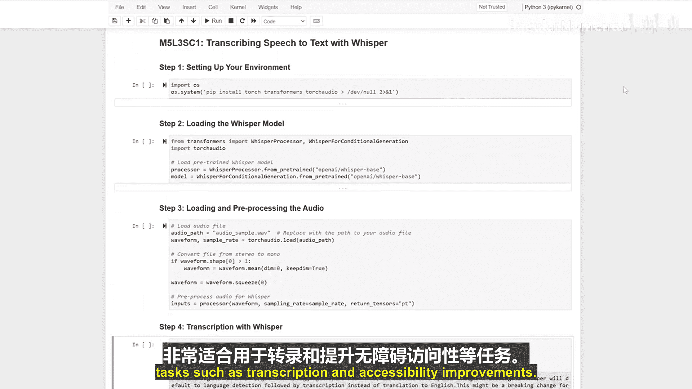

生成式人工智能与大语言模型：P30-05_03_02：使用Whisper将语音转录为文本 🎤

在本节课中，我们将学习如何使用OpenAI的Whisper模型，将音频文件中的语音内容自动转录为准确的文本。这是一个强大的工具，可以轻松地将录音转换为文字稿。

---

想象一下，有一个模型能够毫不费力地将音频录音转换为精确的文本转录稿。Whisper正是这样一个模型，它能够准确地将音频转换为文本，非常适合转录和提升可访问性等任务。

上一节我们介绍了大语言模型的基本概念，本节中我们来看看如何利用Whisper模型处理音频数据。

首先，我们需要设置运行环境。以下是需要安装的必要库：

*   `torch`
*   `transformers`
*   `librosa`

安装时，我们可以选择抑制不必要的输出信息，保持界面整洁。

接下来，我们将加载预训练的Whisper模型及其对应的处理器。处理器将帮助我们准备音频数据，以便模型能够准确地进行转录。

加载音频文件后，我们需要对其进行预处理。我们将使用`torchaudio`库来读取音频，并使用Whisper处理器来提取和标准化音频特征。

现在，我们可以使用加载好的Whisper模型来生成转录文本了。生成完成后，我们将打印出转录出的文字内容。

最后，我们需要评估转录的输出结果。为了获得更好的效果，我们可以通过调整模型的参数来定制转录过程，例如设置语言或启用时间戳等。

---

本节课中，我们一起学习了如何使用Whisper将语音转录为文本。这个强大的模型能够准确地将音频转换为文本，使其成为转录工作和提升信息可访问性的理想工具。