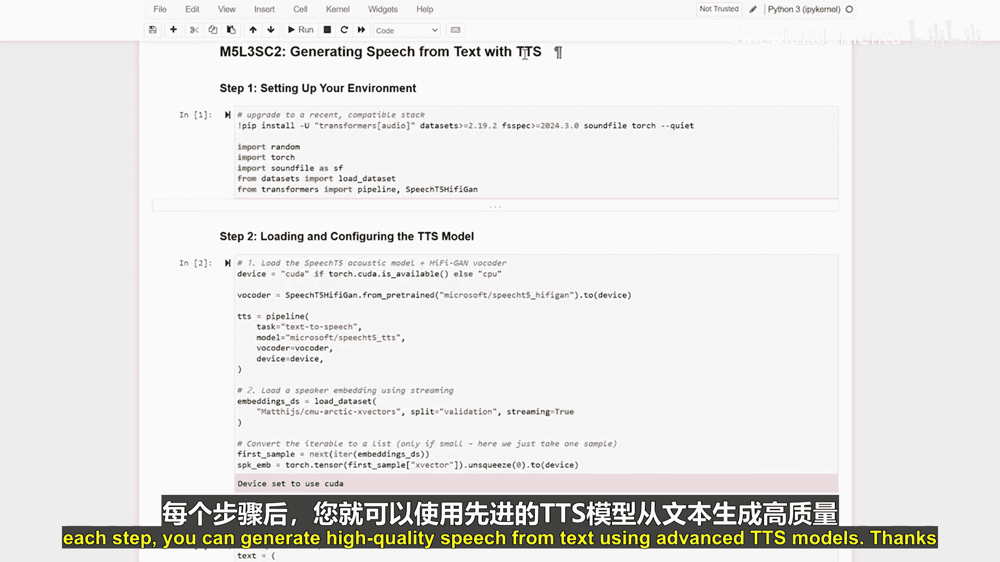

# 031：利用文本转语音技术生成语音 🎤

在本节课中，我们将学习如何利用文本转语音技术，将文字内容转换为语音。我们将依次完成环境搭建、模型加载与配置、语音合成以及音频输出定制等步骤。

## 环境搭建

首先，我们需要为文本转语音任务安装必要的软件包。

以下是需要执行的安装命令：

```bash
pip install TTS
```

## 加载与配置TTS模型

上一节我们完成了环境搭建，本节中我们来看看如何加载和配置核心的TTS模型。

我们将加载两个关键模型：Spee T5声学模型和HiFi-GAN声码器。它们共同作用，以生成高质量的语音。

以下是加载模型的代码：

```python
from TTS.api import TTS

# 初始化TTS模型
tts = TTS(model_name="tts_models/en/ljspeech/speedy-speech-wn", progress_bar=False, gpu=False)
```

## 合成语音

现在我们已经加载了模型，接下来就可以将一段给定的文本合成为语音。

我们将输入文本，并指定一个文件路径来保存生成的音频。

以下是合成并保存语音的代码：

```python
# 要转换的文本
text = "Welcome back. Today we're going to explore how to generate speech from text."

# 合成语音并保存为WAV文件
tts.tts_to_file(text=text, file_path="output.wav")
```

## 定制音频输出

除了基础的语音合成，我们还可以通过调整生成参数来定制音频的输出效果。

以下是可调整的部分关键参数：

*   **`max_length`**：控制生成语音的最大长度。
*   **`num_beams`**：在束搜索中使用的束数量，影响生成质量。



我们可以通过修改这些参数来优化语音的流畅度和自然度。


---

在本节课中，我们一起学习了文本转语音的完整流程。我们从环境搭建开始，接着加载并配置了Spee T5和HiFi-GAN模型，然后将文本合成为语音并保存，最后还探讨了如何通过调整参数来定制音频输出。理解这些步骤后，你就能利用先进的TTS模型从文本生成高质量的语音了。