# 001：因果强化学习——第1-2部分

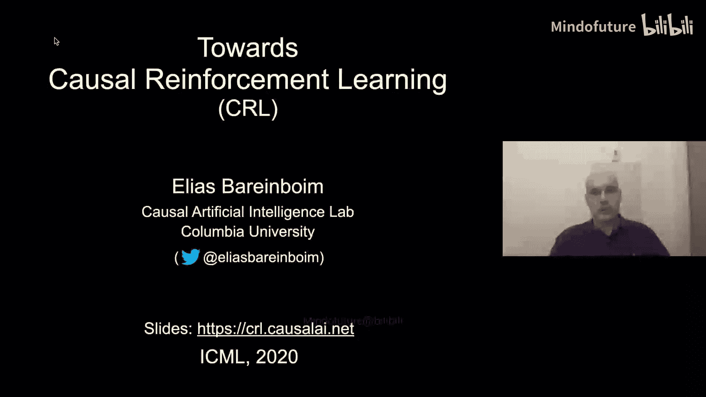

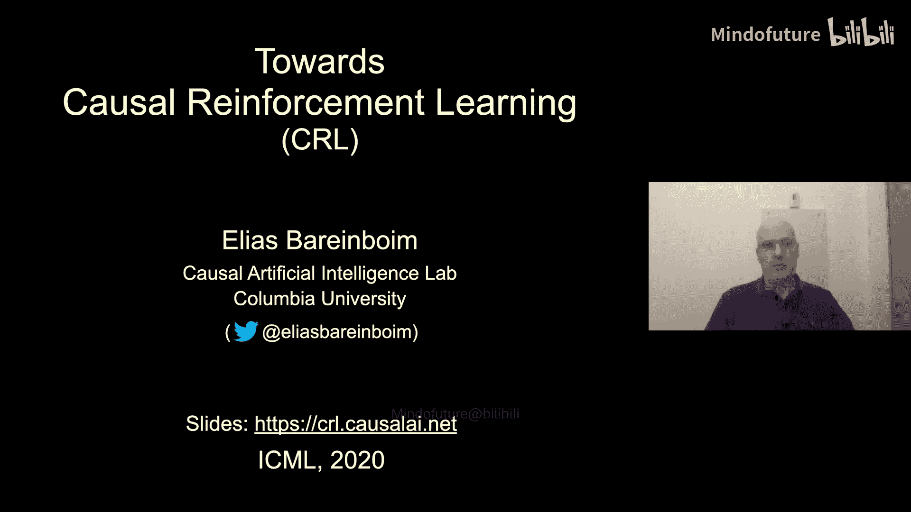

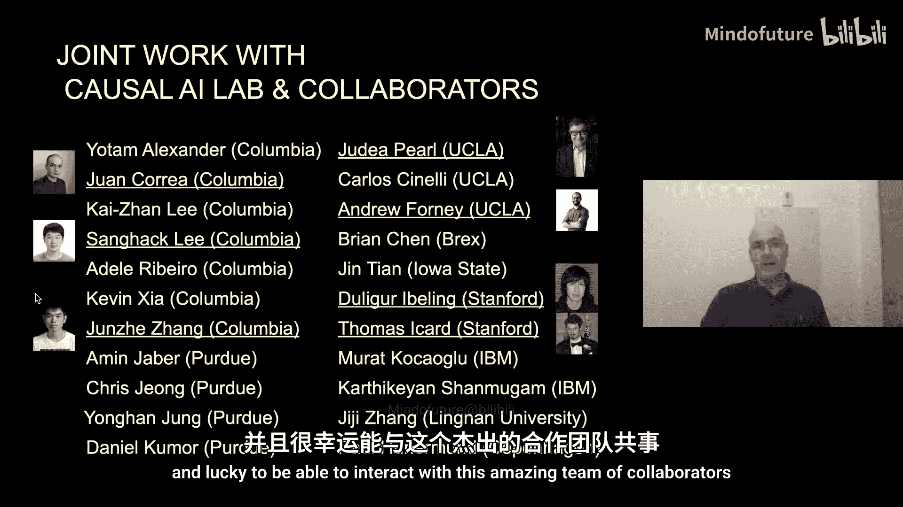

大家好，下午好，很高兴今天能在线上与大家交流。感谢各位的到来。同时，也感谢组织者Alessandra和Jerry邀请我今天在此发言。我是Elilia，来自哥伦比亚大学因果人工智能实验室。首先，我想为我的声音道歉，我有点不舒服。但我认为今天一切都会顺利。我将分享过去几年我对因果强化学习的思考。

这是一个涉及多方面的巨大努力，有许多人帮助实现这一愿景。这是与因果人工智能实验室及众多合作者的共同工作。特别地，我今天将讨论与Taand Deline Howaan、Sanha John Z、Yuda、Andrew Delier和Thomas等人的合作。能与这个出色的合作团队交流，我感到非常高兴和幸运。

首先，我想分享一个更宏观的图景。

这是一个从两万英尺高空俯瞰的宏大图景，是我在实验室试图实现的目标，因果强化学习是其中的一部分。我认为这有助于理解我的思考方式。如果你对这些主题（包括因果强化学习）的合作、问题或想法交流感兴趣，请告诉我。这是一个我认为非常雄心勃勃的图景，是一项需要一代人努力的事业。我在这里的目标是说服你们这些问题很重要，并为大家提供贡献的机会，同时也寻求帮助。

我认为这里的核心见解非常简单但非常强大：现实可以依据因果机制进行分解，我们称之为结构因果模型，尽管它们并非总是可观测的。这类系统的一个重要特性是它们具有自主性或模块性。这一特性在哲学、经济学等许多文献中都有讨论，它将为通用人工智能、机器学习和数据科学带来巨大力量。

我们遵循这样一个图景：现实存在，并且是模块化的。这意味着它可以被建模为一组因果机制的集合。我将在讲座中具体阐述这一点。我特意在这里放上DNA结构图，是为了传达一个观点：这就像是底层现实或底层系统的蓝图。我个人常开玩笑说，这就像是为人工智能发现了DNA结构，而我们现在正试图理解其后果，就像1953年沃森和克里克在《自然》杂志上发表论文后，分子生物学领域的人们所做的那样。自那项发现以来，我们仍在努力理解这些问题，我认为理解这些问题的起点就是结构因果模型，以及将其视为因果机制集合的观点。

从这个视角审视现实，我们有两面硬币，或者说结构模型的两个方面。我多次使用这个名称，并会先定义它。一方面，我们喜欢解释底层系统发生了什么，这是科学的目标。我们喜欢打开自然的黑箱，解释事物如何运作，或者如何用更基本、更可解释的组件来理解。在因果推断领域，关于这个主题有很多著作，它涉及不同的任务，如效应识别、组合、偏倚分析、公平性、鲁棒性和泛化能力等。

另一方面，可以说我完全不在乎科学或解释什么，我是一个实用主义者。我有公司要运营，我想提高利润。如果我是政策制定者，我想改善我所在人群的社会状况，我只想做出决策来改进某些事情。这是另一个视角，即决策制定。这里的任务是如何利用从不完美匹配的数据中学习如何干预一个群体或系统。在机器学习中，这属于强化学习，即序列决策制定的范畴。在科学中，它可能有其他名称，如健康科学中的随机对照试验等。

当然，两者之间存在一些相互作用。如果你对系统有更多理解，通常意味着我们可以更精准、更迅速、更精确或更有效地带来我们想要的社会或经济变革。另一方面，即使理解有限，但如果我们有决策制定或干预能力，我们可以干预系统，搅动事物。如果我们足够谨慎和深思熟虑，我们也可以从中学到关于系统的知识。毕竟，即使在科学方面，我们也是通过这种方式进行的——我们以某种方式隔离系统，以便能够发现新知识，这通常通过实验的思想实现。

这是理论性较强的部分。我们也有兴趣将其应用于教育和软件等领域。应用方面大致可以分为两大块：数据科学和人工智能。在数据科学中，我们试图从大量数据集中进行原则性推断，这里的“原则性”意味着我们希望其具有科学性。在人工智能方面，我们试图学习设计鲁棒且适应性强的学习系统的原则和工具。

今天我们将聚焦于人工智能和机器学习，特别是强化学习问题。我们将讨论因果强化学习。

那么，第一个问题就是：什么是因果强化学习？为了回答这个问题，我想提出两个观察。首先，强化学习非常擅长处理简单复杂性和信用分配问题。考虑到存在延迟——你现在采取行动，效果可能在很久以后才显现，强化学习在这方面表现出色。另一方面，我们知道因果推断也非常擅长利用跨设置、条件和环境的结构不变性。

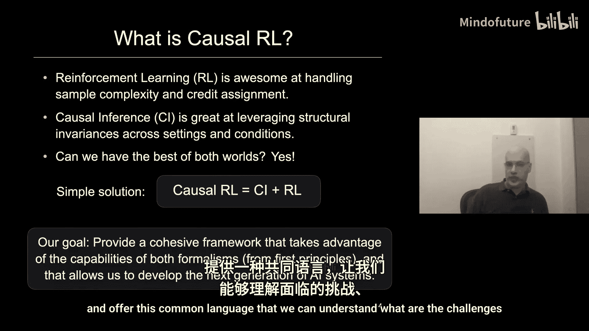

这两个学科几乎是独立发展的，尽管存在一些交叉。一个显而易见的问题是：我们能否兼得两者之长？我坦诚地说：可以。考虑到我对这个主题的热情，问题在于如何实现。解决方案非常简单，可以用一个简单的公式表示：

**因果强化学习 = 因果推断 + 强化学习**

这听起来像是个玩笑，但事实如此。更严肃地说，我们的目标是开发一个统一的框架，从第一性原理出发，将两种形式主义的能力优势结合起来。我们希望这不是一个临时的修补，而是为了开发下一代人工智能系统。

这无疑是一个雄心勃勃的目标。当然，人们对这个主题的反应各不相同，从很多年轻人在理解后感到兴奋，到来自因果推断和强化学习领域的一些保守派的阻力。我的经验是，阻力通常源于双方不理解对方在说什么。本教程的目标就是弥合这一差距，提供一个共同语言，让我们理解新的挑战以及我们试图实现的目标。

为了实现这一愿景，讲座大纲如下。我将首先介绍因果强化学习的基础，包括结构因果模型、因果层次结构以及因果层次定理。然后，我们将通过这个视角来理解当前的因果强化学习和因果推断方法。这是第一部分，虽然有些抽象，但对于理解因果强化学习的新挑战和机遇是完全必要的。

我将大致分为六个小节进行讲解。目标是介绍主要思想、原则和任务，而不是专注于实现细节。正如我提到的，人们常常各说各话，所以让我们尝试奠定基础，明确原则和真正要解决的任务。后续的细节可以在文献中找到，自从我在2014/15年左右开始思考这个问题以来，相关想法已经散布在许多论文中。一份新的因果强化学习综述即将发布，我会在URL `cr.causeyI` 上提供链接。

现在，让我们从强化学习方面开始，并由此展开。我将尝试理解其中的微妙之处。这是教科书式的强化学习定义：它是一种目标导向的学习，旨在最大化数值奖励信号。我们通过与外部环境交互来学习。在每个时间步，动作是从一组不断演化的协变量（如特征和动作历史）中提取的。我们根据当前观察和过去行为自适应地改变策略。

这里有几个组成部分：我们从交互中学习，有目标的概念，有外部环境的概念。这意味着我们划了一条线，区分了外部环境和需要决定做什么的智能体。这是一个没有系统完整规范的学习问题，我们不是在规划。不过，我今天要讨论的许多问题，即使在做规划时也会出现，但今天我会强调学习的这个方面。

根据教科书定义，这是典型的图示：左边是智能体，右边是环境。智能体感知环境状态，经过处理，决定并执行动作 `X = x`。然后环境反馈动作的效果，以奖励的形式。智能体的效用由奖励函数定义，目标是学习如何行动以最大化期望效用或期望奖励。这是人工智能中统一的思想：我们希望开发理性智能体，而理性与最大化期望效用或奖励之间存在经典联系。

现在，我在思考如何对这个教科书图示进行最小的改变，以传达我认为因果强化学习的核心。这就是我想出的图示。

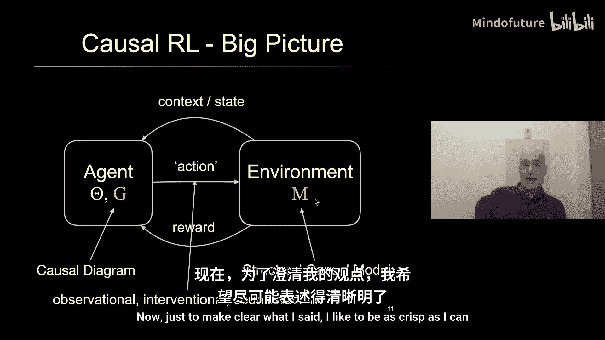

在右边，我们有环境，但环境现在由一个称为结构因果模型的东西给出。环境是因果机制的集合，我们稍后会定义。在左边，我们有智能体，智能体是参数化的，但现在我们有了因果图。这个图将被正式定义。在图中，我认为存在不同类型的交互。智能体可以被动地通过观察与环境连接，可以主动地通过干预与环境交互，或者可以进行某种内省、反思或想象，这被称为反事实推理，我稍后会展开。

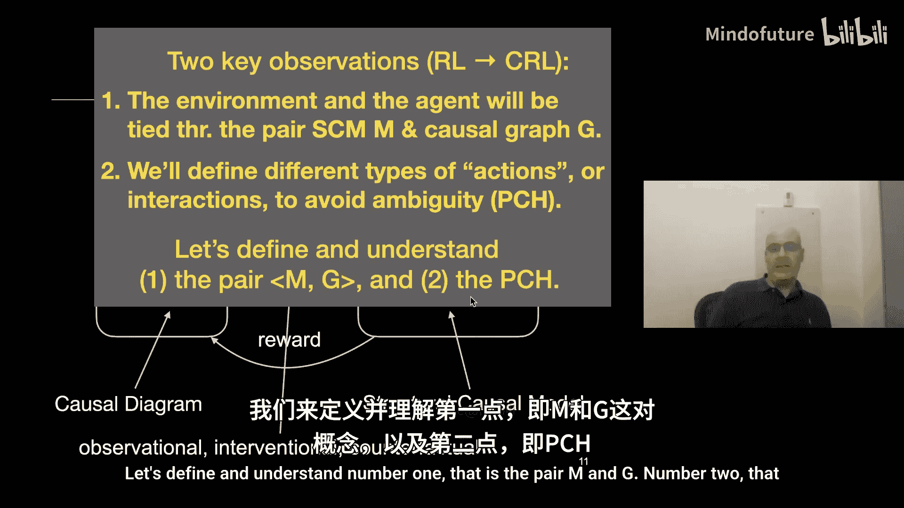

为了更清晰，我想尽可能简洁地说明我想添加到图示中的两个要点。

第一，如果你试图将强化学习转向因果强化学习，环境和智能体将通过一对 `(SCM, 因果图 G)` 联系起来。SCM在环境侧，因果图在智能体的“心智”中。第二，我们定义了不同类型的交互动作，这由因果层次结构给出，以避免歧义。这就是目前我希望你们理解的图景：两个要点，即 `(SCM, 图 G)` 这对组合，以及作为交互中介的因果层次结构。

现在，让我们从结构因果模型和因果图开始深入探讨。

我想从一些直觉开始，解释什么是结构因果模型。我们试图表示一个数据生成模型，即环境或自然的生成模型。这是一种基于过程的方法。举个例子，在药物背景下，假设我们试图理解药物摄入与头痛之间的关系。

我们有一个基于过程的方法，其中药物由一个机制赋值。这个机制 `F_D` 以人的年龄 `A` 和未观测变量 `U_D` 为输入。`U_D` 是生成药物变量变化的所有其他变量。第二个机制是头痛的机制。头痛 `H` 的值由函数 `F_H` 决定，该函数以药物 `D`、年龄 `A` 和未观测变量 `U_H` 为输入。`U_H` 是除药物和年龄外所有可能影响头痛的变量。

我们也可以有一个对应的图。为了简化，我用 `X, Y, Z` 代替药物、头痛和年龄，以避免具体名称分散注意力。我特意没有选择机器人学或其他领域的例子，因为我想说明因果强化学习比那更普遍。`X` 可以是任何动作，`Y` 是结果，`Z` 是一组协变量。

左边是描述现实的过程，右边是因果图。因果图不是贝叶斯网络，不是马尔可夫随机场，也不是其他模型。它是一个因果图。因果图箭头的含义是：如果一个变量参与了某个机制，就添加从该变量指向结果变量的箭头。例如，如果年龄 `Z` 参与了药物 `X` 的机制 `F_D`，则添加箭头 `Z -> X`。如果药物 `X` 参与了头痛 `Y` 的机制 `F_H`，则添加箭头 `X -> Y`。这是一种编码，存在信息损失。

需要指出的是，这里的 `F_D` 可以是任何函数，从简单的线性函数到极其复杂甚至混沌的函数。我没有在幻灯片中具体化它，而是保持开放，允许任何可能的函数。但在特定问题中，它是具体化的。目前，我们对这个函数一无所知，我们只能有一些粗略的概念。

从这个过程我们可以采样，得到可观测变量 `Z, X, Y` 上的概率分布 `P`。我们今天在这里，可以进行统计或机器学习。但你们今天在这里是因为想了解因果关系，以及它如何与干预和强化学习联系起来。

干预的思想是：当系统经历某种变化时，它会如何反应？变化可以是：我们作为外部智能体，决定改变药物分配的方式，使药物等于“是”。我们决定让我们的人群都能获得这种药物，比如冠状病毒疫苗。这就是干预操作：我们用一个新的机制（这里是常数“是”）替换原来的机制 `F_D`。当我们进行这种干预时，其他变量的机制（给定我们进行了干预）保持不变。这就是自主性或模块性的体现。

注意，我这里讨论的是干预“是”，但在进行随机对照研究时，有一个随机硬币决定药物的值。它仍然是一个不同的机制，是随机的，但与人们通常获取药物的机制不同。你可以有更复杂的策略，例如依赖于年龄组的策略 `π(A)`，我们决定以不同的概率给药。这与人们自行选择药物的机制 `F_D` 不同。这里有一些关于条件策略的微妙之处，但为了讨论，我们暂时忽略。

这个操作也有对应的图形表示。在机制层面，`Z` 不再影响 `X`，因为 `F_D` 不再活跃。`X` 被设置为“是”。这表现为箭头被移除。如果你能在现实世界中创造这样的情境，你就可以从这个过程采样，得到所谓的实验分布或干预分布 `P(z, y | do(X=是))`。你也可以用其他符号表示，如 `P(z_{X=是}, y_{X=是})`，这涉及到反事实符号，我稍后会提到。目前我们坚持使用 `do` 符号。

如前所述，通常我们谈论的药物 `X` 可以是任何决策，结果 `Y` 可以是任何结果（如效用），`Z` 是特征集。我使用这些术语与因果推断中的符号保持一致。

这里的挑战是，通常你观察不到这些机制，有时你可能观察到因果图（这已经很有揭示性），但很多时候你无法进行干预。通常我们只有来自左侧的数据，却试图推断右侧，就好像我们进行了干预一样。这是经典问题：从被动观察系统，我们想做出关于干预效果的陈述。如果你能进行这种非常困难的预测，你就可以更精准，最终可以避免实验的副作用，更安全等。

现在，让我将干预和方程或机制的思想推广，更正式地定义结构因果模型。它是一个四元组 `(V, U, F, P(U))`。
*   `V` 是内生变量或可观测变量的集合 `{V1, V2, ..., Vm}`。在前面的例子中，`V1` 可以是药物 `D`，`V2` 可以是头痛 `H`，`V3` 可以是年龄 `A`。
*   `U` 是系统外生变量的集合，是未观测的，有很多个。
*   `F` 是一个函数集合，决定了每个内生变量 `Vi` 的值。对于每个 `Vi`，有一个函数 `Fi`，它以 `Vi` 的父变量集合 `PAi`（可观测变量）和外生变量 `Ui` 为输入。
*   `P(U)` 是外生变量 `U` 上的概率分布，它总结了模型外部宇宙的初始条件状态。

事实证明，这类系统有一个公理化特征，这在Halpern（1998）以及Galles和Pearl的工作中得到了很好的理解。Halpern是逻辑学家，在康奈尔大学从事这方面出色的工作。本质上，今天推导出的任何结果都可以追溯到这个基础。

我目前更感兴趣的是以下观察：一旦你有了一个具体的SCM实例 `M`，它就隐含了我们所说的因果层次结构。我想为了理解上下文，更多地打开这个“盒子”。因果层次结构是《为什么》这本书的主要主题，也被称为“因果阶梯”。

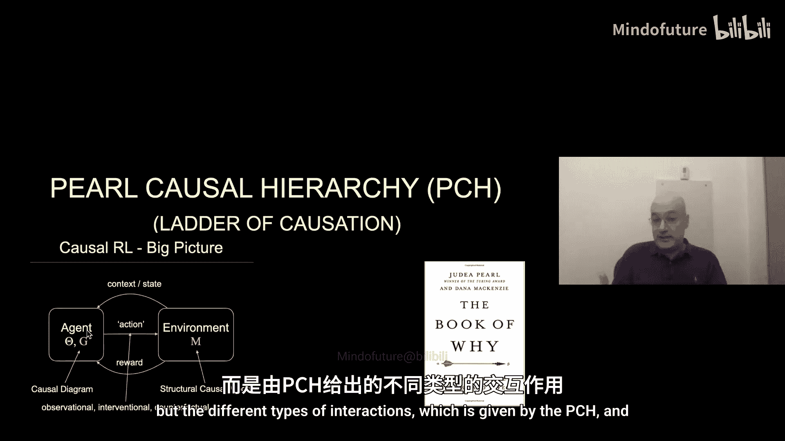

这只是回顾。如果你没读过那本书也没关系，我会以我的方式回顾并阐述，这在数学上是相同的。如果你读过那本书，那很好。那么，我们谈论很多的因果层次结构是什么？我来描述每一层：典型符号、典型活动、典型问题和例子。

第一层 `L1` 称为关联层。符号上表示为 `P(y | x)`。它与“看到”的活动相关：看到 `X = x` 可能让我对变量 `Y` 产生什么信念？例如，一个症状 `X` 能告诉我们关于疾病 `Y` 的什么？在现代机器学习中，这对应于多年来在统计学和其他领域研究的问题，在机器学习中非常成功，属于监督或无监督学习的范畴。有大量关于如何评估像 `P(y | x)` 这样的表达式的理论，例如决策树、贝叶斯网络、回归、分层模型、神经网络等。这里的挑战是，如今你处理的 `X` 可能是特征集，`Y` 是标签，维度可能高达数十万甚至数百万。这在计算复杂性和样本复杂性上都非常困难，因为你没有所有的组合。这就是为什么这是一个如此具有挑战性的问题。

第二层 `L2` 称为干预层。符号上写作 `P(y | do(x), c)`，其中 `c` 是上下文或状态。它与“做”的活动相关：如果我做 `X`（例如服用阿司匹林），我的头痛会治愈吗？在机器学习中，这与强化学习问题非常相关，这也是我们今天在这里的原因。有不同的形式主义可以处理它，例如因果贝叶斯网络、马尔可夫决策过程等。

第三层 `L3` 是反事实层。我暂时跳过符号。它与想象、内省、反思的活动相关。例如“为什么”类型的问题：如果我当时采取了不同的行动会怎样？为什么我服用的阿司匹林治好了我的头痛？假设我服用了阿司匹林（`X'`），现在我被治愈了（`Y'`），我在想：如果我没有服用阿司匹林（`X`），我会生病吗（`Y`）？这里负载很重：有一个反事实世界，在事实世界我服用了并且没事。在机器学习文献中，这并没有真正的对应物。虽然有各种说法，但大致上没有。在因果推断领域有大量工作，但仍有更多待完成。处理这类问题的形式主义是结构模型。

我想说明为什么这是一个层次结构。层次结构意味着，从 `L1` 到 `L2` 再到 `L3`，你从较少的细节（`X` 和 `Y` 之间的相关性）到更详细的描述（反事实）。这可能听起来有点抽象，但请跟我一起，稍后我会用例子说明第三层。这已经是关于世界碰撞的不同任务，与归责、信用分配、公平性、可解释性等问题非常相关，这些都落在 `L3`，尚未被充分探索。

换句话说，我认为你应该研究它。为了说明它在何种意义上形成一个层次结构，我想从我们拥有的关于真实环境、真实因果机制的信息量角度来阐述。给定我的期望是你们大致理解这些是不同的东西，我想更详细地解释我们所谓的因果层次定理。这类似于中心极限定理在因果推断中的核心地位。历史上，Pearl等人长期相信类似的结果，这也是我非常兴奋的原因之一。这个结果最近才被普遍证明。

给定SCM `M` 隐含因果层次结构，并且我们可以证明 `M` 定义或诱导了因果层次结构，我们可以证明以下结果：因果层次定理。在SCM集合上，满足某些技术条件（我引用是因为我尚未定义“测度零”），任何因果层次结构坍缩的子集是测度零的。

换句话说，对于你可能得到的几乎任何SCM（通常你不知道你的环境是哪一个，它是未观测的），因果层次结构不会坍缩，即层次结构的各层保持 distinct。你不会遇到观察和干预概念相同的情况。在《为什么》一书中，如果你思考一下，或者关于想象，也许在某些世界中它们可能是相同的，但我们不知道如何将一个还原为另一个。或者可以说，不，这不是真的，一个严格比另一个更强大。然后，有一些陈述是 `L2` 能做出而 `L1` 无法做出或无法充分说明的。

让我继续阐述，以奠定因果强化学习的基础。为了回答关于特定类型交互的 `L_i` 层问题，需要来自 `L_i` 层或更高层的知识。

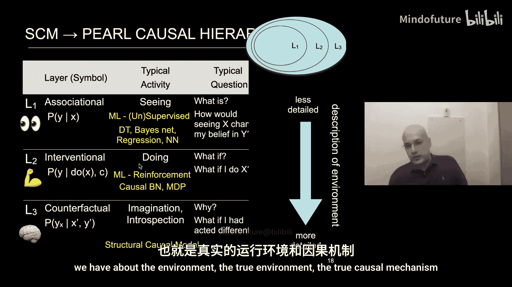

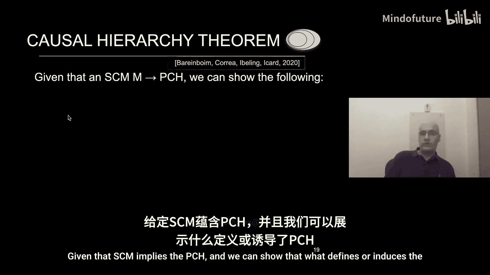

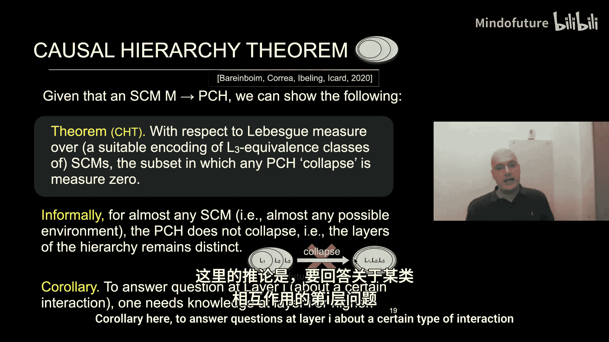

让我试着连接我们所说的内容。我说过，每个SCM `M` 诱导了这个层次结构，即这些不同类型的交互、关于观察、干预和思考的不同概念。这听起来很好很美妙。那么问题来了：为什么因果推断不平凡？如果我有SCM，我就可以计算一切。这是我经常遇到的最常见问题之一。

这是一个非常有趣的想法或梦想，因为事实上这并不正确。事情并不那么容易，不幸的是，正是因为我在这里标题中所写的：SCM几乎永远不可观测。尽管这很重要，尽管存在一个机制集合，但我们并不能完全观测到它。我们通常只观测到一些片段，这些片段在层次结构中。一般来说不是全部。

我必须说，这几乎是“永远不”。当然有例外，比如在物理学、化学，有时在生物学中，各种科学领域试图了解这些机制，他们有时会深入到非常详细的层面，有时需要100年或250年才能从一个物理时代过渡到另一个。但在现实中，他们分析的现象允许他们这样做。我认为，在我们感兴趣的大多数嵌入人工智能的场景中，特别是涉及人类时，实际上不可能获得SCM的描述。人类在循环中是不可预测的，存在某种混沌成分，本质上涉及复杂现象、社会互动和许多其他类型的互动，我们无法以如此清晰的方式隔离系统。这是我们需要承认的第一个困境：我们无法获得SCM。

那么，该怎么办呢？假设有一个智能体嵌入在这个环境中，智能体持续观察世界上发生的事情，通过观察获得 `L1` 类型的数据。这与之前的图示一致。智能体获得观察结果，现在智能体想推断它在这个系统中应该做什么。那么，是否可能使用 `L1` 的数据来对 `L2` 做出陈述？不幸的是，答案是否定的。我在这里放了一个障碍。为什么？我们刚刚讨论过，因果层次定理说我们不能跨层移动，因为 `L1` 的信息不足以确定 `L2`。这是定理。

那么，不可能吗？问题在于，考虑到SCM的不可观测性，再加上因果层次定理，似乎在因果层次结构内无法进行任何推断？我们不能从因果层次结构中获得任何信息？考虑到我无法观测到这个指南，并且我们有因果层次定理的证明，那么问题是你还能做什么？这是一个很强的否定性结果。其意义在于，这正是为什么你需要研究关于SCM的某些东西的动机。这些东西就是我们所说的结构约束。而因果图无非就是一组结构约束。

有不同类别的图，或者说获取它的不同方式。我列出常见的几种：
1.  **使用模板**：这在文献中经常隐含。例如，我们有一个多臂老虎机、一个MDP或一个POMDP。这是一个模板。即使人们从算法上思考，如果你打开算法，你就能提取出它们对环境所做的假设的图。已经有一些论文在做这件事，但这是一个模板。
2.  **知识工程**：也许你对环境有额外的信息。例如，在经济学中，人们能够确定工具变量，那么你可以利用这一点，它对底层SCM施加了某种约束。当然，这比第一种更通用，因为无论第一种是什么，我们都愿意相信世界符合某种 cookie-cutter 模式，但很多时候并非如此。
3.  **因果发现**：如果你想从头开始测试、建模甚至构建一个婴儿智能体，你希望它参与其中而不想硬编码，这被称为因果发现。

换句话说，这就是动机。让我试着把提到的许多概念块拼凑起来，我认为总结一下是好的。

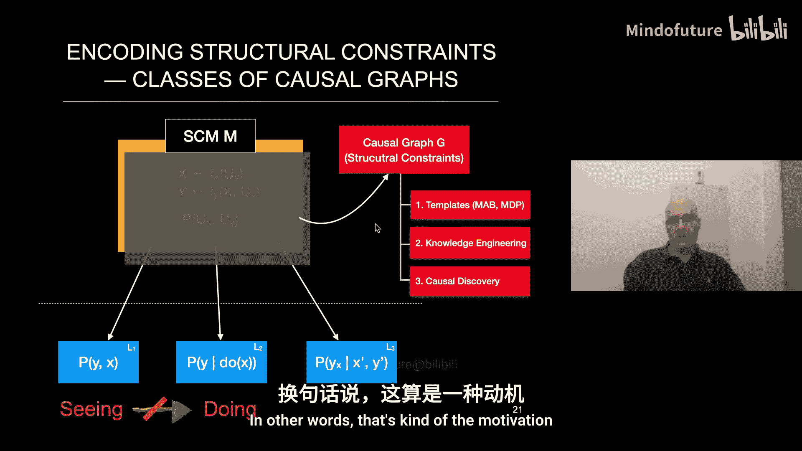

环境或机制可以被建模为SCM `M`。这个特定的环境，本质上是在你的系统中抛出数据的那个，很少是可观测的。尽管如此，每个SCM `M` 可以通过性质不同的交互或分布类型（即因果层次结构：观察、干预和反事实）来探测。不仅是交互类型，也是推理模式。有一种与自然交互的方式，但现在因果层次定理说，对于几乎任何SCM，较低层（比如 `L_i`）的信息不足以确定较高层 `L_{i+1}` 或更高层。这在某种程度上限制了智能体基于其与环境的不同类型交互和数据所能推断的内容。

具体来说，我已经给出了这个例子：从被动观察环境（这是一种数据），它无法推断如何行动。从干预环境（所有可能的干预，你得到 `L2` 类型的数据），它无法推断如果她采取不同行动事情会怎样。这是另一种类型的陈述。因果图是这个底层系统的替代物，相对于我称之为结构不变性的东西。因果图是底层 `M` 的结构不变性的替代物。

好的，这就是我认为我们拥有的构建模块。正如所承诺的，我们有了 `(M, G)` 这对组合，它包含了环境与智能体之间的关系。现在我有了因果层次结构，关于这些部分如何交互或你可能拥有的交互模式。虽然仍然抽象，但请跟我一起。现在我想讨论一下，这如何允许我们解释今天在强化学习和因果推断中的方法，通过我称之为因果强化学习透镜的机制。这就是我们刚刚建立的机制。

现在的目标是学习一个策略 `π`。策略 `π` 使得当你应用这个策略时，会产生一系列动作 `x1, x2, ..., xn`，以最大化某种奖励 `E[Y | do(X), π]`。我只是在这里说，`X` 的值是由 `π` 决定的。这是我使用的符号，有不同的符号。这里的参数我留作未指定，但它可以是任何类型的参数，比如上下文 `C`、过去状态等。

当前文献中发现的策略，我将给出一个概览，然后详细说明。我给出三种：
1.  **在线学习或实验性学习**：智能体自己进行实验。这些系统的输入是形式为 `(do(x_i), y_i)` 的实验，以学习 `Y | do(X)`，从而评估其某种平均值。
2.  **离线策略学习**：智能体从其他智能体的行动中学习。一个智能体自己实验，另一个智能体从其他行动中学习。我们不仅有其他实验，还有样本，形式为 `(do(x_i), y_i)`。我们仍然试图学习 `Y | do(X)`。
3.  **观察学习**：智能体观察其他智能体行动，并想从中学习。这里的输入是 `(x_i, y_i)` 的样本。注意，这里我们有 `x_i`，而之前我们有 `do(x_i)`。这里有实验和样本，但这里我们只有样本。这很微妙。关于第二种的最常见问题，两者都是离线的。这里的微妙之处在于，关键点是智能体是**有意**的。我们是从其他智能体的有意行动中学习，这就是为什么你仍然放 `do`，但因为是样本，因为你没有进行实验。另一方面，在 `do` 演算中，你有样本和 `x_i`，因为你不知道导致智能体选择这个 `x` 的其他关键原因。

我逐一讲解。第一种，我们忽略现有的任何东西，直接进行干预，试图从其他智能体的行动转移到作为智能体的我的行动。最后一种，我们只是观察一个人在做某事，我们不知道这是否是有意的，甚至可能是潜意识的。稍后我会给出一些任务中的例子，我们试图从中学习如何行动。

现在，我逐一稍慢地讲解。首先是一些符号：`do(x)` 表示干预，`x` 表示观察。

让我更具体地阐述在线学习。一旦学习了 `Y | do(X)`，找到最优 `X*` 是直接的。这里的挑战是，`Y | do(X)` 可以通过随机实验或自适应策略来估计。你可以使用UCB、Thompson采样等任何方法自适应地进行，但这就是在线学习的思想。举两个突出的例子，你可以进行单次实验。积极的一面是，它对未观测的混杂因素（即影响多个可观测变量的变量）具有鲁棒性。

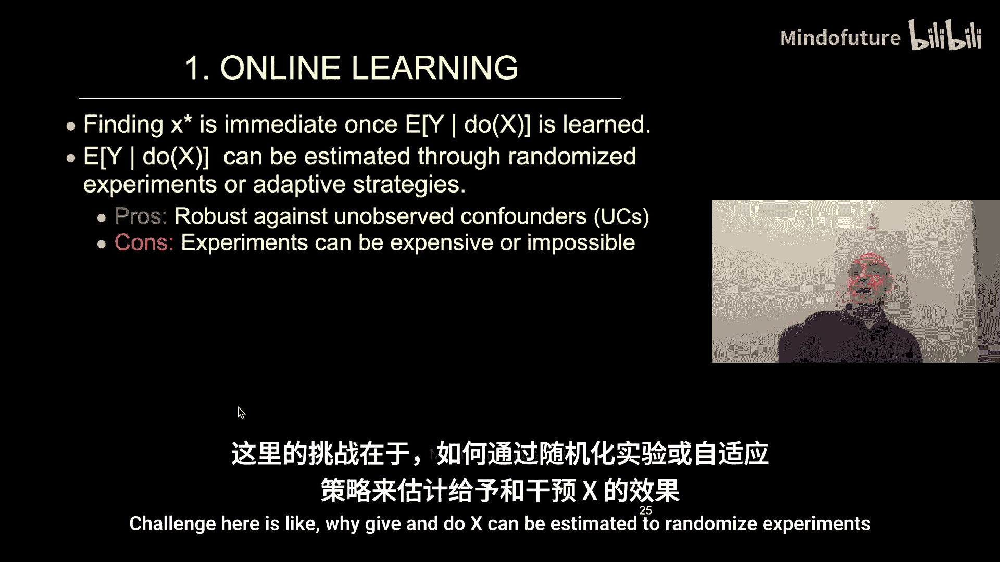

消极的一面是，实验可能昂贵、不可能进行、不道德（难以对人类受试者进行实验），可能导致副作用，甚至可能因为有害或最终邪恶而导致社会破坏。每当你进行这些在线实验时，这就是你最终得到的。

这是你必须有的图：无论这里发生什么，你都有某种决策 `X`，结果 `Y`，然后有这个未观测的圆圈 `U`，它同时影响 `X` 和 `Y`，可以是宇宙中的任何变量。现在我们说，无论世界上有什么，我将把这个系统提交给这个策略 `π`，它将选择 `X` 的值。这就是在线学习的含义。我认为，这是上个世纪（20世纪初）关于如何做到这一点的最大洞见之一，它开启了整个因果推断领域，也开启了新千年。

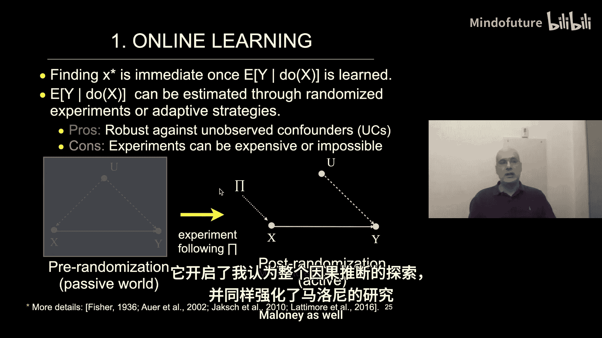

无需明确知道或这样做。这是图示。我喜欢从数据角度思考的另一种方式，我只是复制了之前的图示，但现在我喜欢从数据角度思考。无论世界上发生什么，在我希望你忽略数据之前，我将把世界提交给这个策略 `π`，并开始获取样本，即这里的这些垂直线。这意味着，最终当我在采样并获取由 `π` 决定的 `x` 时，我将能够获得某种 `Y | do(X)` 的估计，平均到 `Y` 上，但这没问题。这就是智能体“心智”中的内容。

关于协变量特定的因果效应或上下文设置或有状态设置，我需要做个说明。我刚才给出的只有 `X`、`Y` 和 `U` 的模型可以扩展以适应一组观测到的协变量，也称为上下文或状态。`U` 将是剩余的未观测混杂因素 `U_C`。然后你可以有一些这些 `U` 并将其作为 `C` 提取出来。这完全可能。这里的目标将类似：我们试图学习一个条件策略 `π(C)`，以最大化基于 `C` 特定因果效应 `P(Y | do(X), C)` 的优化。

为什么这很重要？首先，因为我们通常有上下文或状态，其次，因为它非常具有挑战性。通常 `C` 的维度很高，可能是一百万维，我们谈论的是像素或视频等。这里有一个有趣的连接，我喜欢我在这里的迪士尼级别的动画。也许在这个市场上，在这个动画之后，我可以提供P级。但这是目前非常热门的话题。也就是说，鉴于我们有超高维的 `C`，甚至从像素级别，我们希望有一些函数逼近或某种降维方法，以便能够选择决策 `X`，实现从 `C` 或 `S` 到 `X` 的映射。深度学习非常适合这一点，而深度强化学习实际上正在利用这种连接。

这是一个我不打算在今天详细讨论的点。我认为这很酷，我会保持谦逊。有些人认为这不好，但在这个意义上，为什么我现在不操作这个级别？如果你好奇，可以稍后问我。但在这里，我试图展示或只是展示这些其他维度的交互类型。我想隔离这些问题，所以这没问题，但它可以以我们通常的方式进行复合。虽然不常见，但没关系。

第二种模式是在线学习。第二种是离线策略学习。`Y | do(X)` 可以通过其他智能体以不同策略进行的实验来估计。积极的一面是，不需要进行实验，这几乎是梦想，因为我们不想伤害社会或人们，有时进行实验也不道德，成本也很高。进行一项涉及几百人的实验可能花费大约五百万美元。这依赖于两个假设：A1) 相同的变量被随机化；A2) 上下文需要匹配。让我用图示说明，这就清楚了。

注意，在左侧，有一个智能体在线进行实验，比如使用策略 `π'` 决定 `X` 的值。同样，你可以放一个上下文 `C`，但决定 `X` 的值。现在你想推测或预测当你使用策略 `π` 时会发生什么。我所说的假设A1是：相同的变量在策略范围内。那么 `π'` 控制 `X`，`π` 也控制 `X`，这没问题。上下文需要相同，即它们需要匹配。这里的 `C` 是相同的。策略至少 `C` 等于空集。因为它平均了 `U`，而这里 `C` 是零，那也没问题。然后我们可以使用一种技术，例如逆概率加权，它允许我们利用从策略 `π'` 收集的数据来计算策略 `π` 的效果。

我想用我通常喜欢的数据图示来阐述。这里有一个智能体收集许多数据点，遵循策略 `π'`，这些是这些垂直线。现在我们另一个智能体不想去环境，只想知道策略 `π` 的效果。想法是使用IPW。这是一个公式，展示了如何通过使用你所做概率的倒数来折现效果，然后乘以新概率，从而得到新策略 `P(Y | do(X))` 的效果。

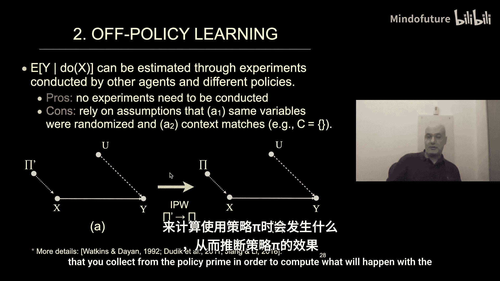

为什么这有趣？为什么人们关心这个？在非平凡领域有数百篇论文。想法是，每当你在上下文设置中，有这里的 `C`，你又有维度问题。你可以做更多的统计，尝试双重鲁棒性，理解倾向得分等，或者你可以做机器学习，尝试降维，但仍然有很多挑战，或者说非常棘手，因为方差可能爆炸，这是一个问题。这是离线策略的总结。

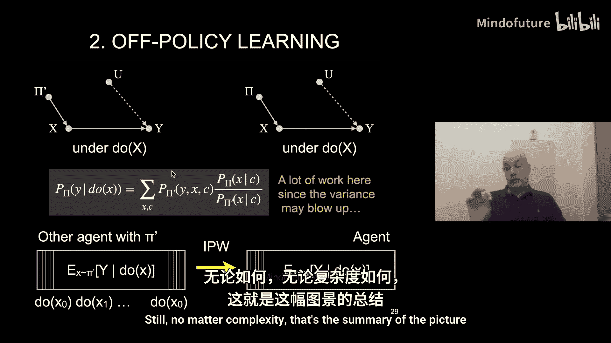

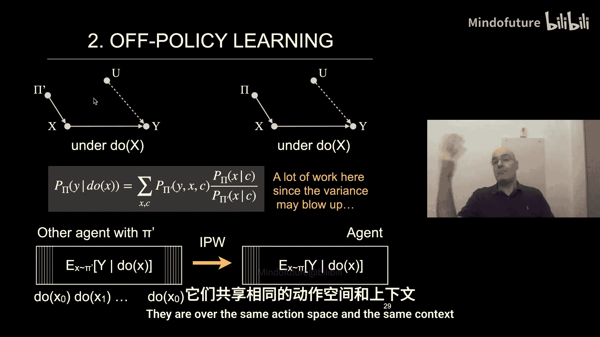

它们作用于相同的动作空间和相同的上下文，它们有相同的感知。

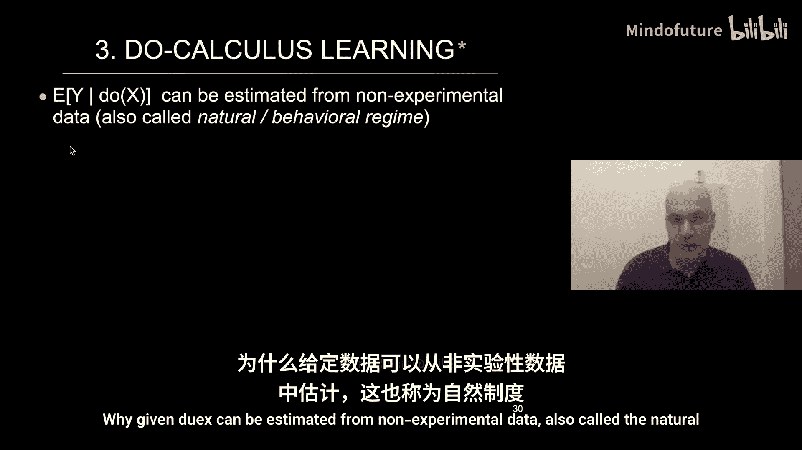

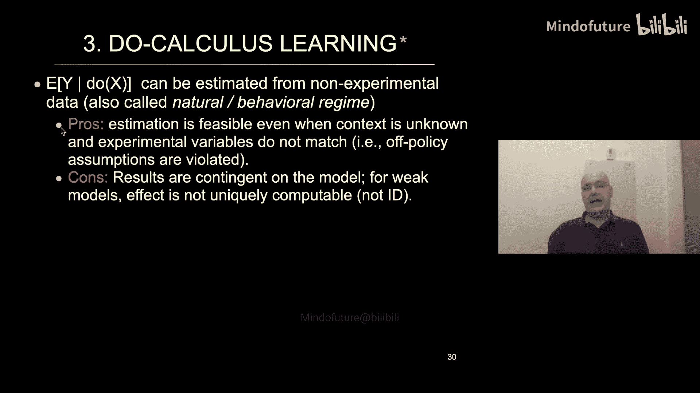

我认为这很难成立，但我会在第二部分回到这一点。没有两个智能体是相同的，即使是两个机器人，让它们进化，它们开始有不同的传感器，外观略有变化，感知世界的方式等等。这很难成立，但有时作为近似成立，我们会讨论。

现在我们有了第三种模式：观察学习。`Y | do(X)` 可以从非实验数据中估计，也称为自然机制或行为机制。积极的一面是，即使上下文已知且实验变量不匹配，估计也是可行的。换句话说，我们之前的离线策略假设被违反了。

消极的一面是，结果依赖于模型。对于弱模型，效应可能无法唯一计算，可能不可识别。这是模型：在左侧，你可以有这个被动的世界，即现实如何运行。注意，`U` 仍然影响 `X` 和 `Y`，但也许你有额外的知识，即机制中有一个第三变量 `Z`，`F_Z` 以变量 `X` 为输入，而变量 `Y` 不再以 `X` 为输入，而是以 `Z` 为输入。这里没有这种链，这是知识，这是结构知识。你不知道确切的机制，但这创造了一些可以利用的推断。

你可以进行 `do` 演算推断，并且你希望在智能体的“心智”中知道 `P(Y | do(X))`，以遵循这里的策略 `π`，而无需进行干预。这里有更多细节，这在因果推断中是一个被充分研究的问题。至少在这份我与Uda合作的国家科学院院刊综述中，我认为对这个问题感兴趣的人应该看看。

这是我们之前的图示。再次从拓扑或不变性角度思考，或者我们想要谈论的世界，这是从数据角度。我有大量观察收集的数据 `(Z, X, Y)`。我们不知道这个人是否进行了任何干预。在这种情况下，我忘了说，在这种情况下，离线策略的假设明显被违反了。注意，A1是相同的（或者你甚至不知道现实中），但A2被违反了，因为第一个智能体的策略上下文是这个变量 `U`，而第二个智能体无法访问 `U`，因为 `U` 对现实中的智能体是不可观测的。所以这里存在不匹配。你可以尝试，当然你可以用IPW进行评估得到数字，但结果并不真实。它不等于策略的效果。

现在你可以运行这个 `do` 演算推断引擎，你有一些映射。这是一个函数（我应该加上），它是 `P(Z, X, Y)` 上的函数，允许我们创建映射。有一些观察结果，有一些比这更一般的结果，即使你没有干预，只有观察，但我们有实验的组合。这是与SunAC和Ju合作的一篇论文，我开头提到过，幸运的是这是去年UAI的最佳论文，非常出色的工作。但它正是关于如何以某种方式处理不同模式数据的普遍性，就这些干预而言。我稍后会详细讨论，但让我回到这里的总结。

我快讲完第一部分了，大概还有两分钟。我讨论了三种不同的模式。我讨论了在线学习，人们忘记环境中发生了什么，没关系，我就去那里，忘记之前是什么，我就去那里，把世界提交给决定 `X` 值或 `π(C)` 决定 `X` 值的策略 `π`，我不断这样做，并从系统中采样很多。这被称为在线学习。

你有离线策略方法，这里有一个策略 `π'` 在运行，它决定 `X` 的值，你实际上想了解如果你执行 `π` 世界会怎样。`X` 的值由 `π` 选择，我们有用IPW翻转事物并计算它的想法。它依赖于我们所说的关于相同动作空间、相同动作随机化以及相同上下文、相同感知的假设A1和A2。两个智能体必须有相同的感知。

现在我有了第三种模式，至少基本版本是，我们有来自环境的观察，我们不知道，这不是有意的，人们如何选择行动？也许他们甚至观察了 `U`，或者 `U` 是……抱歉，但我们不知道，甚至在潜意识层面，或者也许他们要求智能体按事实行动，但你没有观测到 `U`。你不知道我所说的关键原因。对于行动 `X`，没有随机化，没有可控性，我们实际上想了解当你控制时效果会怎样。这里的问题是：这些策略总是有效吗？这些因素穷尽了所有可能性吗？我认为这是更广泛的问题：交互系统中的学习本质上完成了吗？

关于交互系统中的学习是否已经完成的观点，如图所示，这意味着世界上所有可能的学习，被称为深度强化学习或其他，都适合这些桶中的一个。最近我引用了一位非常杰出的企业家和学者的话，他接触数十亿美元，在采访中说（当然不提及是谁），但这个人说：“哦，解决人工智能需要什么？”或者“需要多长时间？”但这是什么意思？这个人说：“哦，解决人工智能需要扩大规模。如果你继续这样做，也许我们再花几十亿，希望这是物理生命寒冷的一部分，也许需要更多，很多很多亿，但最终会到达。”现在我问的是：完成了吗？你需要像那样一栋楼，里面有很多顶尖地方的博士，薪酬丰厚，我们会做更多常规的事情，然后就会完成，因为我们会适合这些桶中的一个？或者还有其他东西，其他学习模式最终是必需的？我认为从因果视角来看，我们知道需要更多。问题是缺少什么？这就是我稍后想讨论的。

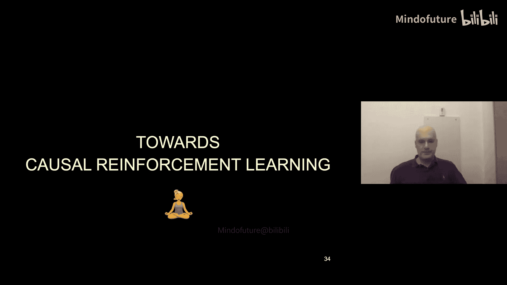

我将要做的是，为每种模式获取我能想到的最