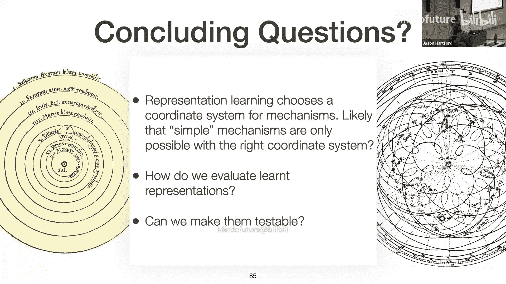

# 002：因果表征学习教程

在本教程中，我们将探讨因果表征学习这一前沿领域。我们将回顾因果推断的历史背景，理解为何从非结构化数据（如图像）中学习潜在因果变量是一个具有挑战性的问题，并介绍一系列旨在解决这一问题的核心技术与理论结果。我们将看到，通过引入额外的假设（如分布变化、稀疏性、时间动态等），我们有可能从观测数据中识别出有意义的潜在因果变量。

## 因果推断简史：从实验到观测数据

上一节我们概述了本教程的目标。本节中，我们来看看因果推断是如何发展到今天的。

因果推断的历史可以大致分为两个阶段。在最初的约250年里，实验是理解复杂世界的主要工具。例如，18世纪的詹姆斯·林德通过实验证明了柑橘类水果可以预防坏血病。19世纪的约翰·斯诺通过移除伦敦宽街的水泵手柄，证明了霍乱由受污染的水源引起。这种方法在20世纪初由罗纳德·费希尔在其著作《实验设计》中正式确立。

然而，实验方法存在局限性。这在20世纪50年代关于吸烟与癌症的辩论中尤为突出。当时，吸烟与肺癌之间存在强相关性，但像费希尔这样的统计学家反对直接赋予其因果解释。他指出，可能存在某种基因，既使人更容易对香烟上瘾，也使人更容易患癌。虽然随机对照试验在理论上可以解决这个问题，但在伦理和实践上均不可行。

这推动了从观测数据中进行因果推断的研究。通过如朱迪亚·珀尔（计算机科学）、唐纳德·鲁宾（统计学）、杰米·罗宾斯（流行病学）以及约书亚·安格里斯特（计量经济学）等学者的工作，我们发展出了一套丰富的工具来从观测数据中估计因果效应。

这种转变在经济学领域尤为明显。2019年的一项研究分析了顶级经济学期刊的标题词云，发现从20世纪50年代到80年代，经济学是一个理论驱动的领域。而从90年代至今，“证据”一词开始占据主导地位，这通常指来自观测因果推断或随机对照试验的证据。这一变革在2021年授予大卫·卡德、约书亚·安格里斯特和吉多·因本斯的诺贝尔经济学奖中得到了认可。

## 为什么需要因果推断？可检验的假设

上一节我们看到了因果推断如何改变了社会科学。本节中，我们来探讨应用科学家为何青睐因果推断。

关键在于，当我们研究的系统很复杂时，我们无法通过分析来推理，而必须从数据中估计变量之间的关系。然而，我们不仅仅是想做出预测，我们更想估计一种可以被其他科学家检验的关系。因果效应的定义决定了，如果我们做好了因果推断，我们就可以用一个数据集上得到的估计去检验另一个数据集上的估计，而无需假设这两个数据集的分布完全相同，只需关注相同的效应。

这一切的前提是我们的假设成立，并且我们有足够的数据。但这通常假设我们已知系统中起作用的变量，并且大部分变量是可观测的。

## 新的前沿：从非结构化数据中学习

上一节我们讨论了传统因果推断的设定。本节中，我们来看看当前面临的新挑战。

我们今天要讨论的场景是，我们无法直接观测到系统的变量，而是得到变量的非结构化代理。例如，在药物发现中，研究人员收集显微镜下的细胞图像。决定细胞状态的潜在变量对我们来说是隐藏的，我们看到的只是图像中的像素。我们需要弄清楚如何处理这些数据。

生物学涉及对复杂相互作用系统平衡态的推理，这与经济学有相似的结构。我们可以越来越详细地观测生物系统，并以自动化方式大规模收集数据。我们也可以进行干预，这从因果推断的角度来看非常有利。但问题在于，与社会科学不同，我们通常无法直接观测到变量，而是得到这种非结构化数据。

更一般地，思考如何构建一个“AI实验科学家”有助于理解这个问题。这与标准视觉系统的区别在于，我们需要一个能将图像映射到抽象变量的系统，并且我们希望这些变量在不同数据集中保持一致。换句话说，就像因果推断中学习的假设可以被其他科学家检验一样，我们希望视觉系统推断出的抽象变量也能被其他机器人同样推断出来。重要的是，我们希望仅从无标签数据中做到这一点，因为这些系统本身尚未被充分理解。

## 因果表征学习：问题定义

上一节我们明确了新挑战。本节中，我们来正式定义因果表征学习问题。

我们将假设存在一组潜在变量 **Z** 来描述系统的底层状态。但我们观测到的是 **X**（例如图像），它由某个生成函数 **G** 从潜在变量渲染而成。我们感兴趣的问题是：能否从 **X** 中恢复这些潜在变量 **Z**？

为了使问题更具体，考虑一个简单的玩具问题：我们知道生成函数 **G**（例如一个游戏引擎），输入是每个球的位置和颜色等参数。我们知道确切的潜在状态，并得到渲染后的图像。问题是：我们能从图像中恢复那大约15个用于渲染的参数吗？

## 为什么这很困难？非辨识性示例

上一节我们定义了问题。本节中，我们通过几个例子来看看为什么这个问题本质上很困难。

首先，我们看自编码器中的非辨识性。假设我们有一个完美的编码器 **G⁻¹**，它能从 **X** 完美恢复原始的 **Z**。我们唯一的约束是自编码器学习恒等函数（即完美重建）。问题是，如果我对潜在空间应用任意可逆变换 **A**，然后在解码前应用其逆变换 **A⁻¹**，由于 **A⁻¹A** 是恒等变换，我仍然能满足完美重建的约束。这样我就得到了一个新的编码器和解码器，它们在损失函数下与原始方案无法区分。实际上，存在无限多个这样的解。

其次，我们考虑另一个极端：假设生成函数 **G** 是线性的，并且进一步要求潜在分布是独立的。在这个强假设下，观测 **X** 只是潜在 **Z** 的线性变换。即使如此，如果我们从完美的编码器开始，并应用一个旋转矩阵 **R**，由于高斯分布是旋转不变的，我们仍然满足独立性约束，并且可以通过在重建前进行逆旋转来满足重建约束。因此，我们仍然有无限多个解（旋转后的解）。这些解是有问题的，因为它们纠缠了坐标。例如，如果原始坐标是位置X和位置Y，旋转后的坐标变成了两者的线性组合。

## 可接受的模糊性：排列与缩放

上一节我们看到即使有强假设，问题依然棘手。本节中，我们来界定什么是“可接受”的解决方案。

有些模糊性是无法避免且可以接受的。例如，如果我们交换 **Z1** 和 **Z2** 的标签，我们无法知道哪个是哪个。这就像我们只是以不同的顺序写下潜在变量，而潜在变量本身构成一个集合，所以排列顺序不应有影响。同样，我们无法知道数据生成过程中使用的测量单位，所以潜在变量的缩放因子也是可以接受的。

因此，理想情况下，我们希望以这样的方式恢复每个潜在变量：每个恢复的变量只依赖于原始的一个坐标。也就是说，我们满足于得到一个估计 **Ẑ**，它等于某个排列矩阵 **P** 乘以某个对角缩放矩阵 **S** 再乘以原始 **Z**。

## 突破：独立成分分析（ICA）

上一节我们定义了可接受解的范围。本节中，我们来看第一个能在此范围内提供辨识性的经典结果：独立成分分析。

假设生成函数 **G** 是线性的，且潜在变量独立。如果所有潜在变量都是高斯的，我们之前看到旋转会导致非辨识性。但是，如果**至多有一个潜在变量是高斯的**，情况就不同了。皮埃尔·科蒙在1994年ICA的奠基性论文中证明，在此条件下，独立成分分析可以辨识潜在变量，**最多相差一个排列和缩放**。

这是一个重要的辨识结果，但它是在极其受限的设定下取得的：线性混合和独立潜在变量。我们如何将其推广到更现实的情况？

## 推广到非线性混合：负结果

上一节我们在线性设定下看到了希望。本节中，我们尝试放松线性混合函数的假设，看看会发生什么。

现在，我们允许生成函数 **G** 是任意单射非线性函数。我们想找到一个编码器，能够恢复位置和颜色等潜在变量（最多相差可接受的变换）。

我们再次从完美编码器开始，并寻找满足我们约束的变换。潜在分布被选为明显非高斯的，以便容易排除线性旋转纠缠。但问题是，编码器现在是一个非线性函数。是否存在某个非线性变换 **A**，能以某种奇怪的方式纠缠 **Z_i** 和 **Z_j**，使得它们不再是原始潜在变量的函数，而是两者的函数？

我们可以显式地构造这样一个 **A**。步骤如下：
1.  对每个坐标分别应用其累积分布函数（CDF），映射到单位超立方体。
2.  应用标准高斯分布的逆CDF，得到标准高斯分布。
3.  应用一个旋转矩阵（高斯分布是旋转不变的）。
4.  应用标准高斯分布的CDF，映射回单位超立方体。
5.  应用原始分布的逆CDF，映射回原始分布。

这个复杂的变换没有改变底层分布（因此满足独立性约束），但它使坐标纠缠在一起。因此，仅靠独立性假设不足以确定正确的表示。

## 辨识性策略概述

上一节我们看到了负结果。本节中，我们来概述获得辨识性所需的各种策略。

就像没有假设就无法进行因果推断一样，没有假设也无法进行因果表征学习。我们需要考虑可以对感兴趣的数据分布做出哪些合理假设，数据生成过程如何被干预扰动，以及可以观测到什么。

我们将方法大致分为利用以下几类思想：
1.  **潜在变量的分布假设**（如ICA中的非高斯性）。
2.  **分布的变化**（跨环境、跨时间）。
3.  **对混合函数的约束**（如线性、稀疏性）。
4.  **多视图与稀疏性**。

思路是，我们从所有可逆函数开始，然后施加约束（如假设的潜在分布族、对生成函数的额外约束），希望这些约束共同作用后，能留下唯一（或可接受范围内唯一）的解。

## 策略一：分布变化与非线性ICA（TCL）

上一节我们概述了策略。本节中，我们深入探讨第一个策略：利用分布变化，即时间对比学习。

这是该领域的首个重要结果。我们不再假设单一的潜在分布，而是假设存在多个分布（例如，在不同时间段）。生成函数 **G** 对所有分布保持不变。为数学便利，假设潜在分布属于指数族，且混合函数是从 **R^d** 到 **R^d** 的（即潜在空间与观测空间维度相同）。

算法上，做法很直观：将观测数据按时间段分桶，然后训练一个分类器来预测给定观测数据来自哪个时间段。令人惊讶的是，他们证明最终隐藏层的表示，**经过一个逐点函数和旋转后**，等价于原始的潜在变量。通过后续的ICA可以处理掉这个旋转。

为什么？简略推导如下：在通用逼近假设下，最优分类器的最终隐藏层激活与对数密度比相关。通过贝叶斯规则和指数族假设，可以将其转化为潜在变量充分统计量的线性函数。再利用变量变换公式将观测密度与潜在密度联系起来，经过一系列代数运算，可以证明隐藏状态是源信号的线性函数。因此，表示是线性可辨识的，再通过ICA处理旋转即可。

## 推广：iVAE

上一节我们介绍了TCL。本节中，我们看看其推广：iVAE。

iVAE进行了几项重要推广：
1.  **环境变量**：将“时间”推广到一般的“环境”变量，只要该变量能引起潜在分布的变化。
2.  **处理噪声**：允许观测中存在噪声。
3.  **处理维度不匹配**：允许潜在维度与观测维度不同。
4.  **多重充分统计量**：使用具有多个充分统计量的指数族，这有助于解决缩放模糊性。

核心思想仍然是利用多个环境下的条件独立性先验，通过变化来锚定表示。

## 策略二：多任务/环境下的稀疏性

上一节我们讨论了利用分布变化进行辨识。本节中，我们转向另一种策略：利用多任务或多环境下的稀疏性。

考虑一个例子：我们有基因表达数据，以及一些介导疾病表型的潜在变量（如蛋白质水平）。我们想从基因表达中恢复这些潜在变量。一个深度学习方法是学习一个特征提取器（编码器），并在其上用一个线性映射来预测疾病表型。问题是，仅此约束是否足够？

在模型设定正确（即真实模型确实是线性的）的情况下，恢复真实潜在变量和真实线性映射的解确实能最小化预测误差。但我们可以对真实潜在变量应用一个旋转，然后让线性映射学习去抵消这个旋转，从而构造出另一个同样最小化预测误差但表示不同的解。

为了打破这种模糊性，我们引入多个环境，每个环境中结果变量 **Y** 与潜在变量 **Z** 的线性映射 **w** 略有不同。我们假设这些环境通过树结构关联，从父环境到子环境，线性系数通过添加一个**稀疏的线性偏移** **δ** 来变化。稀疏性意味着从一个物种到另一个物种，通常只有一个蛋白质的效应发生变化，其他保持不变。

现在，我们在最小化预测误差的同时，对偏移矩阵 **δ** 施加 **L0** 稀疏性惩罚。为什么这有帮助？对于旋转后的错误解，为了学习正确的模型，它需要应用 **A⁻¹** 来“反旋转”。但稀疏偏移 **δ** 乘以 **A⁻¹** 后通常会变得稠密。因此，施加稀疏性惩罚后，正确的表示更可能产生稀疏的 **δ**，从而被选中。

这个思想可以推广到多任务学习：我们有多个不同的任务（标签），每个任务只依赖于潜在变量的一个小子集（稀疏关系）。同样，旋转后的解需要学习稠密的系数来完成任务，而正确的解具有稀疏系数，稀疏性惩罚有助于选择正确的表示。

## 策略三：时间机制与稀疏性

上一节我们利用任务关系的稀疏性。本节中，我们看看如何利用时间动态中机制的稀疏性。

我们假设一个隐马尔可夫模型：潜在状态随时间根据某个转移函数（机制）演化，每个时间点通过生成函数 **G** 渲染观测。**G** 跨时间保持不变，但潜在状态变化。

关键假设是：**转移关系是稀疏的**。即，并非前一时刻的每个变量都影响后一时刻的每个变量。例如，在一个机器人、球和树的系统中，机器人踢球只影响球的位置，而树的位置可能保持不变。

我们可以利用这种稀疏性。真实解允许我们构造一个稀疏的转移函数，而旋转后的解可能无法做到这一点。在额外的假设下（如变量间没有完全对称的因果模式），这种稀疏性约束有助于挑选出正确的解。

另一种形式化方法是将非辨识性集合表征为机制的**等变性**。也就是说，那些与机制交换的变换（如排列、缩放）构成了我们无法区分的解。对于仿射机制，在足够的变异性条件下，我们可以获得与TCL类似的线性辨识性结果。

## 策略四：配对样本与稀疏干预

上一节我们讨论了时间机制。本节中，我们看看如何利用稀疏干预下的配对样本。

假设我们可以对系统进行干预，且这些干预在潜在空间中是**稀疏的**——每次只改变一个潜在变量。我们得到同一图像在不同稀疏干预下的多个视图（配对样本）。

在正确的表示中，图像的变化可以通过沿单个潜在轴移动来实现。在旋转后的表示中，为了表示同样的变化，可能需要沿多个轴进行密集的移动。因此，如果我们要求模型用最稀疏的潜在变化来解释观测到的图像对，那么正确的表示将被选中。

如果真实变化不是单稀疏（1-sparse）而是k-稀疏的，那么我们可能无法辨识到单个坐标，但可以辨识到块（blocks），即潜在变量可以在块内纠缠，但块间是分离的。

## 策略五：非配对样本与支持独立性

上一节我们讨论了配对样本。本节中，我们简要介绍利用非配对样本和一种称为“支持独立性”的新准则。

假设我们可以进行**硬干预**，将某个潜在变量固定为一个常数。如果我们能对每个潜在变量都进行这样的干预，那么就能很容易地确定每个维度的含义。

更一般地，当干预可能同时改变多个潜在变量时，可以利用“支持独立性”这一特性。我们期望不同潜在变量的支持集是独立的（例如，形成一个超矩形）。即使联合分布不独立，支持集也可能是独立的。旋转一个超矩形通常会破坏这种支持独立性，因此这可以作为一个辨识信号。

## 总结与展望

本节课中，我们一起学习了因果表征学习的核心挑战与多种辨识策略。

我们回顾了因果推断从实验到观测数据的发展，并指出了当前的前沿：从非结构化数据中学习潜在因果变量。我们看到了问题的固有难度（非辨识性），并探讨了通过引入额外假设来获得辨识性的多种途径：
*   **分布变化**（如TCL， iVAE）：利用跨环境/时间的分布变化，结合指数族假设。
*   **稀疏性**：在多任务、时间机制或干预中利用稀疏关系作为正则化。
*   **机制约束**：利用时间动态或干预的特定结构。
*   **支持独立性**：利用干预后潜在变量支持集的几何特性。

所有这些策略都围绕一个核心思想：**寻找正确的坐标系**。就像从地心说到日心说的转变一样，正确的表示能使下游的推理和因果发现变得简单而有效。

然而，要构建一个真正的“AI科学家”，我们仍面临许多开放问题，例如：如何评估学到的表示？如何在不同的坐标系间进行权衡？如何将理论结果扩展到更复杂、更高维的真实世界数据？因果表征学习是一个活跃而充满希望的领域，它为机器理解世界的底层因果结构提供了新的工具和视角。