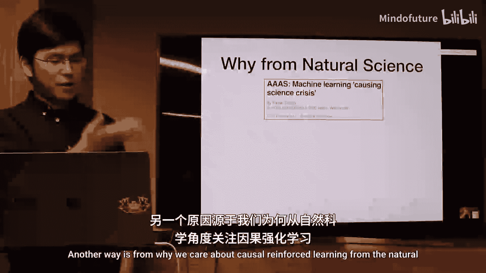
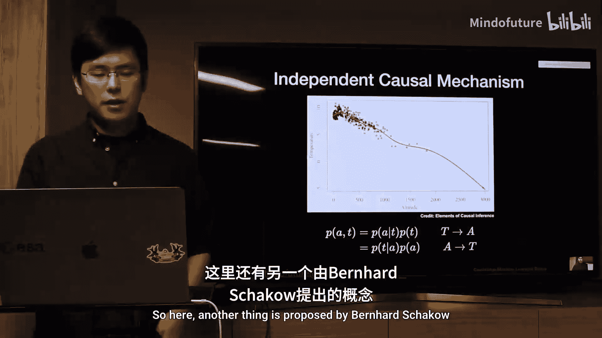

# 003：因果强化学习

## 概述
在本节课中，我们将学习因果强化学习的基本概念。我们将探讨因果推理与强化学习如何结合，以及这种结合为何是实现通用人工智能的关键路径。课程将涵盖因果推理的核心思想、当前强化学习的局限性，以及因果强化学习如何解决这些问题。

## 因果推理与强化学习的结合动机
上一节我们介绍了课程主题，本节中我们来看看为何要将因果推理与强化学习结合。

首先，因果推理拥有悠久的历史。朱迪亚·珀尔在其著作中将因果概念追溯至《圣经》时代。人类很早就开始使用因果解释来理解世界。

当前的人工智能虽然在特定任务上超越了人类，例如图像识别、围棋和星际争霸，但这并非通用人工智能。以星际争霸为例，模型难以将学到的知识迁移到其他任务，并且需要远超人类经验的数据量进行训练。

马库斯和勒昆在关于通用人工智能的辩论中达成了一些共识，其中包括：
*   无模型强化学习目前并非答案。
*   人工智能系统需要更好的内部前向模型。
*   常识推理至关重要。

因果模型可能是最接近物理模型的前向模型，也是表征常识并进行推理的最佳方式。强化学习模仿了自然学习过程：观察、行动、获得奖励并更新模型。然而，当前的强化学习存在根本性缺陷。

## 当前强化学习的局限性
上一节我们提到了强化学习的潜力，本节中我们来看看它面临的具体挑战。

强化学习常被比喻为蛋糕上的樱桃，因为它所依赖的奖励信号信息量极少，且通常是人为设计的，难以涵盖任务的完整信息。这导致其在现实世界中难以应用。

强化学习面临的核心问题包括：
*   **探索与长期信用分配困难**：在连续的状态-动作空间中，无法遍历所有可能性。
*   **数据效率低下**：通常需要从零开始训练，无法有效利用先验知识。
*   **非独立同分布数据**：强化学习的数据是顺序生成的，但经验回放等技术试图将其变为独立同分布数据，这可能导致信息丢失。

## 为何需要因果强化学习
了解了强化学习的局限后，本节我们探讨因果推理如何为其提供解决方案。

朱迪亚·珀尔指出，强化学习是实现因果推理的一种方式，但仅限于干预层面。因果模型则能超越干预，考虑反事实分布，从而覆盖更广泛的分布范围。

韦哈提出了两个关键问题，凸显了结合的必要性：
1.  人类从高维数据中提取高级概念进行高效学习，而强化学习处理高维数据却非常困难。
2.  经验回放破坏了数据的时序依赖性。

从自然科学角度看，传统方法是从数据中归纳模式（如爱因斯坦前的物理学），而现代方法则是先提出理论再验证（如爱因斯坦后的物理学）。因果强化学习恰好融合了这两种路径：强化学习通过干预探索世界，因果推理基于假设进行验证。

人类通过干预自然总结规则，并利用这些规则改进后续的探索与适应。因果强化学习正是让智能体通过与环境的交互学习因果结构，并基于此优化策略。

## 核心概念回顾
在深入因果强化学习之前，我们需要简要回顾两个领域的基础概念。

### 强化学习基础
强化学习框架包含以下要素：
*   **状态 (s)**：环境的状态。
*   **动作 (a)**：智能体采取的行动。
*   **奖励 (r)**：环境反馈的奖励。
*   **状态转移**：动作导致环境状态变化。
*   **奖励假设**：所有目标都可以用期望累积奖励最大化来描述。`G_t = R_{t+1} + γ R_{t+2} + γ^2 R_{t+3} + ...`

### 因果推理基础
因果推理与关联分析有本质区别。赖欣巴哈原则指出，若两个变量统计相关，则可能的因果情况为：X导致Y、Y导致X，或存在隐变量同时导致X和Y。

因果关系的优势在于：
1.  **干预**：可以预测对变量进行干预后的结果。
2.  **反事实**：可以预测从未观察到的情况。

另一个关键概念是**独立因果机制**。例如，温度(T)和海拔(A)的联合分布可以有两种分解方式：`P(T|A)P(A)` 或 `P(A|T)P(T)`。只有前者符合物理机制，因为海拔分布`P(A)`的改变不会影响物理机制`P(T|A)`。这有利于迁移学习。

**混杂因子**是常见挑战。例如，在治疗肾结石的例子中，若忽略结石大小这个混杂因子，会得到错误的治疗结论。只有当混杂因子被观测到时，才能通过校正得到一致估计。

**反事实推理**是因果推理的核心。例如，已知学生Joe的鼓励程度(X)、学习时间(H)和考试分数(Y)，我们可以问：“如果Joe的学习时间翻倍，他的分数会是多少？”这需要基于观测数据估计噪声项（背景信息），然后在模型中执行干预并计算结果。

因果模型中有三类**可识别性**问题：
1.  能否将干预分布表示为观测分布。
2.  能否从数据中唯一确定因果图结构。
3.  在隐变量模型中，能否唯一确定参数。

## 因果强化学习的框架与关联
本节我们将看到因果强化学习如何运作，并与其他机器学习概念关联。

因果强化学习包含两个主要方向：
1.  利用因果推理帮助更高效地学习强化学习策略。
2.  利用强化学习进行因果发现。

这与因果推理的两部分对应：因果推理（给定结构进行推断）和因果学习（从数据中学习结构）。

它可以自然地与多个领域关联：
*   **迁移学习**：智能体在不同地形中奔跑。因果强化学习可以学习环境中的鲁棒因果结构，并直接迁移，而无需预先知道地形特征。
*   **元学习**：目标是学习能处理一系列任务的家庭。如果不同任务共享独立的因果模块，则可以快速复用这些模块。
*   **多智能体强化学习**：面临巨大联合动作空间等挑战。因果发现可以帮助减少动作空间。此外，合作场景需要考虑共同知识理性，这涉及到反事实推理——“如果我采取不同行动，对方会如何反应？”，从而推断其他智能体的意图。

## 潜在应用领域
因果强化学习在多个领域有广阔的应用前景。

*   **视频预测**：基于少量帧预测长期视频轨迹。仅依靠像素统计模型难以进行长时程预测，需要考虑全局因果结构。
*   **机器人学**：在真实行动前进行规划，预测不同行动的未来轨迹并评估风险，从而节省时间和成本。
*   **自动驾驶**：一个例子表明，如果模型错误地将刹车指示灯（结果）与车窗视觉信息（原因）关联，可能导致智能体只会刹车。需要学习正确的因果结构以避免此类问题。
*   **医疗、金融等序列决策**：从纯观测数据（如历史医疗记录）中学习策略和因果结构，而无需与环境实时交互。一个通用模型包含时变和时不变混杂因子，目标是从观测奖励中学习干预下的奖励函数，从而得到最优策略。

## 总结与资源推荐
本节课我们一起学习了因果强化学习的核心思想。

总结来说，因果强化学习的大框架包含两部分：用因果帮助强化学习，以及用强化学习进行因果发现。目前大部分工作集中于前者，后者因缺乏基准和仿真环境而更具挑战性。一个重要的结论是：**因果强化学习为实现通用人工智能而生**。

最后，推荐一些深入学习的资源：
*   **书籍**：
    *   《The Book of Why》 - Judea Pearl （科普）
    *   《Causality》 - Judea Pearl （经典）
    *   《Causal Inference in Statistics》 - Judea Pearl 等 （入门）
    *   《Elements of Causal Inference》 - Jonas Peters 等 （侧重条件独立性检验）
    *   《Cause and Correlation in Biology》 - Bill Shipley （生物学视角）
*   **论文**：Bernhard Schölkopf 在 arXiv 上关于因果机器学习的综述论文提供了很好的总结。

因果推理在不同领域（物理、医学、心理学）的定义和侧重点不同，但正逐渐形成一个统一的框架，并与强化学习等方向深度融合，推动人工智能向前发展。