# 004：因果强化学习——第2-2部分

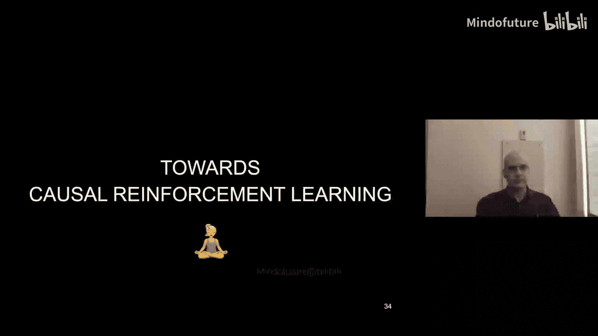

在本节课中，我们将深入探讨因果强化学习（CRL）本身，这是本教程中最令人兴奋的部分。我们将介绍CRL带来的新挑战和学习机会，并列举一些具有代表性的任务。这些任务包含了现实世界中存在但尚未被充分研究的新组件，使得它们极具吸引力。我们将使用因果推断、因果层次理论（CHT）以及环境模型M作为结构因果模型（SCM）和图的语言来理解和解决这些任务。

总共有六个任务或维度。前三个任务我们将花费15到20分钟详细讨论，介绍任务本身以及一些可能的解决方案思路。然后，我们将用一两分钟简要总结其余三个任务。

## 任务一：广义策略学习（GPL）

到目前为止，我们假设世界是“一刀切”的，即在线学习和离线学习的模型完全匹配真实模型。离线学习包括离策略学习和基于do演算或因果演算的学习。然而，我们很快会看到第一个例子，事情并不那么简单，单独使用这些方法无法解决问题。这就是我们所说的**广义策略学习（GPL）**。

上一节我们介绍了CRL的总体框架，本节中我们来看看第一个具体任务：广义策略学习。

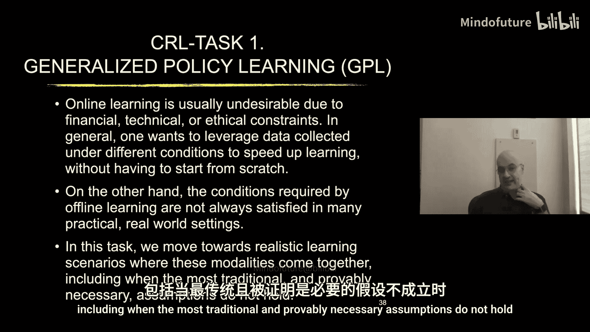

在线学习通常由于财务、技术或伦理约束而不可取。通常，我们希望利用在不同条件下收集的数据来加速学习，而不是从头开始。然而，离线学习所需的条件在许多实际场景中并不总是满足。在这个任务中，我们转向更现实的学习场景，将在线和离线模式结合起来，包括当最传统且被证明必要的假设不成立时。这一点很重要——这些假设是必要且可证明的。

让我们从一个例子开始。假设我们试图学习一个输入分布P(X, Y)，其中X是行动，Y是结果或奖励。我们希望学习P(Y | do(X))。这可以是机器人通过演示学习，而教师可以观察到比学生更丰富的上下文（例如，有更精确的传感器）。或者是在医学背景下，从观察数据中进行最优实验设计。

例如，输入数据来自一个数据集P(X, Y)，X是决策（如用药），Y是结果（如康复）。存在一组未观测变量U，同时影响X和Y。这些数据可能来自某个医院，有100万个数据点。任务是学习药物对结果（如五年存活率）的因果效应。我们真正想要的是P(Y | do(X))。

如果我们尝试应用离策略学习，会发现假设A2（观测上下文相同）被违反了。医生可能观测到更丰富的上下文，但并未记录在电子健康记录中，或者存在于潜意识层面。这导致了混杂偏差。如果尝试使用do演算，也会发现在这个图中无法进行推断。这似乎证明了需要进行在线实验。

但我的建议是：考虑到我们有这100万个数据点，而在线实验可能只涉及300人并花费500万美元，让我们尝试利用观察数据。我们忽略医生和FDA决策者之间的差异，假设他们在因果意义上是可交换的（技术上称为“天真”假设）。换句话说，我们将尝试使用观察数据作为先验，即得到P(Y | X)，并尝试在某种在线学习程序中使用它作为先验。

我使用汤普森采样（Thompson Sampling）作为示例方法，你可以选择任何方法。目标是展示最简单的设置来讨论核心问题。先验自然地融入其中，并且我们使用二元变量（最受限的设置）。如果变量有更多自由度，这个问题会更频繁、更明显地出现。

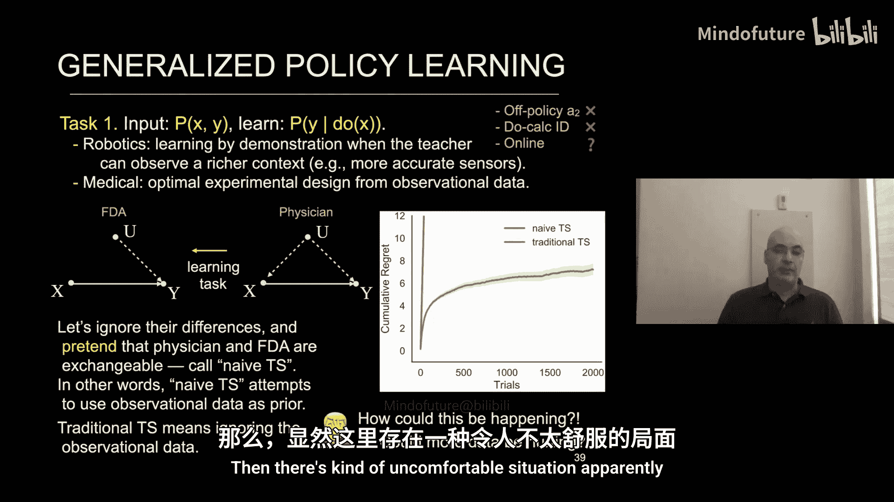

但结果图看起来并不好。使用观察数据作为先验的“天真TS”方法，其累积遗憾曲线几乎是平坦的。相比之下，传统的TS（抛弃所有观察数据）则表现出预期的学习曲线，在大约500次试验后就能以高置信度区分最优臂。

为什么会这样？这似乎违背了“更多数据总是更好”的基本统计原则。数据竟然在损害性能。

为了理解内部发生了什么，我们查看详细图表。真实情况（智能体未知）是do(X=0)的期望奖励高于do(X=1)。但在来自医院的观察数据中，P(Y|X=1)却高于P(Y|X=0)。智能体将观察数据作为先验（例如，使用250个数据点），其95%置信区间显示do(X=1)的估计高于do(X=0)。因此，智能体在初期大量选择次优臂X=1，陷入了困境。而传统TS从50/50先验开始，经过探索后很快就能识别出最优臂。

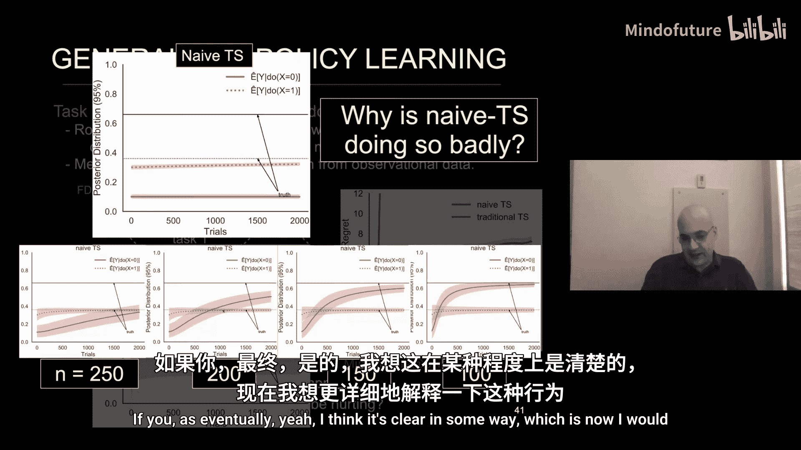

即使观察数据量增加到250、500、1000，天真TS也需要大约2000轮交互才能赶上传统TS。这令人难以置信，因为我们的目标正是利用大量观察数据来“预热”学习，减少实验。但在这里，正是这些样本在损害性能。

现在，我想更深入地解释这种行为，并引入**不可识别性**的问题。这是我们之前看到的因果图。

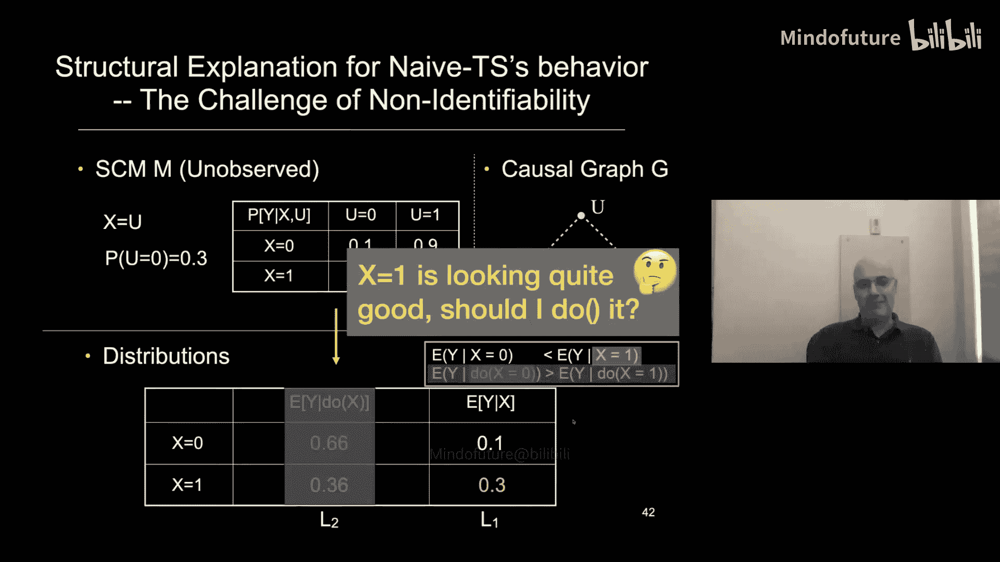

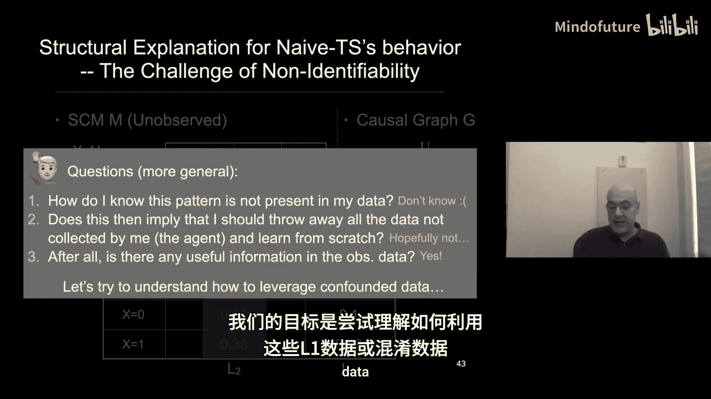

这是生成之前图表的SCM。这个观测世界的SCM导致了两个不同的分布：L1（观察性）分布和L2（实验性）分布。我们可以看到，在L2中，do(X=0)大于do(X=1)，所以选择do(X=0)是更好的。但同时，在L1数据中，P(Y|X=1)却大于P(Y|X=0)。在实践中，我们看不到L2分布，我们正是因为不知道才进行学习。整个挑战在于我们没有L2数据。因果层次理论告诉我们，L1数据蕴含的信息少于L2数据。

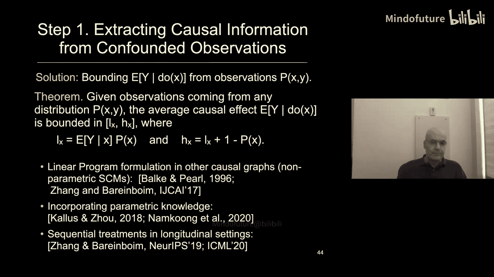

那么，这是否意味着我应该抛弃所有非由我（智能体）收集的数据，总是从头开始学习？在非常受限的模型下，答案可能是否定的。但一般来说，没有希望仅从离线数据学习。然而，对于其他模式，答案应该是“不”，因为其他条件非常严格，智能体往往是“双胞胎”且在相似环境中演化。

观察数据中是否有任何有用信息？我会说**是的**，存在有用信息。问题是如何利用这些L1数据或混杂数据？

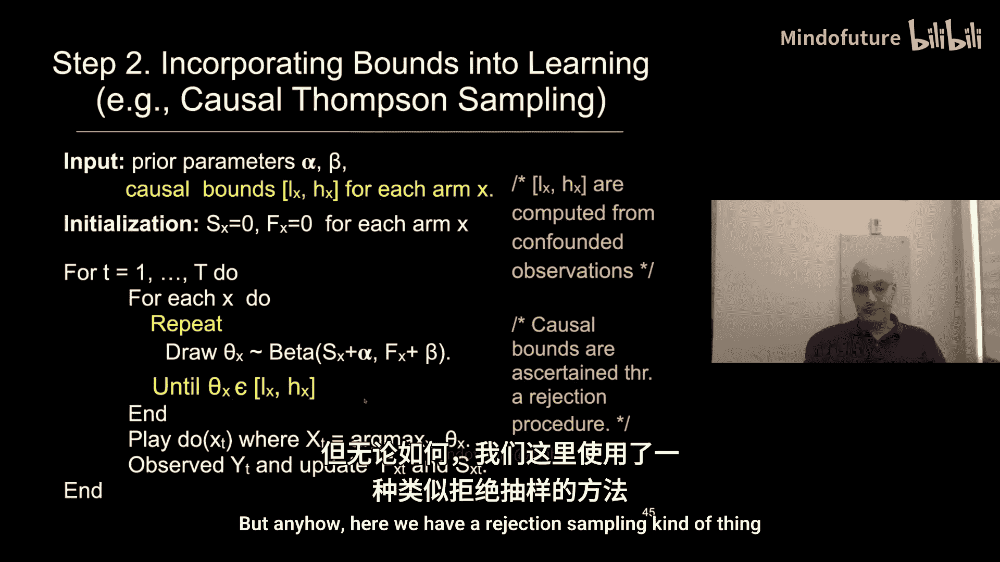

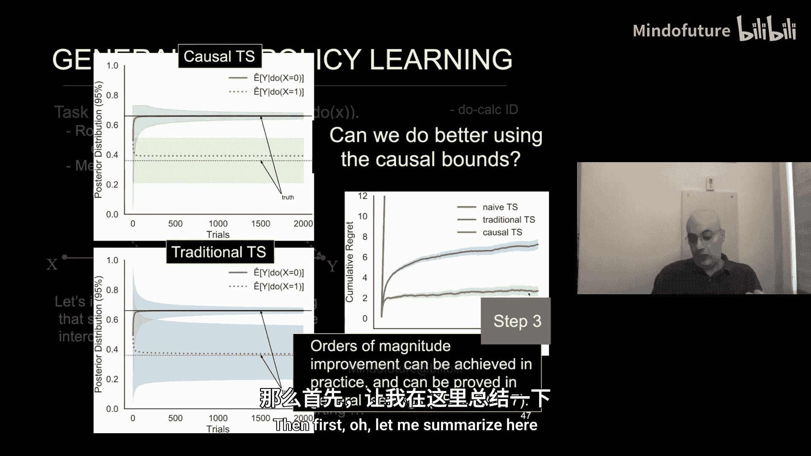

我们采取一个非常简单的三步法来解决这个问题。

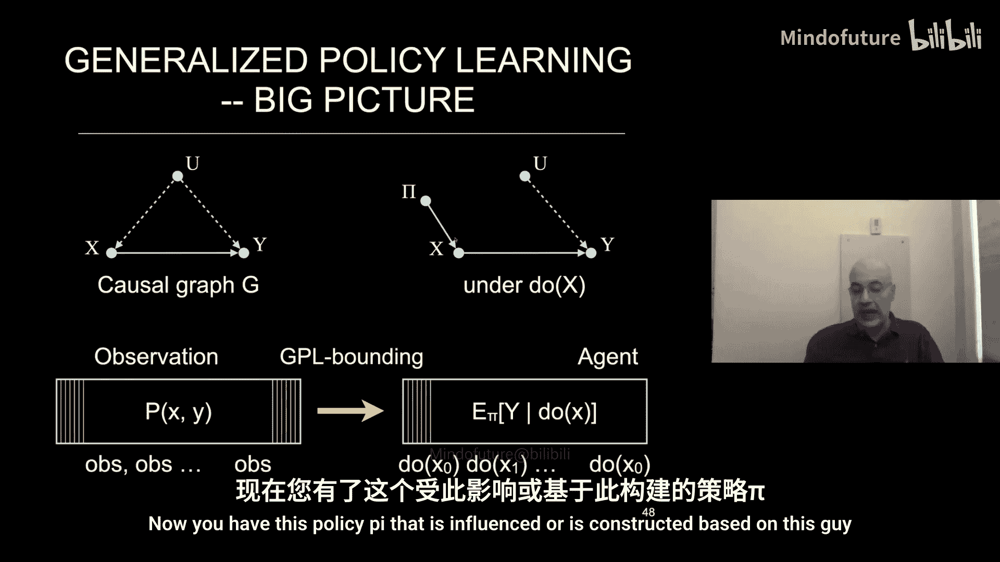

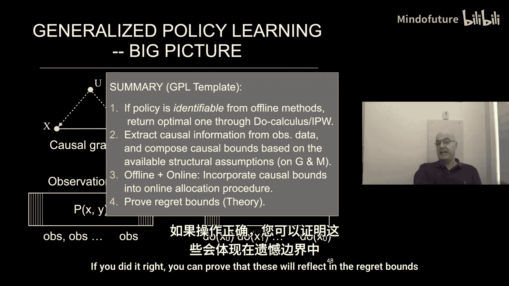

**第一步**：从混杂的观察数据中提取因果信息。我们采取的解决方案是进行**边界估计**。我们不试图进行点识别（即从P(X,Y)计算P(Y|do(X))并假装它们相同），而是尝试基于任何分布P(X,Y)的观察结果，来界定P(Y|do(X))的平均效应。存在由这些表达式给出的上下界。重要的是，这些表达式是观察分布的函数，不包含do运算符，没有L2数据。这很好。

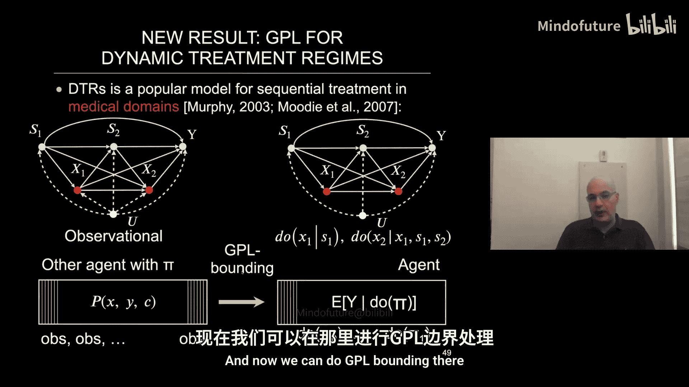

边界估计有不同的形式。这里展示的是我喜欢的一种，更相关于线性规划形式，是非参数的（如果你对F和P(U)没有任何假设）。如果加入参数知识（例如，知道F或U的某些函数形式），可以得到更紧的边界。我的建议是，通常从这些开始，如果它们效果很好，那很好；如果它们非常宽松，那么可以开始考虑使用哪些合理的假设来加速学习。

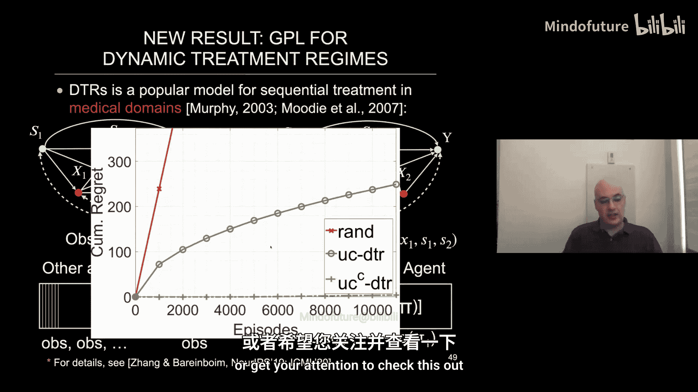

**第二步**：将这些因果边界纳入学习过程。我选择汤普森采样是因为易于解释。UCB版本更容易证明一些结果。我在这里突出显示更改：为每个臂输入因果边界，并加入某种拒绝采样，以确保我们从数据中采样的值在边界内。

一个很好的问题是：如果你没有那么多观察数据怎么办？我们可以更谨慎，加入某种分布，不那么严格。这是一个很好的合作问题。

**第三步**：在实践中，这效果非常好。整个过程从使用数据的不良方式（不收敛），到抛弃数据（无法学到任何东西），再到这个简单方法可以显著减少初始探索。目标正是利用观察数据来“砍掉”大量初始探索。

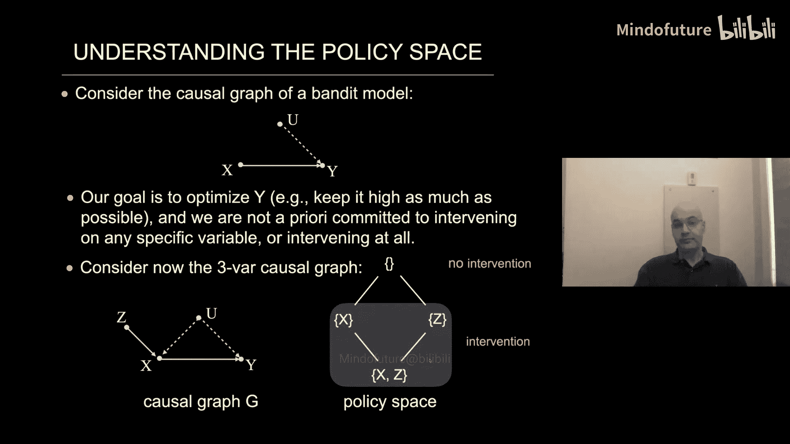

在实践中，可以实现数量级的改进。第三步是：你能证明这转化为遗憾边界吗？可以查阅参考文献。

让我总结一下。我们有这个因果图，有许多观察数据（竖线表示数据点）。我们应用GPL边界估计，无法得到点估计，因此需要在线进行一些探索。我们有一个策略π，它受到这些边界的影响或基于其构建。然后我们在线交互。

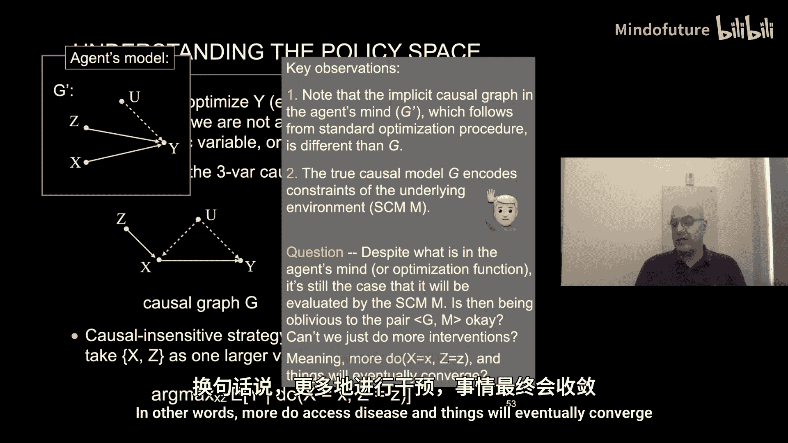

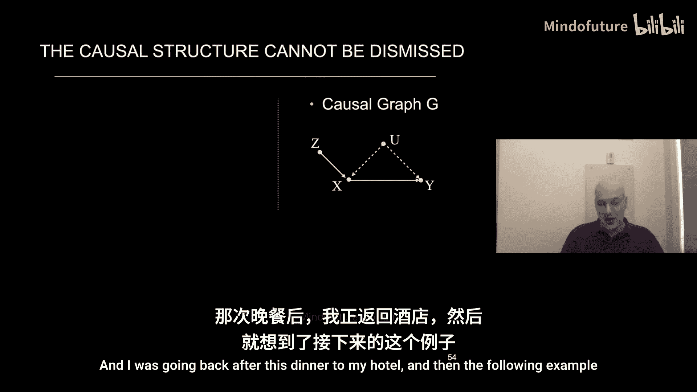

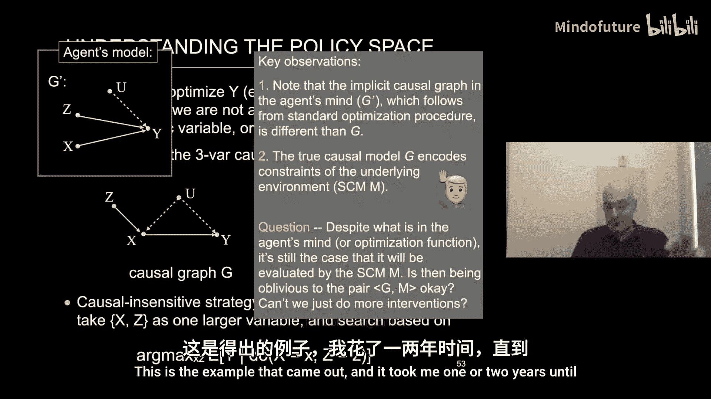

以下是该任务的模板：
1.  如果策略可以通过离线方法识别，则直接返回最优策略（使用do演算、IPW或其他估计方法）。
2.  否则，从观察数据中提取因果信息，并根据可用的结构假设（可以是关于图G的假设，或关于函数形式的假设）构建因果边界。
3.  然后在线进行，将因果边界纳入在线分配程序。
4.  如果你做对了，可以证明这会反映在遗憾边界中。

这很酷。我时间有点紧，但想快速提一下一个新结果：动态治疗 regimens（DTR）设置。这在医学领域非常流行。我们有一个序列性质：X1, Y1, C1, X2, Y2... 同样存在潜在变量影响所有节点。我们可以将GPL边界应用于此。现实中的结果非常好。这是随机化解决方案（Murphy等人）与我们的解决方案的对比图。我们的解决方案利用了DTR设置中已有的结构假设。绿色曲线（仅使用观察数据）效果就很好。这是一个非常酷的结果。

## 任务二：何时及何处干预（精炼策略空间）

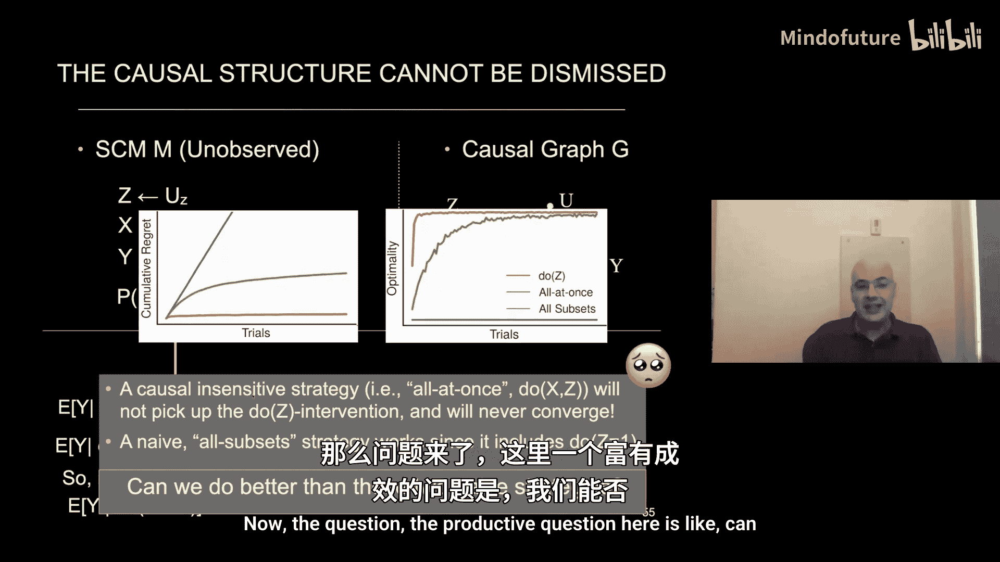

这是与我的博士后Sanghack Lee的合作。在文献中，通常假设策略空间是固定的，例如动作集A={X1, X2, ..., Xk}，并且干预通常被假定会导致积极结果。我们在这个任务中的目标是理解何时需要干预，或者干预是否可能导致意想不到的后果（副作用、安全问题等）。另一方面，如果干预是必要的，我们想理解应该改变环境中的哪些部分以实现期望的结果。这涉及到“何时”干预和“何处”干预。

让我通过一个例子来理解什么是策略空间。考虑一个图 bandit 模型：X是决策，Y是结果，U是潜在变量。我们的目标是优化变量Y（奖励），我们希望尽可能保持Y高。我们并不先验地承诺干预任何特定变量，我们只想保持Y高，甚至可能根本不干预。

现在考虑一个与标准bandit的偏差：我们有三个变量Z, X, Y。Z影响X，X影响Y。结构机制是：X = f_x(Z, U_x)，Y = f_y(X, U_y)，Z = f_z(U_z)。策略空间是各种干预的组合：不干预（让系统自然演化）、干预X、干预Z、同时干预X和Z。这些选项之间存在某种子集关系。

现在考虑一个我称之为“因果不敏感”的策略：我们忽略因果结构G，将变量Z和X视为一个大变量，并尝试基于函数E[Y | do(X=x, Z=z)]进行优化。第一个观察是：智能体心中的隐含因果图G'（来自此标准优化过程）与环境中的真实因果图G不同。在智能体心中，Z和X只是被π设定的值，它们指向Y。但真实因果模型G施加了底层环境的约束。

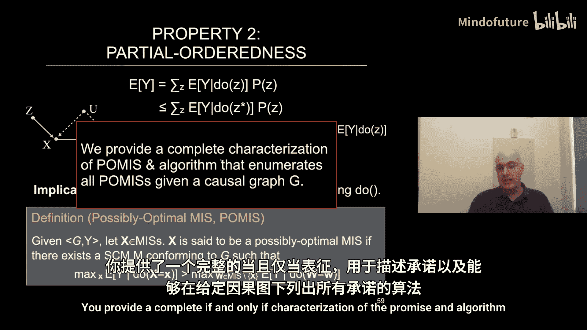

一个合理的问题是：尽管智能体心中或优化函数是什么，它都将通过SCM进行评估。那么，忽略图G，我们不能直接做更多干预（更多do操作）并最终收敛吗？我想展示情况并非如此。

这个例子来自大约五年前的一次晚餐讨论。因果图如下：

SCM如下：Z = U_z，X = Z + U_x，Y = X + U_y。且P(U_z=1)=P(U_x=1)=0.5。

首先评估“因果不敏感”策略。可以证明，在这个模型中，Y | do(X, Z) 等于 Y | do(X)。因为对Z的干预被X阻断。那么，如果我们干预X（设X=1），Y = 1 + U_y。要Y=1，需要U_y=0，概率为0.5。同样，如果X=0，Y=U_y，要Y=1，需要U_y=1，概率也是0.5。因此，无论我们对X做什么干预，最大期望奖励只有0.5。

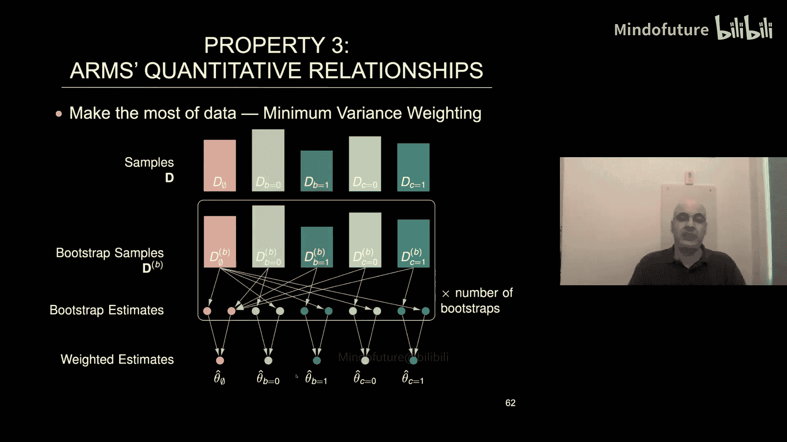

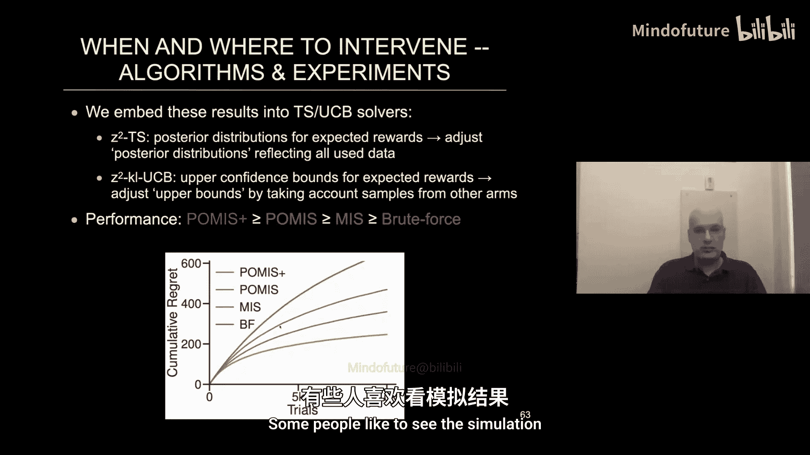

现在对比干预Z。如果我们do(Z=1)，X可以自由变化：X = 1 + U_x。那么Y = X + U_y = (1 + U_x) + U_y = 1 + (U_x + U_y)。由于U_x和U_y独立且期望为0.5，但更关键的是，在这个特定参数化下，可以计算出E[Y | do(Z=1)] = 1。这比干预X好得多！

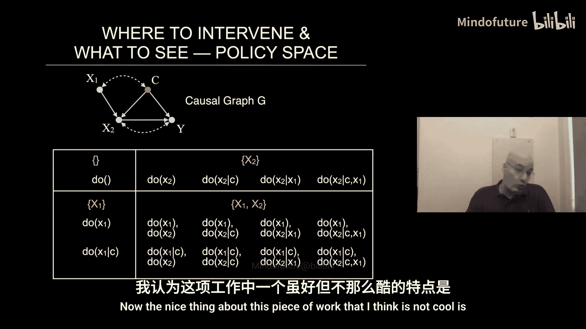

“因果不敏感”策略（我们称之为“全干预一次”策略，即同时干预所有可干预变量）将永远不会选择do(Z)干预，因此永远不会收敛。图表显示，累积遗憾线性增长，选择正确动作的概率始终很低。

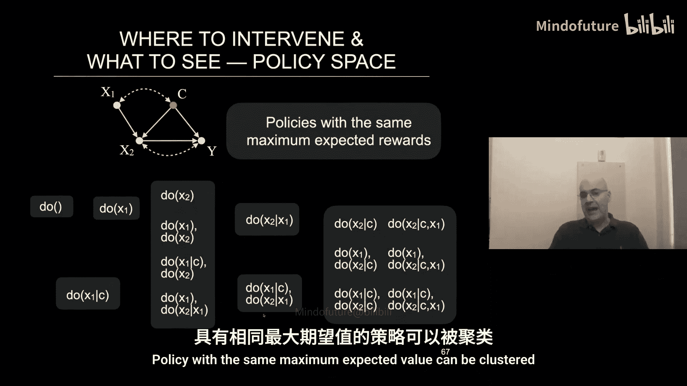

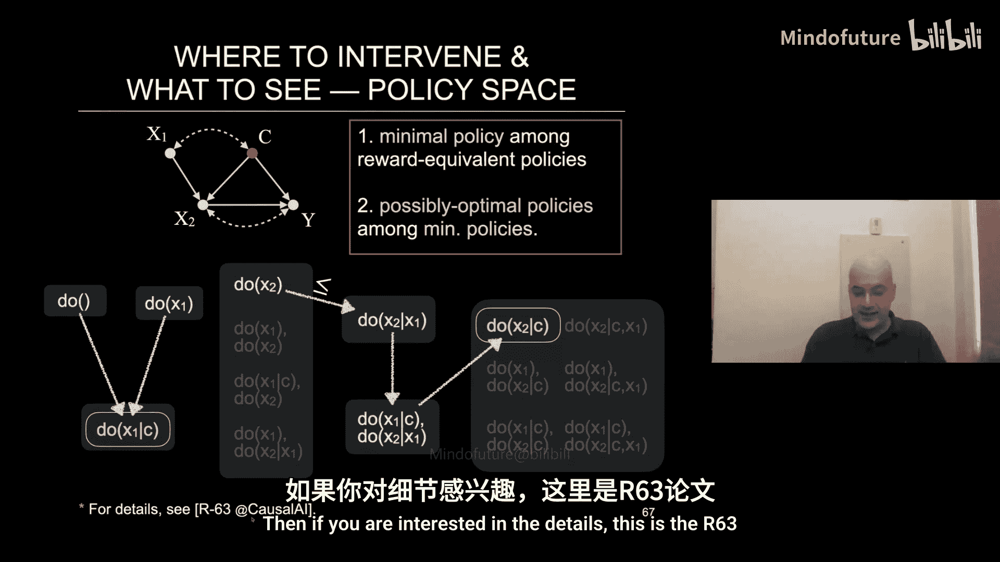

有人可能会说：那么让我们尝试所有子集干预（即幂集）。这显然会包含do(Z)。但问题是，我们能比这两种策略做得更好吗？

我们来讨论策略空间。给定图G，策略空间包含不同的干预集合。对于每个元素，我们有具体的干预赋值（例如，do(X=0), do(X=1)）。原始的“天真”策略是“全干预一次”。而“暴力”策略是尝试所有子集及其赋值。

我们想研究策略空间相对于模型M和图G施加的拓扑约束的性质。第一个性质：如果Y | do(X, Z) = Y | do(X)，那么显然干预Z是多余的。这意味着我们更倾向于简单的do(X)，而不是浪费样本尝试do(X,Z)组合。这引出了第一个定义：**最小干预集（MIS）**。给定图G和结果Y，一个可观测变量集X（不包含Y）被称为MIS，如果不存在其真子集X'，使得对于所有与G兼容的SCM，都有Y | do(X') = Y | do(X)。

第二个性质：比较MIS之间的期望奖励。考虑观察期望E[Y]。可以写出E[Y] = Σ_z E[Y | Z=z] P(Z=z)。这等于E[Y | do(Z)]（因为Z没有父节点）。可以证明，E[Y] ≤ max_z E[Y | do(Z=z)]。这意味着，对于这个特定图，干预总是比不干预好。但存在反例表明，有时不干预可能是最好的。

这引出了第二个定义：**可能最优MIS（POMIS）**。给定图G和结果Y，一个MIS X被称为POMIS，如果存在一个与G兼容的SCM，使得使用X能获得的最大期望奖励大于所有其他MIS W能获得的最大奖励。

在我们的例子中，不干预不是POMIS，因为我们已经展示了存在SCM使得do(Z)占优。我们可以从策略空间中移除它。现在，do(X)和do(Z)都是POMIS，这意味着基于拓扑结构，智能体需要在线尝试这两者。我们至少需要尝试这四个选项。

一个快速说明：为什么直觉上认为干预更接近Y的变量（X）总是更好？因为你想控制Y。但在这个例子中，我们需要干预更上游的Z。如果你干预X，你会搞砸什么？思考一下这个例子，当干预X时，你实际上固定了X，但U_x的影响被消除了，而U_x可能携带了关于如何最大化Y的信息。通过只干预Z，你允许X自然响应Z和U_x，从而可能获得更好的结果。

POMIS之间并非独立。存在一些连接。例如，在一个更复杂的图中，通过干预B，你也可以学习关于干预C的信息。或者通过干预C，你可以学习关于不干预的信息。这很酷。这意味着存在一种识别算法，可以连接这些臂。

我们可以将这些连接纳入任何在线算法。我们使用了一个基本算法来展示其有效性。图表显示，我们甚至没有展示“全干预一次”的朴素方法。“暴力”方法尝试所有子集。“MIS”方法只尝试最小集。“POMIS”方法只尝试可能最优集。而绿色曲线则利用了臂之间的连接，尽可能提高样本效率。

我想快速提一下一个新结果：除了决定在哪里干预，智能体还需要决定**在哪里观察**。智能体被信息轰炸，需要谨慎选择关注哪些地方。假设我们有一个因果图，有上下文C。策略可以是：干预X2，让X1自然变化；或者不干预X1，让X2只听从C，等等。这产生了一个策略空间。这项工作的一个很酷的发现是，策略空间中存在等价类：具有相同最大期望奖励的策略可以被聚类。你可以进行过滤，类似于MIS和POMIS的概念，得到“最小策略”，并在策略之间建立偏序关系。然后，你可以识别出“可能最优策略”。对于一个3节点的图，这可以将策略数量从15个减少到2个。如果你感兴趣，可以查看论文。

## 任务三：反事实决策制定

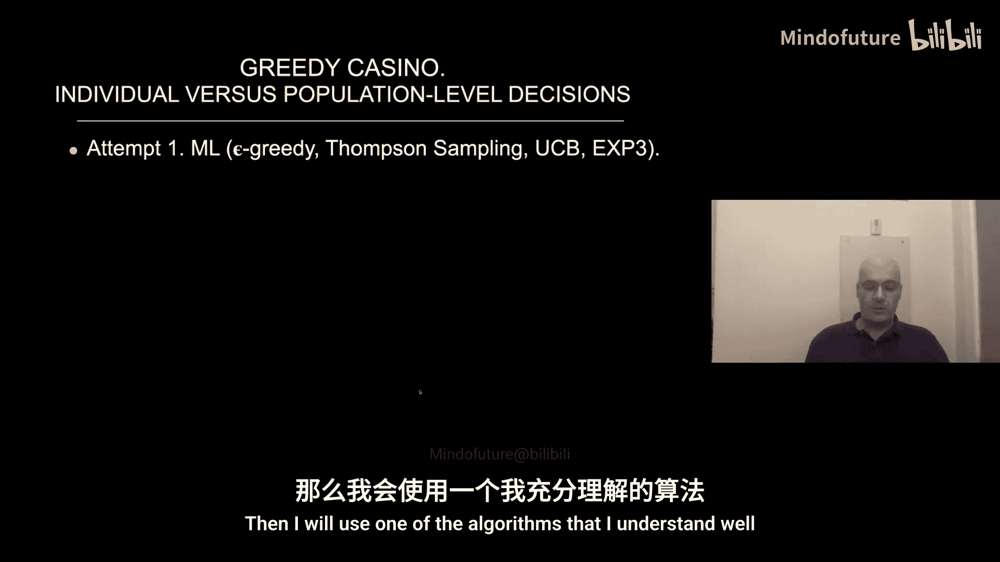

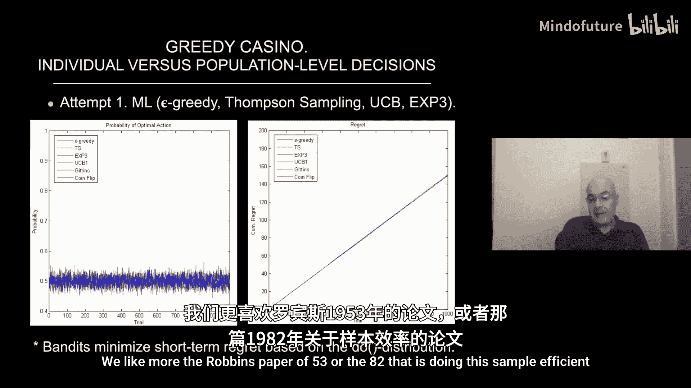

这是与我的朋友Andrew Forney和Uygar Sümbül的合作。按时间顺序，这是CRL中出现的第一个任务（约2014-15年）。智能体通常以反射方式行动，不考虑行为的原因或因果。在这种情况下，它们可能被利用而从未意识到。这是在线学习中的一个普遍现象，当智能体基于随机化进行优化时（即所有非因果/因果不敏感的设置，忽略因果结构），就会发生这种情况。

我们的目标是为智能体提供执行**反事实推理**的能力，将它们自己的意图考虑在内，这将导致基于反事实归一化的更精细的遗憾概念和新的优化函数（L3类型）。

反事实决策制定要回答的问题是：应该如何为特定单元U=u选择处理x*，以最大化期望奖励Y？我们感兴趣的不是平均效应E[Y | do(x)]（对所有人群平均），而是针对这个特定个体（具有特定年龄、性别、种族等）。一个次要问题是：如果你有观察性（L1）和实验性（L2）数据怎么办？应用场景很多：机器人开始拥有自己的意图时；个性化医疗；职业培训项目评估。

为了具体说明，我想谈谈“贪婪赌场”的例子，来自我们2015年的论文。赌场雇佣专家团队研究顾客行为，得出结论：决定因素是醉酒程度；醉酒者被更炫目的机器吸引，清醒者则避开它们。赌场有两种机器X0和X1，奖励Y（赢/不赢），未观测变量是机器是否闪烁(B)和顾客是否醉酒(D)。赌场根据这些发现设置了支付结构：如果机器闪烁且顾客醉酒，则支付较低；如果机器不闪烁且顾客清醒，支付也较低。换句话说，如果人们遵循他们的自然倾向，他们就会吃亏。这就是“陷阱”。

我们作为玩家，不知道这些。我们首先在赌场地板进行随机抽样（L1数据），收集了10000个数据点，发现E[Y | X=0] = E[Y | X=1] = 0.15。这低于规定的30%支付率，我们怀疑有问题。第二天，监管检查员进行了随机对照试验（RCT，L2数据），发现E[Y | do(X=0)] = E[Y | do(X=1)] = 0.3。赌场声称一切合规。

现在，我们作为机器学习学生，在第三天想玩这个游戏。我们应该怎么做？我们和普通顾客可交换吗？我们已经看到了数据，而他们没看过。假设我们可交换。如果我们只是随机选择（抛硬币），我们得到0.3的奖励。如果我们使用标准的bandit算法（如汤普森采样），基于do分布进行优化，结果令人失望：学习曲线几乎是线性的，选择正确动作的概率保持在0.5，和随机抛硬币一样。我们并不比检查员好。

在第四天，我们尝试运用因果推断知识，使用L3反事实。我们提出一个称为**反事实决策准则（RDC）** 的新准则：最大化 E[Y_{X=x1} | X=x0]。这个反事实句子的意思是：给定我即将玩机器X0，如果我玩了机器X1，我的结果会怎样？这被称为“对已处理者的处理效应”（ETT）。相比之下，之前我们优化的是E[Y | do(x)]，在L3符号中可写为E[Y_x]。

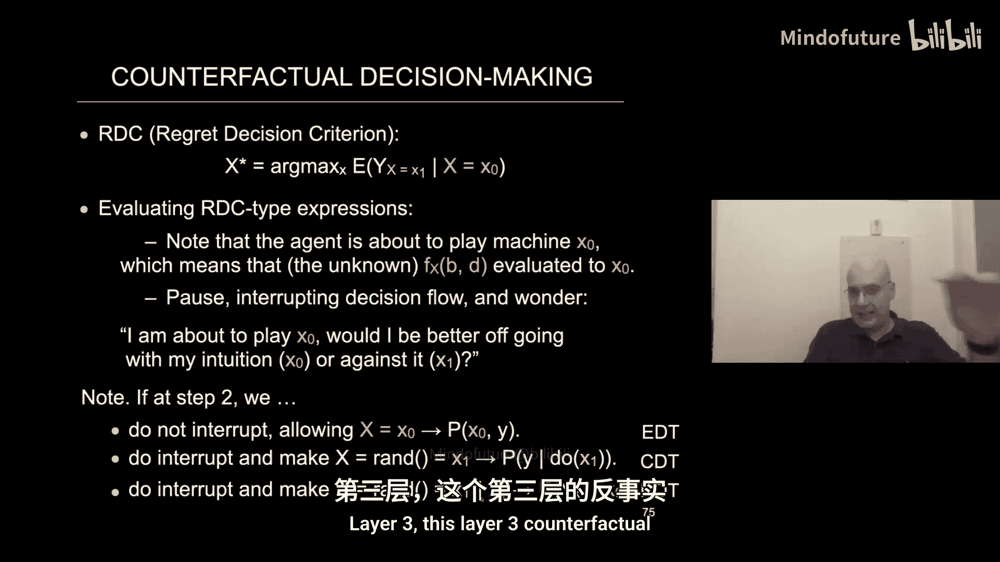

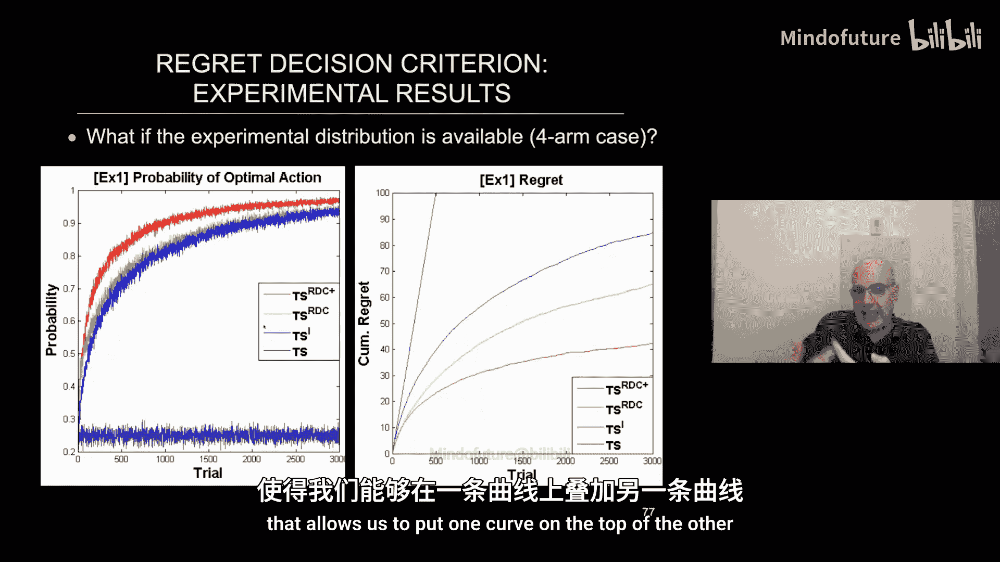

问题在于，反事实通常难以甚至不可能仅从数据评估，除非满足特殊条件（如二元变量、后门条件成立等）。那么，我们如何评估这样的表达式呢？

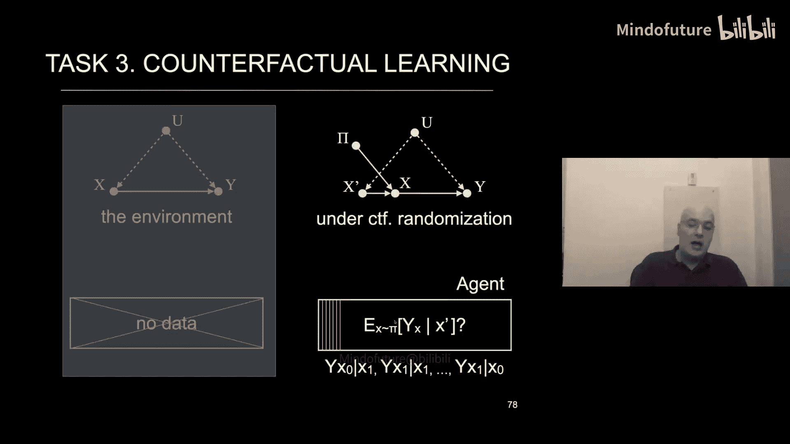

技巧在于：智能体即将玩机器X0，这意味着未观测函数f_x(B,D)即将被评估为X0。我们暂停决策流程，思考：我即将遵循我的直觉选择X0，我是应该遵循直觉，还是应该违背它选择X1？这是第一次我们可以设想AI在说：我即将做某事，但不知道原因。

如果我们不中断，让X=x0，那么我们就像第一天的“猴子”一样，产生了L1数据。如果我们中断并进行随机化（抛硬币），我们就消除了U的影响，得到了do分布（Fisher的RCT）。但我们在说别的东西：我们中断，进行随机化R，但设定期望行动为x0。为什么？因为x0包含了关于潜在空间的、我们无法访问的信息。可以证明，这恰好等于反事实E[Y_{x1} | X=x0]的含义。

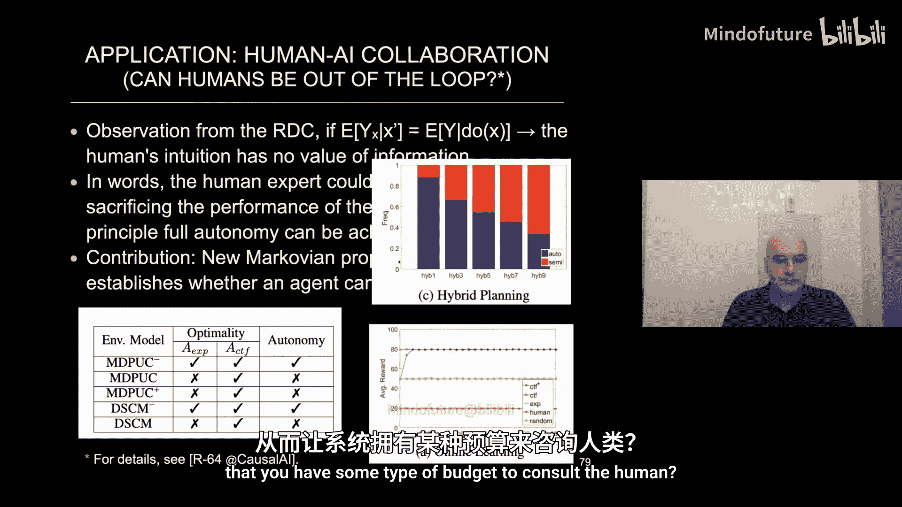

因此，我们主张这应该成为新的准则。如果你倾向于哲学或决策理论，这对应于某种决策理论（CDT与EDT）。RDC结合了两者。

如果我们这样做，我们得到蓝色学习曲线：我们能够收敛，最终学会最优策略。我们还可以利用第一天的观察数据（L1），获得一个提升，因为臂之间存在关系。一旦确立了程序的一致性，目标就是在此基础上加速收敛。我们可以结合观察性和实验性数据集，利用它们之间的约束，得到更好的曲线。

这项任务引入了一个新的策略π，它考虑了X'（对U的评估），并将U的评估与你在反事实归一化下承诺的行动分离开来。我们仍然需要随机化，但需要更聪明地理解其含义。

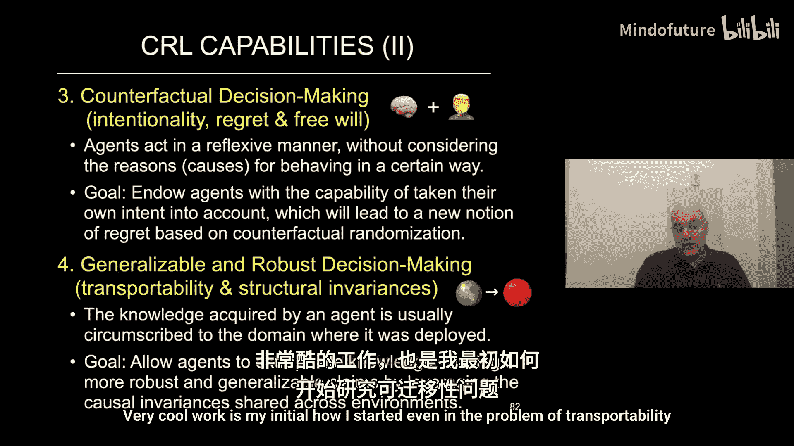

一个有趣的结果是关于**人机协作**的应用。一个简单观察来自RDC：如果Y_x | X' = Y | do(x)，那么人类的直觉没有价值。在这种情况下，人类专家可以在不牺牲系统性能的情况下被取代，至少在原则上可以实现完全自主。反之，如果等式不成立，即使人类表现比机器差，其直觉中仍存在可以被反事实智能体利用的“火花”。这是一个优美的结果。还有许多细化工作，例如，如果不能完全自主，是否可以半自主，在预算内咨询人类。

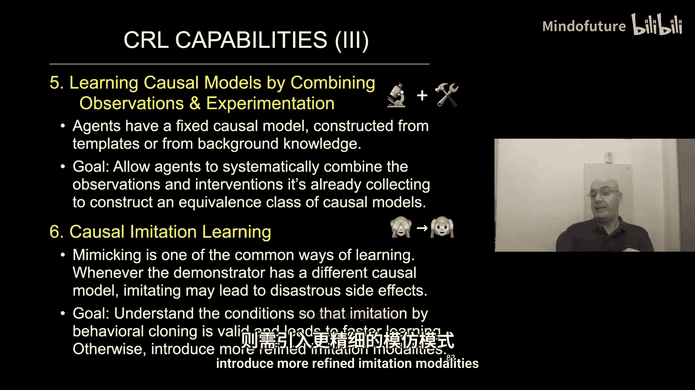

## 总结

在本节课中，我们一起学习了因果强化学习的三个核心任务。

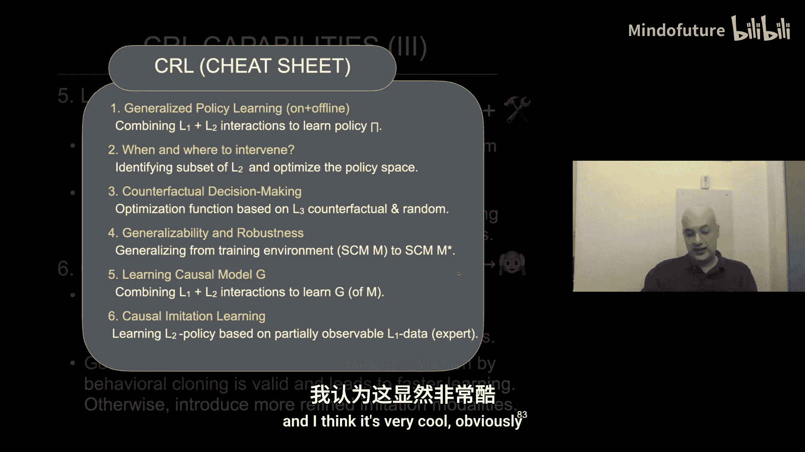

1.  **广义策略学习（GPL）**：我们探讨了如何结合有偏的观察数据（L1）和在线实验（L2）来更高效地学习策略。当传统离线学习的假设不成立时，通过因果边界估计利用观察数据作为先验，可以显著减少所需的探索。
2.  **何时及何处干预**：我们挑战了“干预总是有益”的假设，并展示了如何根据因果图精炼策略空间。通过识别最小干预集（MIS）和可能最优MIS（POMIS），智能体可以进行更精准、更高效的干预，避免不必要的副作用。
3.  **反事实决策制定**：我们引入了超越传统基于do的优化的新范式。通过让智能体进行反事实推理（“如果我做了不同的选择会怎样？”），并基于反事实决策准则（RDC）进行优化，智能体可以更好地理解自身意图，并在诸如“贪婪赌场”等复杂场景中实现更优的学习和决策。这为人机协作中的自主性判断提供了新的视角。

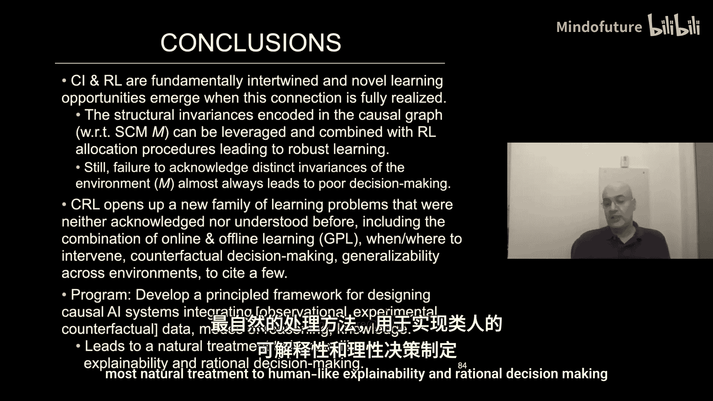

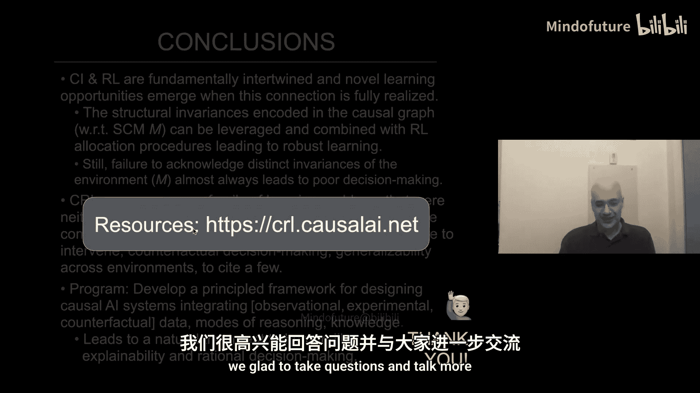

因果推断和强化学习是根本交织的，当这种联系被充分认识时，新颖的学习机会就会出现。编码在因果图中的关于底层SCM的结构信息，可以与我们的在线分配程序结合利用，从而实现鲁棒且高效的学习。反之，忽视环境独特的因果结构几乎总是导致糟糕的决策。CRL开启了一系列以前既未被承认也未被理解的新学习问题，包括在线与离线学习结合、何时何地干预、反事实决策制定、跨环境泛化、因果模仿学习等。最终目标是开发一个原则性框架，用于设计集成了观察性、实验性和反事实数据与推理模式的因果AI系统，这有望通向更类人的可解释性和理性决策。