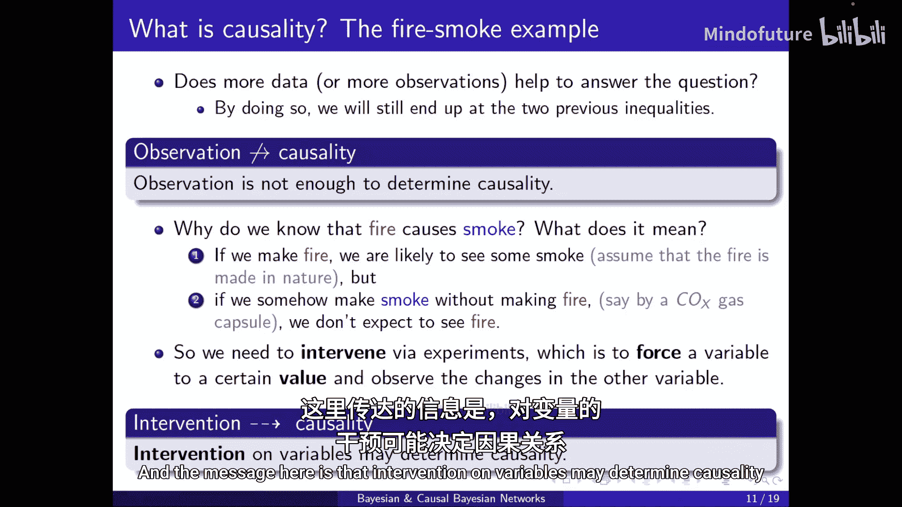
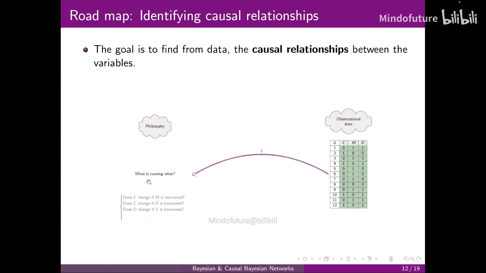
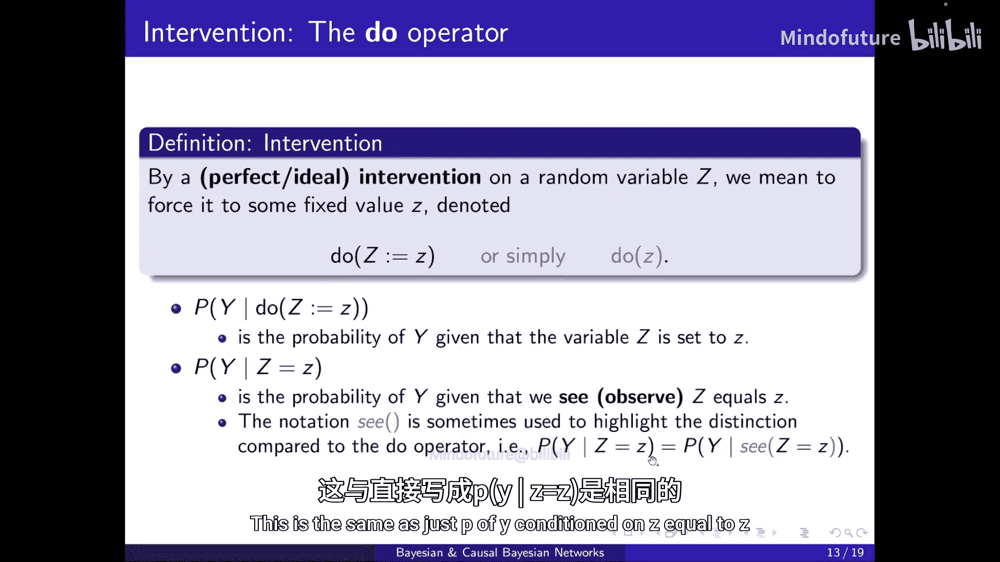
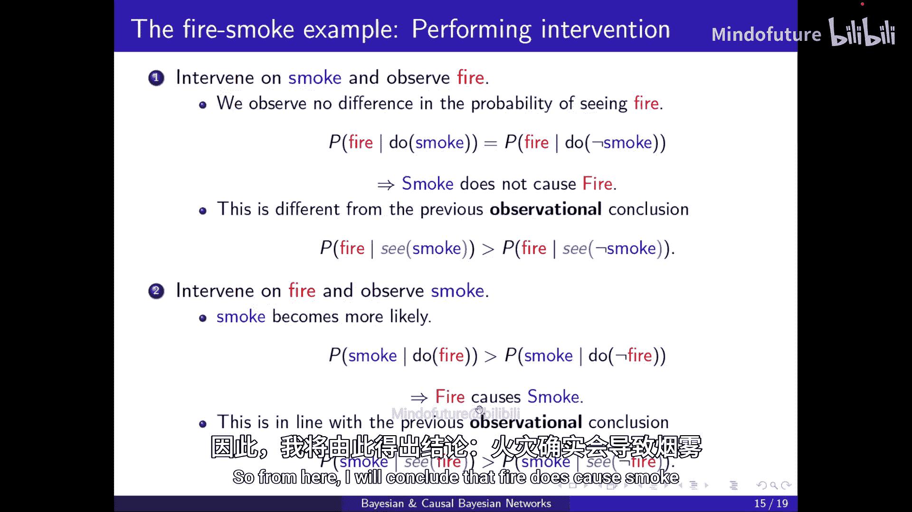
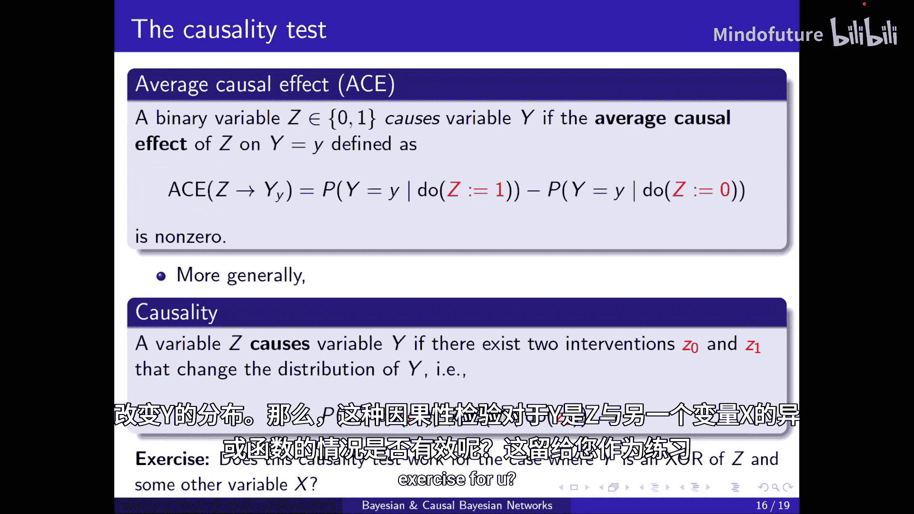
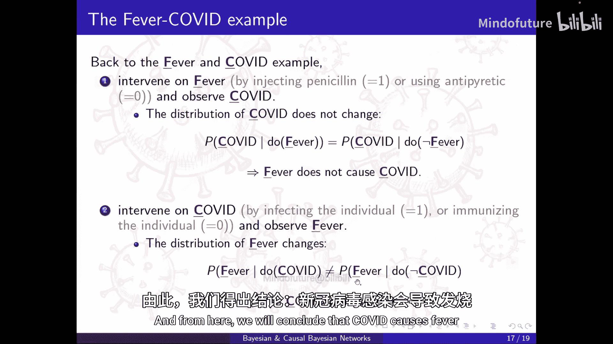
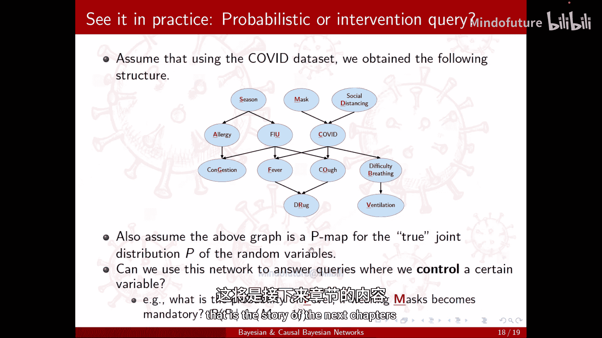
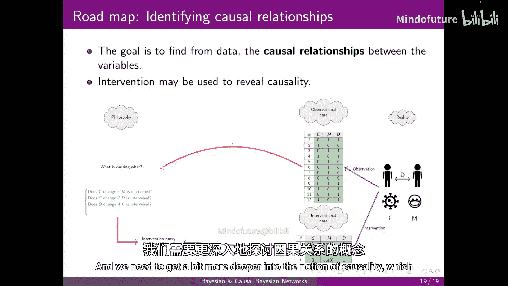

# 018：因果关系_2_干预 🔬

在本节课中，我们将要学习因果推断中的一个核心概念：**干预**。我们将通过具体的例子，理解为什么仅靠观察数据不足以确定因果关系，以及如何通过主动干预来揭示变量间的因果方向。

上一节我们探讨了从数据中识别因果关系的挑战，本节中我们来看看如何通过“干预”这一关键操作来突破观察的局限。

## 从观察到干预

考虑一个关于“火灾”和“烟雾”的例子。我们有两个二元变量：`Fire`（火灾）和 `Smoke`（烟雾），分别表示某个地点是否存在火灾和烟雾。

从观察数据中，我们可以得到以下结论：
*   一旦观察到烟雾，发现火灾的概率会比没有烟雾时更高。
*   如果知道某处有火灾，那么观察到烟雾的可能性也比没有火灾时更高。

因此，`Fire` 和 `Smoke` 之间存在统计依赖或相关性，我们无法断定它们相互独立。但究竟是谁导致了谁？是火灾引起了烟雾，还是烟雾引起了火灾？

收集更多观察数据无助于回答这个问题。因为从条件概率的角度看，`Fire` 和 `Smoke` 在观察数据中是对称的，无法区分因果方向。

## 干预：确定因果的关键 🔑

那么，“火灾引起烟雾”这个信息从何而来？答案是**实验**，即**干预**。

*   如果我们**制造**火灾（干预 `Fire`），很可能会看到烟雾。
*   但如果我们通过其他方式（例如释放一氧化碳气体胶囊）**制造**烟雾（干预 `Smoke`），而**不**制造火灾，我们并不期望会引发火灾。

因此，我们需要通过干预实验来强制设定某个变量的值，然后观察其他变量的变化。这不仅仅是纯粹的观察，而是需要对变量做出改变。核心信息是：**对变量的干预可能决定因果关系**。

回到我们的路线图，目标是从数据走向因果关系。目前我们拥有的是观察数据。上述讨论可以转化为更具体的问题：如果干预了变量 M，C 会改变吗？如果干预了变量 D，C 会改变吗？回答这些问题，就是回答“谁因谁果”的一种方式。

## 数学形式化：do-算子 📝

为了让概念更精确，我们引入数学符号。

通过一个**完美的理想干预**，我们意味着强制将一个随机变量 Z 设定为某个固定值 z。其记号为 **`do(Z = z)`** 或简写为 **`do(z)`**。双竖线 `||` 用于强调该变量被强制设定为此值。

现在，区分两个关键概念：
*   **`P(Y | do(Z=z))`**：这是在我们将变量 Z **干预**（设定）为值 z 的条件下，Y 的概率。
*   **`P(Y | Z=z)`**：这是我们**观察**到 Z 等于值 z 的条件下，Y 的概率。

请注意两者的区别。有时也会用符号 `C` 来强调这种区别，例如 `P(Y | C, Z=z)` 与 `P(Y | do(Z=z))` 含义相同。

## 回到火灾与烟雾的例子

当干预一个变量时，需要确保没有其他变量被同时干预。

以下是干预 `Smoke` 的方法：
*   **`do(Smoke = true)`**：通过释放一氧化碳气体胶囊来产生烟雾（**不能**通过点火，否则也干预了 `Fire`）。
*   **`do(Smoke = false)`**：通过抽吸等方式防止烟雾。

以下是干预 `Fire` 的方法：
*   **`do(Fire = true)`**：通过点火产生火灾（同时**不能**产生一氧化碳气体）。
*   **`do(Fire = false)`**：防止火灾发生。

现在，我们可以进行因果测试：

1.  **干预烟雾，观察火灾**：
    *   无论我制造烟雾还是防止烟雾，火灾的概率**不会**改变。
    *   由此可以得出结论：**烟雾不会导致火灾**。
    *   注意，这与观察性结论 `P(Fire | Smoke=true) > P(Fire | Smoke=false)` 不同。

2.  **干预火灾，观察烟雾**：
    *   如果我制造火灾，相比防止火灾时，更有可能观察到烟雾。
    *   由此可以得出结论：**火灾会导致烟雾**。
    *   这与观察性结论 `P(Smoke | Fire=true) > P(Smoke | Fire=false)` 一致。

## 因果效应的正式定义

对于一个二元变量 Z，如果其**平均因果效应**不为零，则称 Z 对变量 Y 有因果效应。

**平均因果效应** 定义为：
`ACE(Z -> Y) = P(Y | do(Z=1)) - P(Y | do(Z=0))`

如果 `ACE` 不为零，则存在从 Z 到 Y 的因果效应。

更一般地，如果存在对 Z 的两种不同干预（例如 `do(Z=z0)` 和 `do(Z=z1)`），能改变 Y 的分布，那么变量 Z 就是变量 Y 的一个原因。

## 应用于发烧与新冠的例子 🤒

回顾之前的例子，我们有变量 COVID（新冠感染）和 Fever（发烧）。

*   **干预发烧**：通过药物强制退烧或引发发烧，然后观察新冠感染情况。结果：新冠的分布**不会**改变。因此，**发烧不会导致新冠**。
*   **干预新冠**：通过感染或免疫来干预个体是否患新冠，然后观察发烧情况。结果：发烧的分布**会**改变（感染新冠后更可能发烧）。因此，**新冠会导致发烧**。

## 回答上一节的问题

在上一节，我们提出了一个问题：“如果强制戴口罩，这个人会发烧吗？”

根据本节所学，我们知道这个问题对应的不是观察性查询 `P(Fever | Mask=1)`，而是**干预性查询** `P(Fever | do(Mask=1))`。

我们了解到可以通过实际干预（实验）来回答这个问题。但如何从我们已有的因果图模型中推导出这个答案？这将是后续章节要讲述的内容。

## 总结与路线图展望

让我们再次回到从数据到因果关系的路线图。

我们了解到，解释因果关系的一种方式是通过干预。从现实世界（如社会、许可、新冠、口罩）中，我们可以收集两种数据：
1.  **观察性数据**：被动记录所得。
2.  **干预性数据**：通过主动实验所得。

通过干预性数据，我们可以直接回答像 `P(C | do(...))` 这样的干预查询。然而，如何从观察性数据和因果图模型出发，来回答干预查询，中间还有许多需要深入探讨的内容，例如更深入的因果模型概念。这将是下一节的重点。

**本节课中我们一起学习了**：为什么观察不足以确定因果关系；如何通过“干预”实验来揭示因果方向；引入了 `do`-算子来形式化干预的概念；定义了平均因果效应作为因果关系的检验标准；并通过火灾-烟雾、新冠-发烧的例子巩固了这些概念。干预是连接数据与因果推断的核心桥梁。