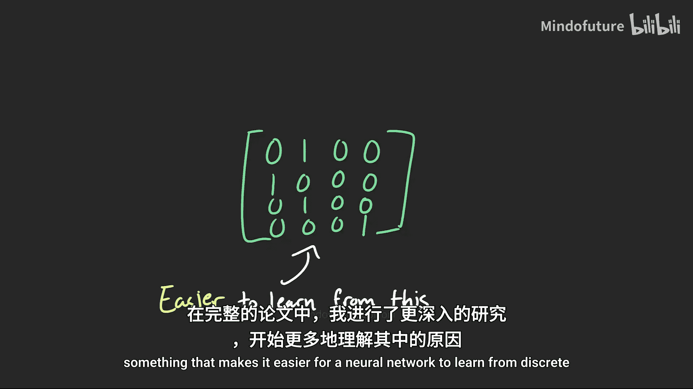
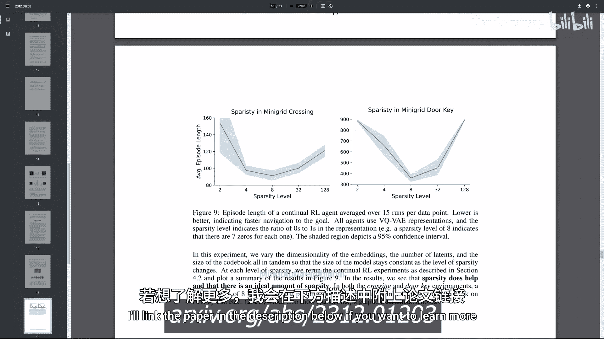

# 019：离散表征在模型与策略学习中的作用 🧠

在本节课中，我们将要学习表征学习与基于模型的强化学习（Model-based RL）的核心概念，并深入探讨一个具体问题：**离散表征**（Discrete Representations）为何以及如何影响智能体的学习过程。我们将通过对比实验，分析离散表征在**世界模型学习**和**策略学习**两个核心环节中的表现。

---

## 概述

过去两年，我的研究聚焦于两个核心领域：**表征学习**和**基于模型的强化学习**。表征学习关注如何将现实经验（例如，参加微积分课）转化为对人工智能体有意义的数字形式。基于模型的强化学习则旨在创建能够学习世界内部模型，并通过“想象”来学习的智能体。

大约一年前，Dreamer V3算法的发布成为了一个关键节点。尽管它不是首个基于模型的RL算法，但它在约150种不同环境（从机器人到《我的世界》）中都表现出色，尤其是在过去模型方法表现不佳的领域。Dreamer V3的一个独特设计是使用了**离散表征**，这与主流的**连续表征**截然不同。这引发了一个核心研究问题：**离散表征真的有效吗？如果有效，它是如何起作用的？**

为了解答这个问题，我们需要将复杂的系统分解。在基于模型的强化学习中，主要包含两个核心组件：**世界模型（模型学习）** 和**策略（将观察映射为行动）**。因此，我们的探索将分为两部分：
1.  离散表征如何影响世界模型的学习？
2.  离散表征如何影响策略的学习？

---

## 世界模型学习实验 🧪

上一节我们介绍了研究背景和核心问题，本节中我们来看看离散表征对**学习世界模型**的影响。

我们使用一个基于像素的“迷你网格”（Minigrid）环境进行实验。智能体的目标是：拾取钥匙、打开门、然后到达绿色标记的目标点。为了增加难度，我们会偶尔强制智能体采取随机行动。

以下是建立世界模型并进行对比的实验流程：

首先，我们收集环境中的大量样本数据（状态转移序列）。

接着，我们使用这些观察数据训练一个**自编码器**。自编码器是一种试图重建输入观察的神经网络，其关键在于网络中部存在一个比输入和输出维度都小的“瓶颈层”。为了准确重建原始观察，网络必须学会在压缩数据的同时，保留编码该观察所需的重要信息。这个自编码器会输出**潜在状态**，记为 `Z`，它是观察的压缩版本。

然后，我们以潜在状态 `Z` 和行动 `A` 作为输入，训练一个**世界模型**来预测下一个潜在状态 `Z‘`。这得到了一个**单步模型**。通过将这个模型反复应用于新预测的状态，我们可以预测任意步长后的未来。

为了评估模型，我们对比了三种轨迹可视化：
*   **基准（Ground Truth）**：智能体在真实环境中的行为轨迹。
*   **连续表征世界模型**：使用连续潜在状态的模型进行“想象”的轨迹。
*   **离散表征世界模型**：使用离散潜在状态的模型进行“想象”的轨迹。

实验发现，使用离散表征的世界模型所产生的想象轨迹，更接近真实基准轨迹。智能体能够更快地拾取钥匙、开门并到达目标。这表明，在模型架构相同的情况下，基于离散表征学习的世界模型**预测更准确**。

然而，这个结果引出了新的疑问：为什么连续模型不够准确？有两种可能：
A. 离散表征赋予了模型某种连续模型天生缺乏的能力。
B. 实验中使用的世界模型规模较小，连续模型可能只是**容量不足**，无法学习环境的全部信息。

为了验证，我们通过增加参数来扩大两个世界模型的容量，并绘制了模型大小与预测误差的关系图。结果显示，当模型较小时，离散模型误差更低；但随着模型容量增加，**两者都收敛到了相近的、近乎完美的性能水平**。

这证实了答案是 **B**：在模型容量不足以完美建模世界时（这在现实世界或任何有趣的问题中是常态），离散表征表现得更好。这意味着，**离散表征允许模型用更少的容量学习到更多关于世界的知识**。

---

## 策略学习实验 🎯

在了解了离散表征对模型学习的影响后，我们接下来探讨它对**学习策略**的作用。

我们沿用上一节的方法来获取连续和离散表征。然后，我们需要在这些表征之上学习一个策略。具体流程如下：在每个时间步，智能体从环境获得观察，通过编码器（连续或离散）将其转换为潜在状态 `Z`，然后使用PPO等算法学习一个策略，将 `Z` 映射到能使其更接近目标的行动 `A`。

通过对比两种智能体达到目标所需的平均步数（学习曲线），我们发现：两者最终都收敛到了相同的、约20步到达目标的最优解。但是，**基于离散表征学习的策略，其收敛速度比连续表征快2到3倍**。两种基于表征的方法都显著优于直接从原始观察（像素）学习策略的基线方法。

然而，这里存在一个关键问题：在实际的强化学习中，我们通常没有现成的、已学习好的表征，而是需要**策略与表征同时学习**。当我们进行这样的“同时学习”实验时，情况发生了变化：基于离散表征的策略学习**初期显著落后**。

原因是，学习离散表征的 **VQ-VAE** 其学习速度慢于学习连续表征的普通自编码器。那么，这是否意味着离散表征无用？并非 necessarily。

---

## 迈向持续学习：离散表征的潜力 🔄

之前的实验都在简单的“迷你网格”环境中进行，这个世界很小，智能体有可能学会所有可能发生的情况。我们这样做是为了剥离干扰因素，专注于核心问题。

但我从事RL研究，是因为对更复杂、更真实的问題感兴趣。在这些问题中，世界如此庞大和复杂，你永远无法经历所有情况或学习一个完美的世界模型。在这种**无法学会一切**的范式下，游戏的名字是**适应**，关键在于遇到新事物时的**在线学习**。这正需要**持续学习**的能力。

我提出，离散表征可能非常适合持续学习。在模型学习实验中，我们看到当模型无法学会一切时，离散表征表现更好。在策略学习实验中，虽然离散表征导致初期学习较慢，但未来更快的学习和适应能力，有可能抵消缓慢的初始学习阶段。

为了验证这一点，我们定期改变迷你网格环境的布局，迫使智能体进行适应。观察每次环境变化后的学习曲线（图中竖虚线表示变化点），我们发现：**在初始表征学习阶段之后，基于离散表征的策略在每次环境变化后，其适应速度都 consistently 快于基于连续表征的策略**。

是的，学习这些特定的离散表征确实需要更长时间。但一旦学会，它们能更快地适应和学习新知识。无论是在模型学习还是策略学习中，似乎都有一些非常有趣的事情发生，使得神经网络**更容易从离散表征中学习**。

---

## 总结

本节课中，我们一起学习了表征学习与基于模型强化学习的基础，并深入探究了离散表征的作用。

1.  **在世界模型学习方面**：当模型容量有限时（这是普遍情况），离散表征能帮助学习到更准确的世界模型，即用更少的参数编码更多有效信息。
2.  **在策略学习方面**：如果已有学习好的表征，基于离散表征的策略收敛更快。若需策略与表征同时学习，离散表征初期较慢，但**在需要持续适应变化环境的场景中，它展现出更强的长期适应能力和学习效率**。

核心结论是：离散表征并非在所有情况下都是“银弹”，但它在处理**复杂、非稳态、需要持续学习**的现实世界问题时，显示出独特的潜力和优势。在完整论文中，我还深入探讨了其背后原因，例如稀疏性和二元性所扮演的角色。如果你对此感兴趣，可以通过描述中的链接查阅论文。

感谢观看。