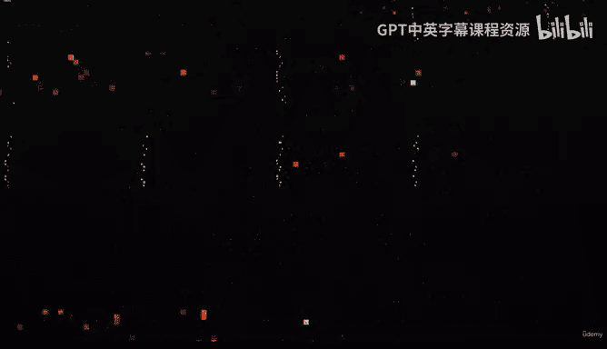
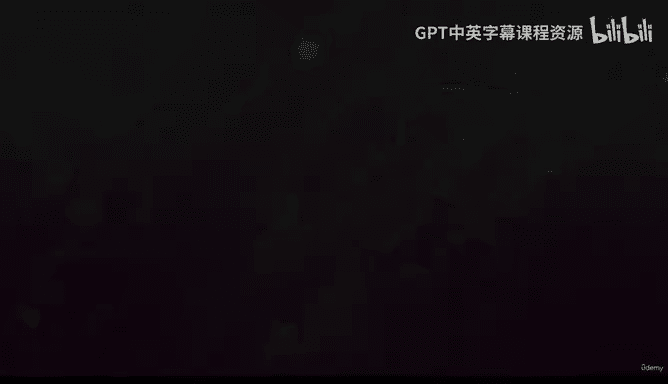

# 1：欢迎来到PyTorch世界 🚀

在本节课中，我们将要学习什么是PyTorch，为什么它在当今的机器学习和人工智能领域如此重要，以及本课程将如何帮助你从零开始掌握这一强大的工具。

---

## 概述：什么是PyTorch？🤔

机器学习与数据科学已是当今世界最热门的领域，现在是时候更进一步了。欢迎来到学习PyTorch并成为深度学习大师的最佳殿堂。

如果你还不了解PyTorch，这里为你介绍：**PyTorch是一个用Python代码编写的机器学习框架**。它使你能够构建最先进的深度学习算法，例如神经网络，这些算法为当今许多人工智能应用提供动力。

这听起来很厉害，因为PyTorch目前正炙手可热。我不仅仅是指它的标志名称，它正被特斯拉等领先科技公司用于构建其自动驾驶汽车的计算机视觉系统，被Meta用于为其内容时间线提供内容筛选和理解系统，被苹果用于创建计算增强摄影，甚至被用于自动化除草拖拉机。

此外，许多最新的机器学习研究都是使用PyTorch代码完成和发表的。因此，懂得如何编写和阅读PyTorch代码意味着你将处于该领域的前沿。

---

## 学习方法：在实践中学习 💻

你知道最好的学习方式就是动手实践，对吗？那么，请将本课程视为一个PyTorch动力构建器。我们将以学徒制的方式，肩并肩、逐行地一起编写PyTorch代码，帮助你学习作为数据科学家或机器学习工程师每天都会用到的PyTorch技能。

我们将从最基础的知识开始，所以即使你是机器学习的新手，也能快速跟上进度。

---

## 课程路线图：我们将探索什么？🗺️

上一节我们介绍了PyTorch的基本概念，本节中我们来看看本课程将涵盖的核心内容。

我们将探索更高级的领域，包括：
*   **PyTorch工作流程**
*   **PyTorch神经网络分类**
*   **计算机视觉**
*   **自定义数据集**
*   **实验跟踪**
*   **模型部署**
*   以及我个人最喜欢的：**迁移学习**——一种强大的技术，可以将一个机器学习模型在另一个问题上学习到的知识应用到你的问题上。

在此过程中，你将围绕一个名为“FoodVision”的总体项目构建三个里程碑式的项目。FoodVision是一个用于对食物图像进行分类的神经网络计算机视觉模型。

以下是这些里程碑项目将带来的好处：
*   帮助你练习使用PyTorch，同时涵盖重要的机器学习概念。
*   创建一个你可以展示给雇主的作品集，并告诉他们：“这就是我所做的。”

---

## 课程目标与讲师介绍 🎯

在本课程结束时，你将拥有丰富的PyTorch实践经验，并能自如地参与公共PyTorch项目、构建你自己的PyTorch项目，并在奇妙的机器学习世界中加速你的职业生涯。

差点忘了自我介绍，我是Daniel Bourke，你的PyTorch讲师。我是一名自学成才的机器学习工程师，曾在澳大利亚发展最快的人工智能公司之一工作。现在，我向全球成千上万的学生教授最新、最受欢迎的机器学习技能。

在本课程中，我们将一起学习掌握PyTorch。我希望你能够像机器学习工程师一样思考和处理机器学习问题。这样，当需要你作为一名机器学习工程师应用新技能时，你已经有了大量的实践。

---

## 总结：你准备好了吗？✨

本节课中我们一起学习了PyTorch的定义、其行业重要性以及本课程的结构和目标。

因为这就是我们的目标，对吗？如果你想学习机器学习职业所需的技能，如果你想学习被特斯拉和苹果等公司使用的最流行的机器学习框架，如果你喜欢通过实践来学习，如果你想掌握PyTorch，那么你来对地方了。

我们课程里见。让我们开始编码吧！