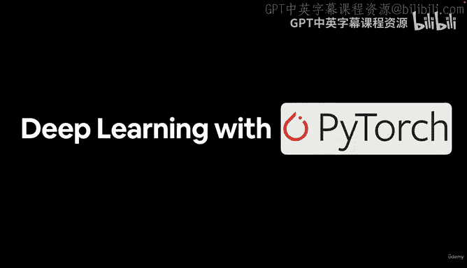
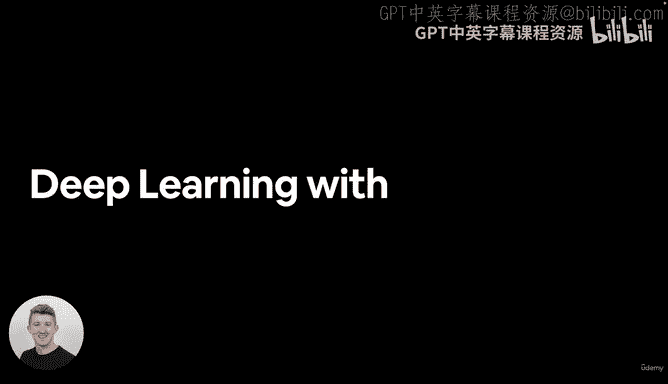
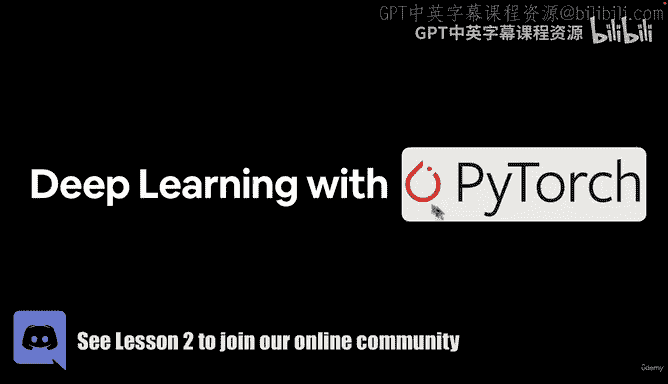
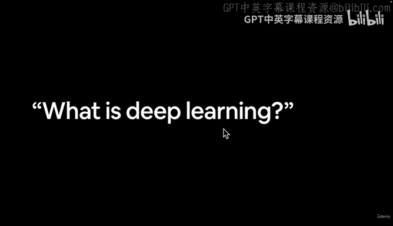
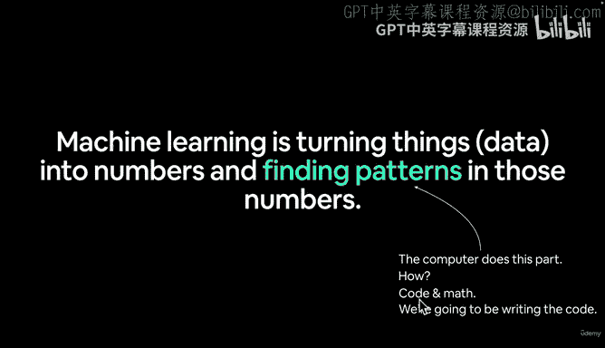
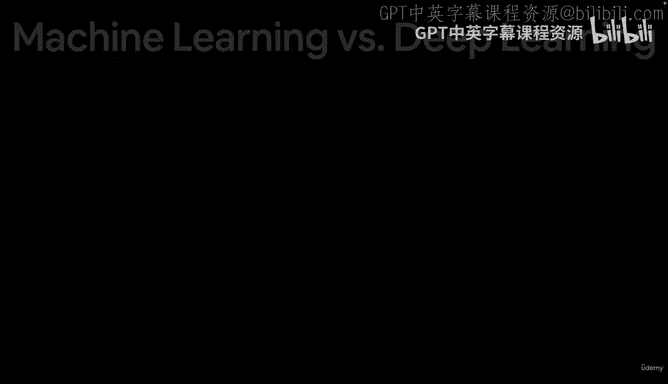
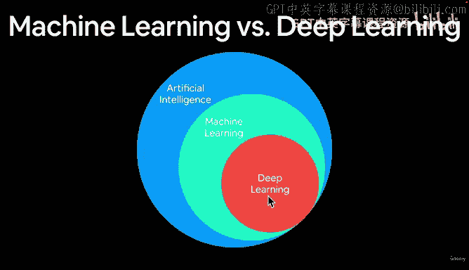
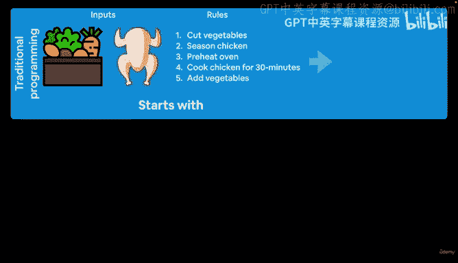
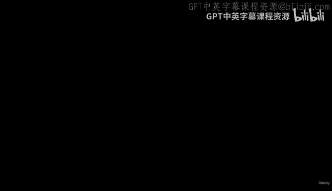

# 2：欢迎与深度学习简介 🚀

在本节课中，我们将学习深度学习的基本概念，了解它与机器学习和传统编程的区别，并为后续的实践操作打下基础。

## 概述

我是Daniel，欢迎来到PyTorch深度学习课程。本课程将重点介绍如何使用PyTorch进行深度学习。我们将从核心概念入手，但更侧重于动手实践和编写代码，而非仅仅停留在理论定义上。

## 什么是机器学习？ 🤔

机器学习是将各种形式的数据（如图像、文本、数字表格、视频、音频文件）转化为计算机可以处理的数字，并从中寻找规律的过程。计算机通过机器学习算法或深度学习算法来完成这一任务，这些算法本质上是由代码和数学构成的。

本课程以代码为核心。我们将编写大量代码来实现各种功能，这些代码背后会触发相应的数学运算来发现数据中的规律。如果你想深入了解代码背后的数学原理，我会提供额外的学习资源链接。

## 机器学习 vs. 深度学习

为了更清晰地理解，我们来分解一下这些概念。人工智能是一个广泛的领域，机器学习是它的一个子集，而深度学习又是机器学习的一个分支。

我们将在本课程中使用PyTorch，专注于编写深度学习代码。当然，PyTorch也可用于许多其他机器学习任务。实际上，我经常交替使用“机器学习”和“深度学习”这两个术语。虽然机器学习范畴更广，深度学习更具特定性，但本课程的重点不在于精确定义，而在于理解它们如何运作。

## 传统编程与机器学习范式

如果你熟悉机器学习的基础知识，可能了解这个范式，但我们还是简要回顾一下。

在传统编程中，我们通过编写明确的规则来处理输入并产生输出。例如，要编写一个能复现祖母著名烤鸡菜肴的程序，我们需要输入食材（如蔬菜和鸡肉），并编写一系列明确的规则（如切菜、给鸡肉调味、预热烤箱、烤制30分钟、加入蔬菜）。这些输入与规则相结合，最终产出烤鸡这道菜。

相比之下，典型的机器学习算法接收一些输入和期望的输出，然后自行找出连接输入与输出的规则（即规律）。在传统编程中，我们需要手动编写所有规则；而理想的机器学习算法会自动构建从输入到理想输出之间的桥梁。

在机器学习领域，这通常被称为**监督学习**，因为你会有一些带有对应输出的输入（也称为特征和标签）。机器学习算法的任务就是找出输入（特征）与输出（标签）之间的关系。

例如，要编写一个机器学习算法来学习祖母的烤鸡食谱，我们需要收集大量食材（输入）和对应的成品照片（输出），然后让算法尝试找出从食材到成品的转换方法。

以上就是传统编程与机器学习在定义上的主要区别。我们将在整个课程中动手编写这类算法。

## 为什么使用机器学习或深度学习？

在进入下一个视频之前，请思考一个问题：与传统编程相比，你为什么会想使用机器学习算法？

回想一下我们刚刚看到的传统编程与机器学习的范式区别。如果需要手动编写所有规则，是否会变得非常繁琐？请思考这个问题，我们将在下一个视频中探讨答案。

## 总结

本节课我们一起学习了深度学习的基本定位，了解了机器学习是**将数据转化为数字并寻找其规律**的过程，并明确了深度学习是机器学习的一个子集。我们还对比了**传统编程（手动定义规则）** 与**机器学习（算法从数据中学习规则）** 的核心范式差异，为后续的实践课程做好了准备。