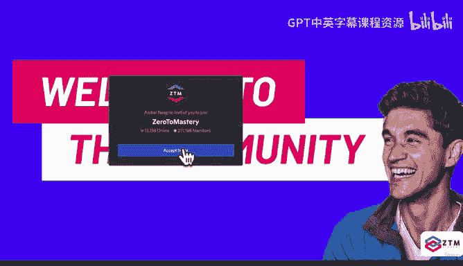
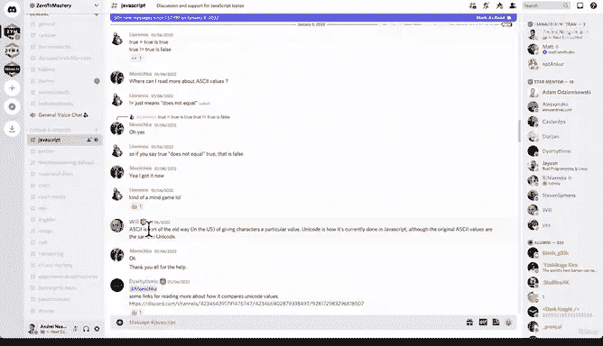
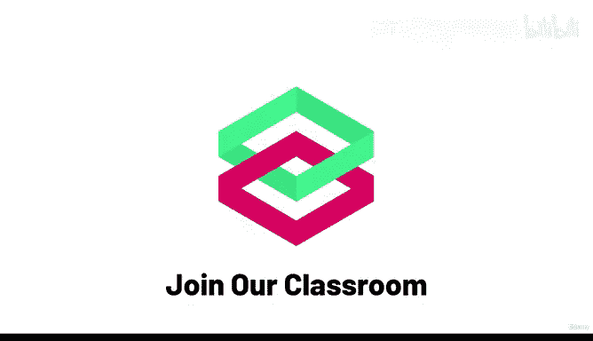

# 3：003_01_003 加入我们的在线课堂！🎓

在本节课中，我们将探讨如何通过加入在线学习社区来提升课程完成率与学习效果。我们将介绍一个包含三个步骤的行动计划，帮助你建立学习责任感，并融入一个积极互助的学习环境。

---

大多数学习者难以独自完成在线课程。这是因为在家学习的舒适环境缺少了一个关键要素：**责任感**。停止去实体学校上学比停止观看在线课程要困难得多。

然而，有一种方法可以确保你完成课程，无论课程变得多难。我们教授的正是这些因难以掌握而极具价值的技能。完成课程意味着掌握这些技能，否则便是浪费你的投入。

为了显著提高你的成功几率，你需要采取一个可能让你略感不适但极其有效的行动：**加入我们的在线课堂**。

在下一讲中，我将提供一个仅供ZTM学员使用的私密链接。在那里，你需要完成以下三件事：

以下是三个关键步骤：

1.  **自我介绍**：在社区中介绍自己。你可以自由选择分享多少个人信息。同时，设定一个目标：“我将在 `[此处填写日期]` 前完成X课程”，并将这个日期记入你的日历。
2.  **寻找学习伙伴**：前往“责任伙伴”频道，寻找一位目前正在同时开始学习ZTM课程的人（课程不必相同）。你们可以结成多个伙伴。目标是确保彼此都能完成课程和设定的目标。
3.  **参与社区交流**：在通用聊天室中畅所欲言。此外，还有针对特定课程的频道供你讨论。置身于志同道合的学习者中，能帮助你保持动力，找到班级的归属感。

在社区中，我们还将定期举办由我本人、其他ZTM讲师和学员参与的线上聚会。我建议你在学习过程中保持Discord服务器开启。

这不是推销，而是学习的基本事实：**在群体中学习、被其他学习者环绕、拥有责任感，你更有可能成功**。

最后，在整个学习过程中，当你遇到问题或挑战时，请不要放弃。回到我们的Discord服务器提问并寻求帮助。但更重要的是，当你开始掌握技能并成长时，请回到这里帮助其他学员。**教授和帮助他人是巩固所学知识的最佳方法之一**。

如果你能围绕学习建立这样的例行程序——打开Discord、开始听课、让自己置身于拥有相似目标的人群中——你将拥有完成课程所需的责任感和支持系统。我向你保证。

还有一个有趣的环节：当你完成课程后，你可以在“校友”频道发布你的结业证书，成为校友。社区中表现突出的成员甚至有机会成为明星导师。

这一切听起来或许有些傻，你可能会说自己不需要任何人。但请相信我们多年的经验：那些完成课程、找到工作并在职业生涯中取得成功的学习者，往往都遵循了这一模式。**有时，成功需要你去做一些不那么舒适的事情**。

---

本节课中，我们一起学习了如何通过加入在线学习社区来克服独自学习的挑战。我们介绍了通过**自我介绍、寻找学习伙伴和积极参与讨论**来建立责任感和支持系统的具体方法。记住，在群体中学习能显著提高你的成功率。我们下一讲再见，也期待在社区中见到你！