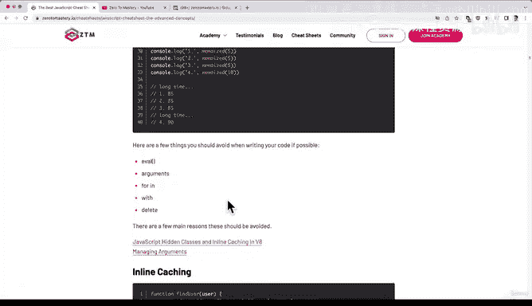
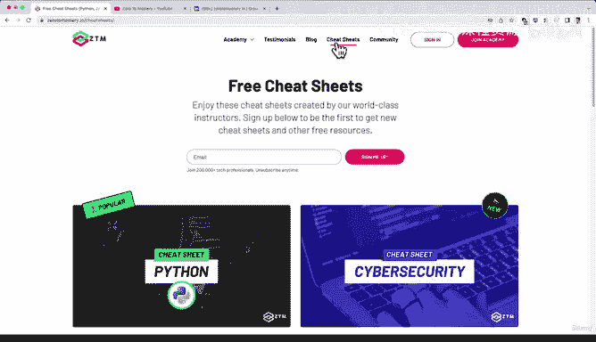
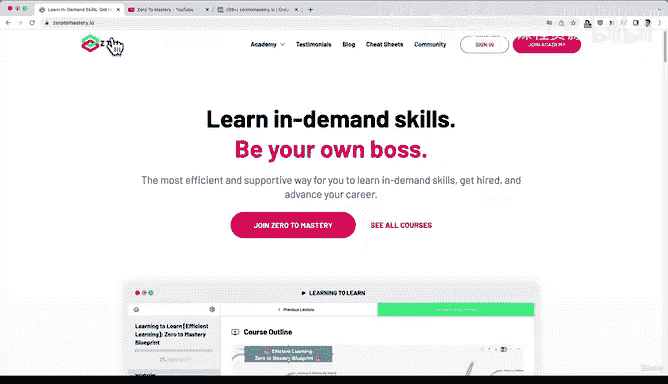

# 4：ZTM社区资源指南 🎁

在本节课中，我们将了解作为ZTM学员可以获得的额外免费资源和福利。这些资源旨在帮助你更好地学习、实践、建立联系并紧跟技术潮流。

上一节我们介绍了课程的基本结构，本节中我们来看看ZTM为学员提供的丰富社区与学习资源。

## 社区与活动

作为ZTM学员，你将加入一个庞大的技术爱好者和学习者社区。社区提供了多种互动和练习机会。

以下是社区提供的主要活动与资源：

*   **编程挑战**：你可以在官网的“社区”板块找到编程挑战，用于练习和巩固技能。
*   **开源项目**：ZTM学员可以参与为社区成员开放的开源项目。
*   **Discourse论坛**：我们拥有Discourse服务器，供学员交流讨论。
*   **线上校园活动**：这是一个虚拟直播课堂，你可以在这里结识其他学员并进行交流。
*   **年度活动**：我们全年会举办诸如“Advent of Code”或“Hacktoberfest”等活动。

## 学习辅助材料

除了社区活动，ZTM还提供了系统的学习辅助工具，帮助你更高效地掌握知识。

以下是主要的学习辅助材料：

*   **速查表**：这些速查表完全免费，无需注册即可使用。你可以打开与你所学课程相关的速查表（例如JavaScript速查表）进行对照学习或记笔记。我们每月都会新增一份速查表，你可以根据兴趣随时查看。
*   **技术博客**：我们的博客每周会发布2-3篇博文，内容涵盖广泛，包括面向初学者的教程、行业深度文章、求职技巧以及不同讲师的观点分享等。博客设有不同标签，如“初学者入门”、“职业进阶”等，方便你按需阅读。

## 行业动态与职业发展

为了帮助你从海量信息中高效获取行业精华，并规划职业路径，ZTM提供了以下专项资源。

以下是相关的资讯与规划工具：

*   **月度行业简报**：每月，我和其他ZTM讲师会撰写行业月度回顾，总结当月重要动态、推荐最佳阅读资源并提炼核心要点，将信息消化为一篇博文。目前我们提供**Web开发者月度简报**、**Python月度简报**、**机器学习月度简报**和**区块链开发者月度简报**，未来还会增加更多领域。
*   **职业路径指南**：如果你在寻找特定的职业方向，这个工具会为你提供建议，包括学习路径、求职时机以及各职业所需的技能水平。该网站同样免费，无需注册。

## 社交与额外渠道

最后，ZTM还建立了社交平台和视频渠道，以拓展你的职业网络并获取更多免费学习内容。

以下是两个重要的社交与学习渠道：

1.  **LinkedIn群组**：我们为所有学员建立了LinkedIn群组。如果你想完善LinkedIn档案、与其他学员互荐技能、获取职业建议，这里是一个绝佳的起点。群组内经常分享职位空缺、职业技巧，并互相进行技能认可。
2.  **YouTube频道**：我们最近启动了名为“0 to Mastery”的YouTube频道，每周发布3-4个免费视频，涵盖各种主题。你可以随时查看，未来一年还会有更多内容上线。

本节课中我们一起学习了作为ZTM学员所能享有的全部额外资源，包括活跃的社区、实用的学习工具、前沿的行业资讯以及拓展职业网络的渠道。请善用这些资源，祝你在学习之旅中一切顺利，再次欢迎加入ZTM！