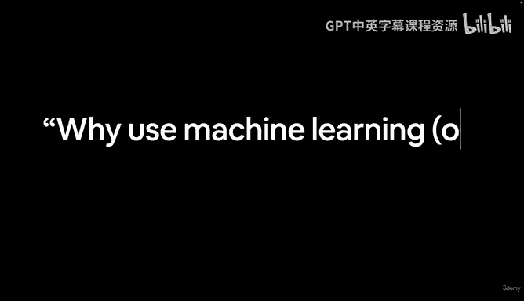
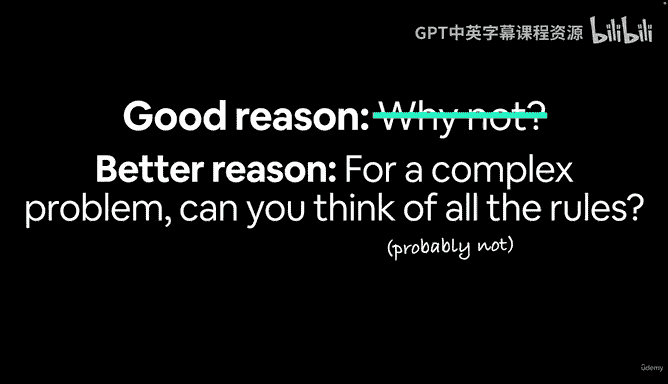
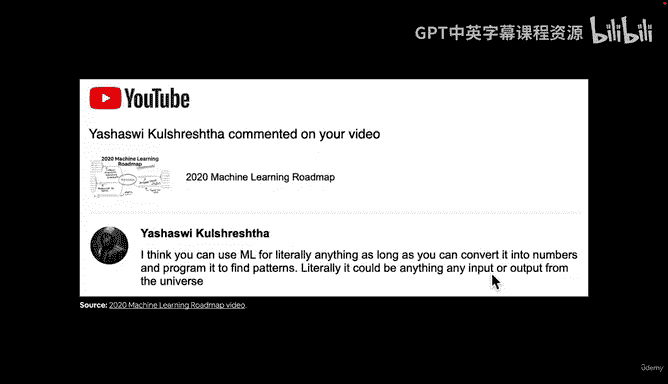
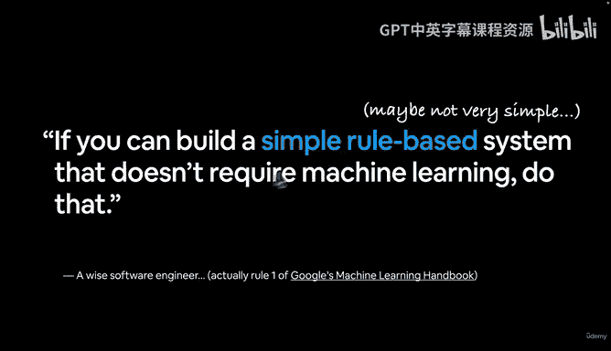
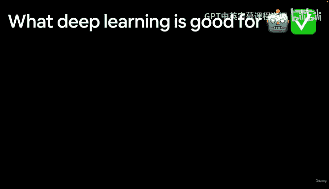

#  5：为何使用机器学习或深度学习？🤔

在本节课中，我们将探讨为何要选择使用机器学习或深度学习，而不是传统的编程方法。我们将通过具体例子来理解其适用场景，并介绍一条重要的指导原则。

---

欢迎回来。在上一节视频中，我们简要介绍了传统编程与机器学习之间的区别。

同样，我不想在定义上花费太多时间。我更希望你能在实践中看到这些概念。

我留给你一个问题：为何要使用机器学习或深度学习？

让我们思考一个充分的理由。为什么不呢？我的意思是，如果我们每次都必须编写所有那些手写规则来复现艾丽西娅祖母的烤鸡菜肴，那将相当繁琐，对吧？

让我们就此划清界限。为什么不呢？一个更好的理由，正如我们刚才所说，是针对复杂问题。你能想出所有规则吗？

让我们想象一下，我们正试图制造一辆自动驾驶汽车。如果你学过开车，你可能花了大约20小时或100小时。但现在我给你一个任务：写下关于驾驶的每一条规则。

*   你如何从自家车道倒车出来？
*   你如何左转并驶入街道？
*   你如何进行倒车入库？
*   你如何在十字路口停车？
*   你如何知道去某处该开多快？

我们刚刚列出了半打规则。但你很可能还能想出更多，甚至可能达到数千条。

因此，对于像驾驶这样的复杂问题，你能想出所有规则吗？很可能不能。

这就是机器学习和深度学习发挥作用的地方。

这是一条我很喜欢分享的、来自我某个YouTube视频下的精彩评论。

这是我的2020年机器学习路线图。这条评论来自Yahuwi（我可能读错了）。Yahuwi说：“我认为你可以将机器学习（顺便说一下，我将在课程中频繁使用ML这个缩写，ML即机器学习）用于几乎任何事情，只要你能将其转化为数字。” 这正是我们之前所说的：机器学习是将事物转化为计算机可读的数字，然后编程让其寻找模式，只不过在机器学习算法中，通常是我们编写算法，然后由算法（而不是我们）来发现模式。

因此，从字面上看，它可以是任何事物。宇宙中的任何输入或输出。这正是机器学习非常酷的一点。

但是，仅仅因为它能用于任何事情，你就应该总是使用它吗？

接下来，我想向你介绍谷歌的机器学习第一法则。

如果你能构建一个简单的基于规则的系统，例如我们之前提到的、将食材映射到西西里祖母烤鸡菜肴的那五个步骤规则，如果你能仅用五个步骤就做到这一点，并且每次都能奏效，那么你很可能应该那么做。

所以，如果你能构建一个不需要机器学习的简单规则系统，那就去做。

当然，也许问题并不那么简单，但也许你仍然可以编写一些规则来解决你正在处理的问题。

这是一位睿智的软件工程师提出的，我之前也暗示过这一点。这是谷歌机器学习手册的第一条法则。我强烈建议你通读它，但我们不会在本视频中详细讨论。你可以去搜索一下，或者链接会在你获取资源的地方提供。

请记住这一点：尽管机器学习非常强大、有趣且令人兴奋，但这并不意味着你应该总是使用它。我知道在深度学习与机器学习课程的开头说这个有点特别，但我只是希望你记住：简单的基于规则的系统仍然很好。机器学习并非解决一切问题的万能药。

现在，让我们看看深度学习擅长什么。但我要留一个悬念作为家庭作业，因为我们将在下一个视频中探讨这个问题。

下课。