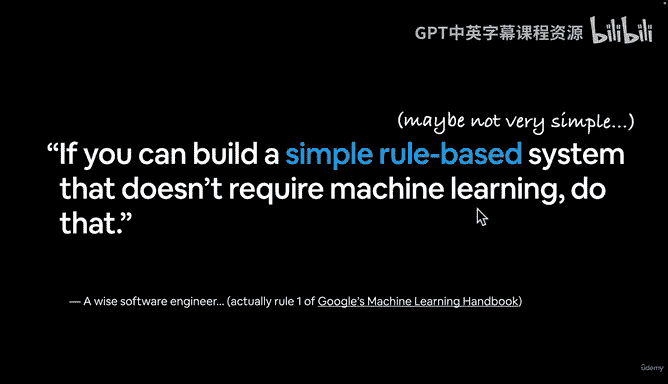
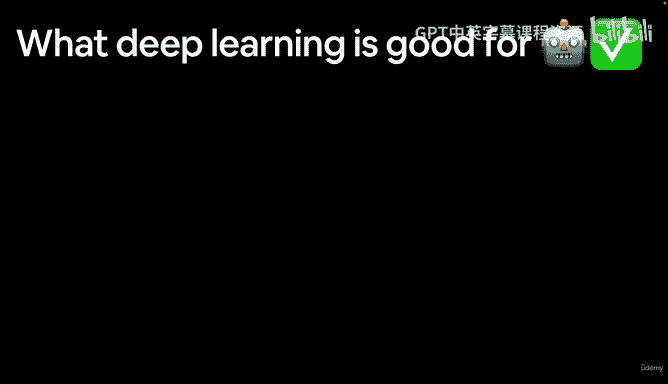
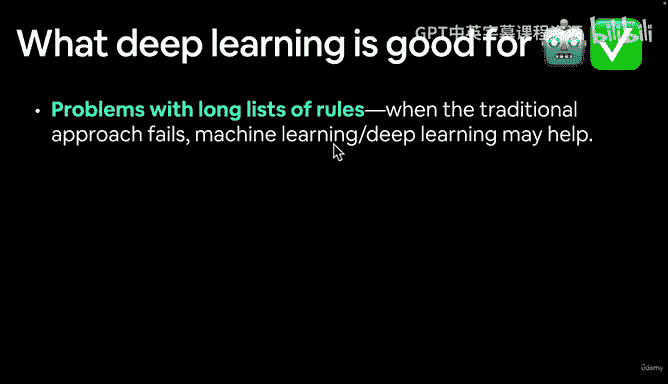
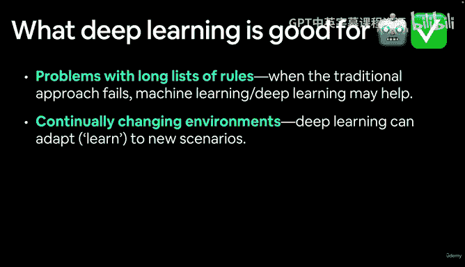
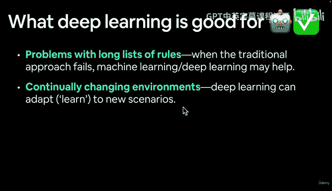
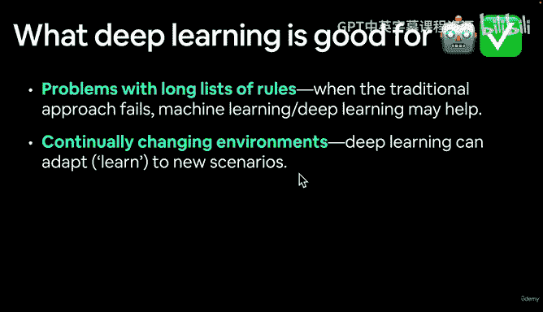
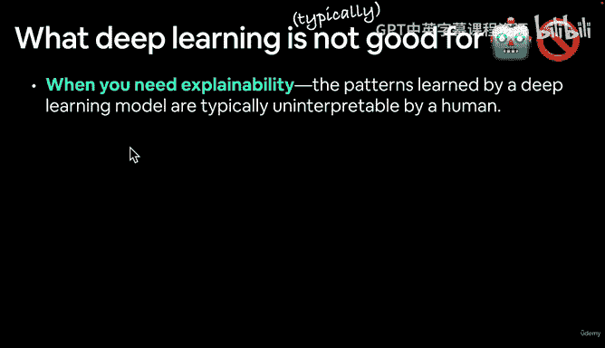
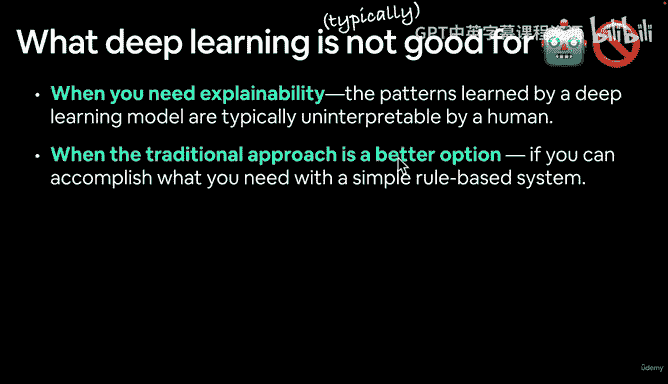
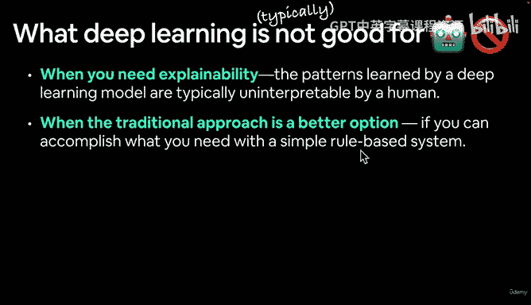
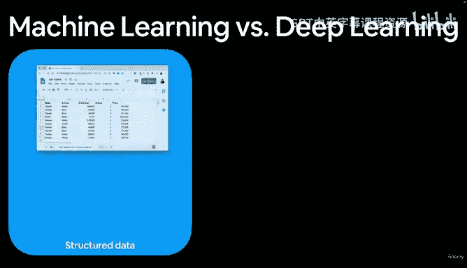

# 6：机器学习首要法则与深度学习适用场景 🎯

在本节课中，我们将学习机器学习的首要法则，并探讨深度学习适合与不适合的应用场景。理解这些原则有助于我们在实际项目中做出更明智的技术选择。

## 概述

上一节我们介绍了机器学习的基本概念。本节中，我们将深入了解谷歌提出的机器学习首要法则，并分析深度学习技术最适合解决哪些类型的问题，以及哪些情况下应避免使用它。

## 机器学习首要法则

谷歌提出的首要法则是：**如果你不需要使用机器学习，就不要使用它**。

这意味着，在考虑采用机器学习或深度学习解决方案之前，应首先评估传统方法是否足够。只有当传统方法无法有效解决问题时，才应考虑引入更复杂的学习算法。

## 深度学习的适用场景

以下是深度学习技术通常能发挥优势的几种情况：

**规则列表冗长的问题**
当传统方法失效时，深度学习可能提供帮助。传统方法通常涉及：输入数据 -> 编写一系列规则处理数据 -> 得到已知输出。然而，对于规则极其复杂的问题，例如驾驶汽车的规则（可能涉及成百上千甚至数百万条规则），编写和维护这样的规则列表将非常困难。这正是当前自动驾驶领域广泛采用机器学习和深度学习作为前沿解决方案的原因。

**环境持续变化的问题**
深度学习的一个优势在于其持续学习的能力。模型可以适应并学习新的场景。例如，如果你更新了模型训练所用的数据，模型能够调整以适应未来不同类型的数据。这类似于驾驶汽车：你可能非常熟悉自己的社区，但当你前往一个从未去过的地方时，虽然可以依赖已知的驾驶基础，但仍需适应新的速度限制、停车位置等具体情况。

**拥有大型数据集的问题**
深度学习在当今科技世界中蓬勃发展，很大程度上得益于海量数据的存在。例如，Food-101数据集包含了101种不同食物的图像。试想一下，如果要构建一个能识别101种不同食物的应用程序，编写区分它们的规则列表将会极其冗长。仅以香蕉为例，你不仅需要编码香蕉的外观特征，还需要编码所有“非香蕉”事物的特征。对于这类问题，让模型从数据中自动学习模式比手动编写规则更为高效。

综上所述，深度学习擅长处理：**规则列表冗长的问题、环境持续变化的问题，以及从海量数据集中发现洞察的问题**。

## 深度学习的不适用场景

需要注意的是，深度学习并非万能钥匙。以下情况通常不适合采用深度学习（这里使用“通常”一词，因为具体问题需要具体分析，且技术也在不断发展）：

**需要可解释性的场景**
深度学习模型学习到的模式，通常体现为大量称为“权重”和“偏置”的数字（我们后续会详细讨论）。这些模式对人类而言通常是难以解释的。有些模型拥有数百万、数千万甚至数万亿个参数（参数即模型从数据中学到的数字模式）。理解一个涉及数百万个数字的列表是极其困难的。

**传统方法是更好选择的场景**
这再次呼应了机器学习的首要法则。如果你能用简单的基于规则的系统实现目标，那么可能根本不需要机器学习或深度学习。

**错误不可接受的场景**
深度学习模型的输出并不总是完全可预测的。它们是概率性的，意味着模型进行预测时，实际上是在做一个概率性的“赌注”。而基于规则的系统，其输出每次都是确定可知的。因此，如果应用场景无法承受由概率性错误带来的风险，那么可能应该回归使用简单的规则系统。

**数据量不足的场景**
深度学习模型通常需要相当大量的数据才能产生优异的结果。当然，这里也有例外，存在一些技术可以在数据量不大时也能取得良好效果，我们后续会看到。

需要强调的是，以上列举的是“通常”情况。例如，你可以研究“深度学习可解释性”领域来寻找提高模型透明度的技术；也可以查阅具体案例来比较机器学习与深度学习的适用性；通过大量测试，也能在一定程度上确保模型的可靠性和可重复性。技术是不断发展的，保持开放的心态很重要。

## 总结与过渡

本节课中，我们一起学习了机器学习的首要法则，并探讨了深度学习技术适用与不适用的主要场景。关键在于根据具体问题的特性（如规则复杂性、环境变化性、数据规模、可解释性要求和容错率）来权衡技术选型。

下一节，我们将进一步对比机器学习与深度学习，并依据所有处理的数据类型，来了解不同的机器学习问题领域。我们将在下个视频中详细介绍这些丰富多彩的内容。