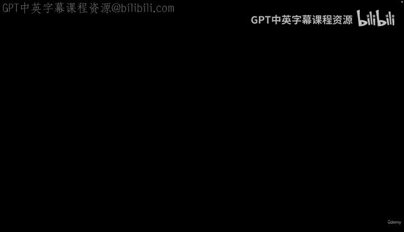
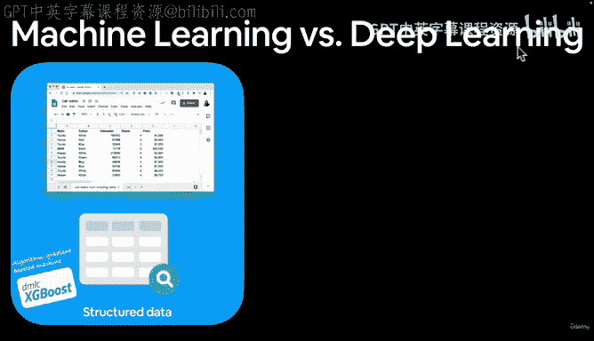
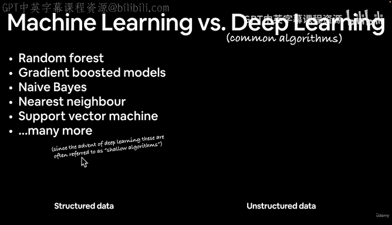
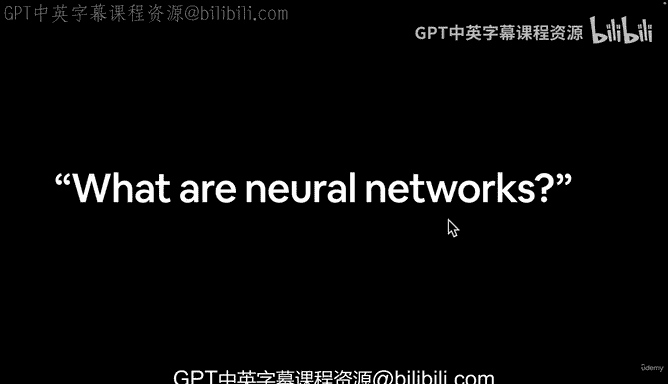

# 7：机器学习与深度学习对比 🤖🧠

在本节课中，我们将要学习机器学习与深度学习之间的核心区别。我们将探讨它们各自适用的数据类型、常用算法，并理解为何在某些场景下选择一种方法优于另一种。

上一节我们介绍了深度学习的适用场景与不适用场景。本节中我们来看看机器学习与深度学习之间的具体对比。

## 结构化数据与传统机器学习 📊

传统机器学习算法通常适用于**结构化数据**。结构化数据指以行和列组织的数据，例如表格数据。

以下是处理结构化数据的常用算法：
*   随机森林
*   梯度提升机（例如 **XGBoost**）
*   朴素贝叶斯
*   K-近邻算法
*   支持向量机（SVM）

在这些算法中，**XGBoost** 是处理结构化数据时备受青睐的算法，常见于数据科学竞赛和生产环境。

## 非结构化数据与深度学习 🌌

深度学习则通常更擅长处理**非结构化数据**。非结构化数据没有固定的行列结构，形式多样。

常见的非结构化数据类型包括：
*   自然语言文本（如社交媒体帖子、维基百科文章）
*   图像数据
*   音频文件

处理这类数据，通常会使用某种**神经网络**。

## 深度学习常用算法 🧬

深度学习之所以称为“深度”，是因为其模型可以包含许多层。常见的神经网络类型包括：
*   全连接神经网络
*   卷积神经网络（CNN）
*   循环神经网络（RNN）
*   变换器（Transformer）

神经网络的魅力在于，其架构几乎可以针对不同问题无限变化和组合。

## 选择之道：艺术与科学的结合 🎨🔬

需要明确的是，机器学习与深度学习的应用边界并非绝对。根据具体问题的表征方式，上述许多算法可以交叉使用。选择何种方法，部分是科学，部分是艺术。

本节课中我们一起学习了机器学习与深度学习的核心区别：传统机器学习算法（如XGBoost）通常更适用于结构化数据，而深度学习神经网络则更擅长处理非结构化数据。同时，我们也了解到在实际应用中，根据问题灵活选择最佳方法至关重要。