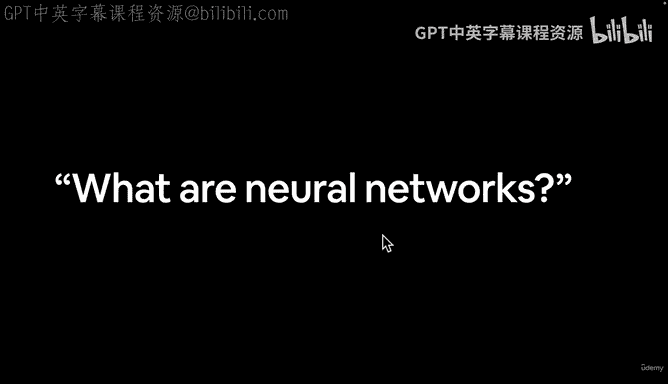
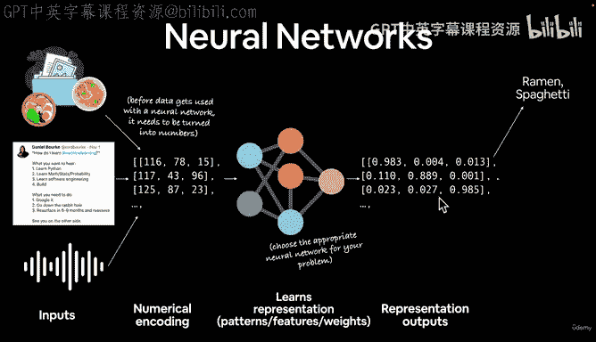
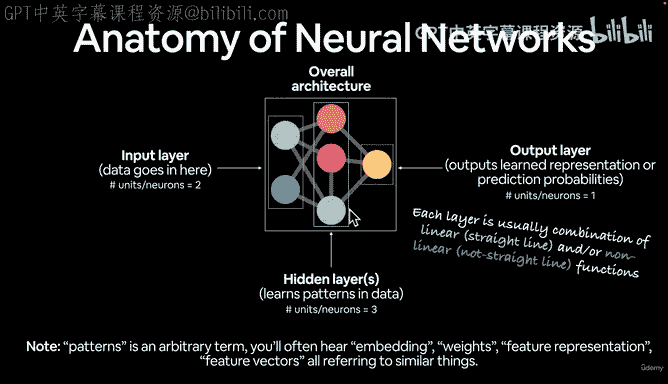
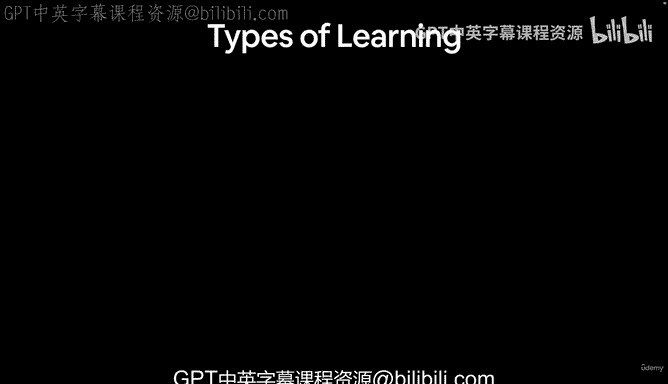

# 8：神经网络结构解析 🧠

在本节课中，我们将要学习神经网络的基本结构。我们将从定义神经网络开始，逐步解析其组成部分，并了解数据如何在其中流动。通过本课程，你将掌握神经网络的核心概念及其工作原理。

---

欢迎回来。在上一个视频中，我留下了一个悬念问题：什么是神经网络？我建议你去搜索这个问题。但你可能已经搜索过了。现在，我们一起搜索一下。

如果我输入“什么是神经网络”，我已经搜索过了。什么是神经网络？解释神经网络。神经网络定义。网上有数百种类似的定义。五分钟了解神经网络。3Blue1Brown。我强烈推荐该频道关于神经网络的系列视频，这将在课外资源中提及。StatQuest 也非常棒。

这里有数百种不同的定义。你可以阅读其中10个、5个或3个，然后形成自己的定义。但为了本课程，我将这样定义神经网络。

我们有一些数据，可能是食物图像、推文或自然语言，也可能是语音。这些是非结构化数据的输入示例，因为它们不是行和列。这些是我们拥有的输入数据。

那么，我们如何在神经网络中使用它们呢？在数据可用于神经网络之前，需要将其转换为数字。人类喜欢看拉面和意大利面的图片。我们知道那是拉面，那是意大利面，看过一两次后就能识别。我们喜欢阅读好的推文，喜欢听美妙的音乐或听朋友在音频文件中说话。

然而，在计算机理解这些输入内容之前，需要将其转换为数字。这就是我所说的数值编码或表示。这个数值编码用方括号表示它是矩阵或张量的一部分，我们将在本课程中深入实践。

我们有了输入，将其转换为数字，然后将其传递给神经网络。这是神经网络的图形表示。然而，神经网络的图形表示可能会相当复杂。但它们都代表相同的基本原理。

例如，在这个图形中，我们有一个输入层，然后有多个隐藏层。你可以根据需要设计这些层。然后我们有一个输出层。因此，我们的输入将以某种数据形式进入。隐藏层将对输入执行数学运算，即对数字进行操作。然后我们将得到输出。

3Blue1Brown 的“从零开始的神经网络”视频非常棒，强烈推荐你观看。但回到这里。

我们有了输入，将其转换为数字，并将其输入神经网络。这通常是输入层、隐藏层。你可以根据需要设置任意多个不同的层。每个小点称为一个节点。这里有很多信息，但我们将通过实践来了解其外观。

然后我们得到某种输出。你应该使用哪种神经网络？你可以为问题选择适当的神经网络，这可能涉及手动设计每个步骤，或者你可以找到在类似问题上有效的神经网络。例如，对于图像，你可能使用卷积神经网络（CNN）；对于自然语言，你可能使用Transformer；对于语音，你可能也使用Transformer。但基本上，它们都遵循输入、操作、输出的相同原则。

因此，神经网络将自行学习一种表示。我们不会定义它学习什么。它将以某种方式操纵这些模式。当我说学习表示时，我也将其称为学习数据中的模式。很多人称之为特征。特征可能是单词“do”通常跟在“how”之后，跨越多种语言。特征几乎可以是任何东西。同样，我们不定义这个，神经网络自行学习这些表示、特征，也称为权重。

然后我们从那里去哪里？我们有一些数字，数值编码将数据转换为数字。我们的神经网络学习了一种它认为最能代表数据模式的表示。然后它输出这些表示输出，我们可以使用它们。你经常会听到这些被称为特征、权重矩阵、权重张量，学习表示也是另一个常见术语。这些东西有很多不同的术语。

然后，它将输出。我们可以将这些输出转换为人类可理解的输出。例如，如果我们看这些，这些可能是表示或模式。神经网络单独可以有数百万个数字，这里只有9个。想象一下，如果这些是数百万个不同的数字，我几乎无法理解这里的九个数字。因此，我们需要一种方法将这些转换为人类可理解的术语。

对于这个例子，我们可能有一些输入数据，即食物图像，然后我们希望神经网络学习拉面图像和意大利面图像之间的表示，最终我们将获取它学习的模式，并将其转换为它认为这是拉面图像还是意大利面图像。对于这条推文，它是自然灾害推文还是非自然灾害推文。

因此，我们的神经网络已经，我们已经编写代码将其转换为数字，通过神经网络传递。神经网络学习了一些模式。然后我们理想地希望它将这条推文表示为非灾害。然后我们可以编写代码执行这里的每个步骤。对于语音输入也是如此，将其转换为你可能对智能扬声器说的话，但我不说，因为我的许多设备可能会启动。

现在，让我们介绍神经网络的解剖结构。我们已经暗示过这一点，但这是神经网络解剖101。同样，这个东西实际上是高度可定制的。我们稍后将在PyTorch代码中看到它，但数据进入输入层，在这种情况下，单元/神经元/节点的数量是2。

隐藏层，你可以有多个。我在这里加了一个“S”，因为你可以有一个隐藏层，而深度学习中的“深度”来自于拥有许多层。这里只显示了四层。你可能有很多层，例如ResNet-152有152个不同的层。所以，你可以有很多隐藏层。这里我们只画了一个。在这种情况下，有三个隐藏单元/神经元。然后我们有一个输出层。因此，输出学习表示或预测概率，取决于我们如何设置。我们稍后会看到这些是什么。在这种情况下，它有一个隐藏单元。所以是2个输入，3个隐藏，1个输出。你可以自定义这些的数量，自定义有多少层，自定义输入什么，自定义输出什么。

现在，如果我们讨论整体架构，这是描述所有层的组合。所以当你听到神经网络架构时，它指的是输入层、隐藏层（可能不止一个）和输出层。这是整体架构的术语。

我说模式是一个任意术语，你可能听到嵌入、权重、特征表示、特征向量，都指类似的东西。所以，我们如何将数据转换为某种数值形式？构建一个神经网络来找出模式，输出我们想要的期望输出。

现在，更技术性地说，每一层通常是线性和非线性函数的组合。线性函数是直线，非线性函数是非直线。如果我让你用无限直线和非直线画任何你想要的东西，你可以使用直线或曲线。你能画出什么样的模式？在基本层面上，这基本上就是神经网络所做的。它使用直线和非直线的组合来绘制数据中的模式。我们稍后会看到这是什么样子。

在下一个视频中，让我们简要介绍不同类型的学习。我们已经研究了神经网络是什么，整体算法，但神经网络学习也有不同的范式。我们下个视频见。