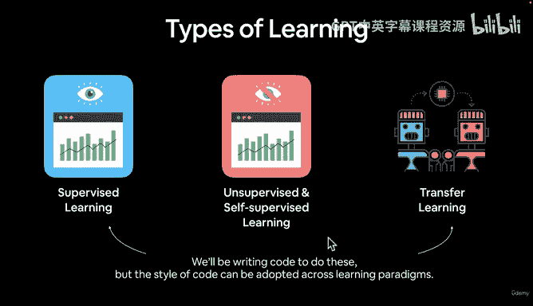
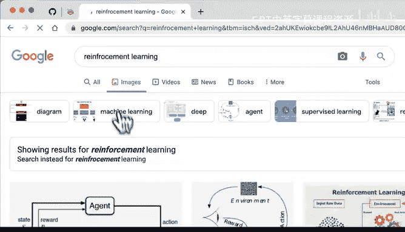
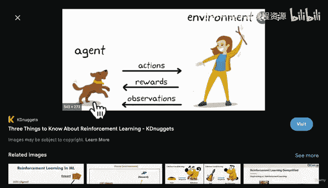
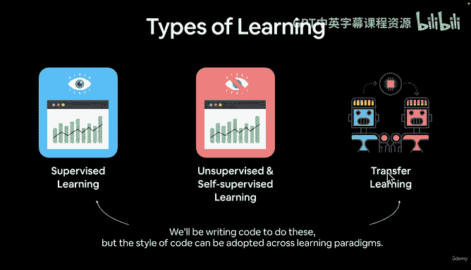
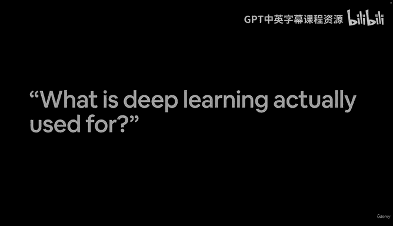

# 9：不同类型的学习范式 🧠

在本节课中，我们将要学习机器学习与深度学习中的几种核心学习范式。理解这些范式是构建有效模型的基础。

上一节我们简要介绍了神经网络的基本结构，本节中我们来看看不同类型的学习范式。

## 概述：主要学习范式

机器学习主要包含以下几种学习范式：
*   监督学习
*   无监督学习与自监督学习
*   迁移学习
*   强化学习（作为延伸了解）

## 1. 监督学习 📊

监督学习是指你同时拥有**数据**和**标签**。

以下是监督学习的两个例子：
*   **烹饪案例**：在之前构建神经网络学习西西里祖母烤鸡食谱规则的例子中，**数据**是生食材（蔬菜、鸡肉），**标签**是这些食材最终应该呈现的理想状态。
*   **图像分类案例**：在区分猫狗照片的任务中，你拥有1000张猫的照片和1000张狗的照片，并且你知道每张照片对应的类别。你将照片（数据）和类别（标签）一同提供给机器学习算法进行学习。

因此，监督学习的核心公式可表示为：**算法学习从 `数据` 到 `标签` 的映射关系**。

## 2. 无监督学习与自监督学习 🧩

无监督学习与自监督学习是指你**只有数据本身，而没有标签**。

以下是这种范式的一个例子：
*   同样在猫狗照片的例子中，如果你只有一大堆照片，但没有“猫”或“狗”的标签，这就是无监督/自监督学习的场景。

在这种范式下，算法旨在学习数据内在的**表征**。所谓“表征”，指的是数据中的模式、特征、权重等，它们通常以数字形式表示。

一个自监督学习算法可以找出狗和猫图像之间的基本模式，但它最初并不知道这些模式分别对应“狗”和“猫”的概念。之后，你可以查看它学到的模式，并手动进行解释：“这种模式看起来是狗，那种模式看起来是猫”。

简而言之，无监督和自监督学习**仅基于数据本身进行学习**。

## 3. 迁移学习 🔄

迁移学习是深度学习中一个非常重要的范式。

迁移学习是指**将一个模型从数据中学到的模式，迁移到另一个模型中**。

以下是一个迁移学习的例子：
*   假设我们要构建一个区分猫狗照片的监督学习模型。我们可以从一个已经在大量图像上学习过通用模式的模型（例如，一个预训练的图像识别模型）开始，将这些基础模式迁移到我们自己的模型中。这样，我们的模型就获得了一个“先发优势”，可以更快、更好地学习特定任务。

迁移学习是一种非常强大的技术。在本课程中，我们将主要编写代码来专注于**监督学习**和**迁移学习**，因为它们是机器学习和深度学习中最常见的两种范式。当然，我们所编写的代码风格也可以适应其他学习范式。

## 4. 强化学习（延伸阅读）🎮

还有一种未被归入上述类别、自成一体的范式，那就是**强化学习**。

以下是强化学习的基本框架：
*   强化学习涉及一个**环境**和一个在该环境中执行**动作**的**智能体**。智能体根据其动作从环境获得**奖励**和**观察**结果。

例如，如果你想训练你的狗在室外小便，你会在它在室外小便时给予奖励，而在它弄脏沙发时不给予奖励（或给予惩罚）。这就是强化学习的思路。

强化学习与其他范式有所不同。建议你在课后自行深入研究一下不同的学习范式。

## 总结与挑战 💡

本节课我们一起学习了机器学习的几种核心范式：需要数据与标签的**监督学习**、仅从数据中寻找模式的**无监督/自监督学习**、以及复用已有知识的**迁移学习**。我们还简要了解了基于奖励机制的**强化学习**。

在进入下一视频之前，给你一个挑战：请自行搜索“深度学习目前有哪些实际应用？”，并列出一些你自己的发现和想法。试试看吧，我们下个视频见！