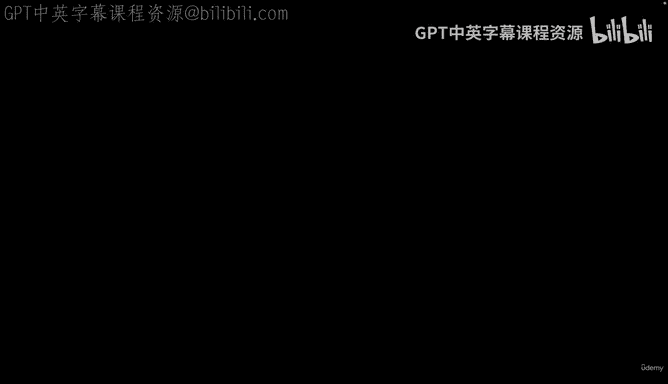
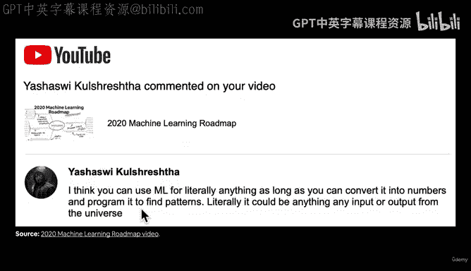
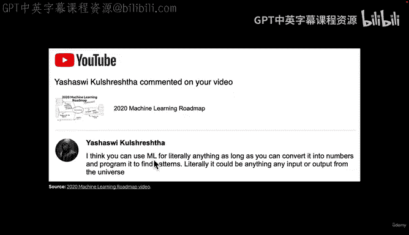
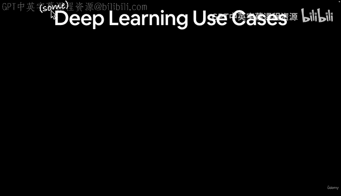
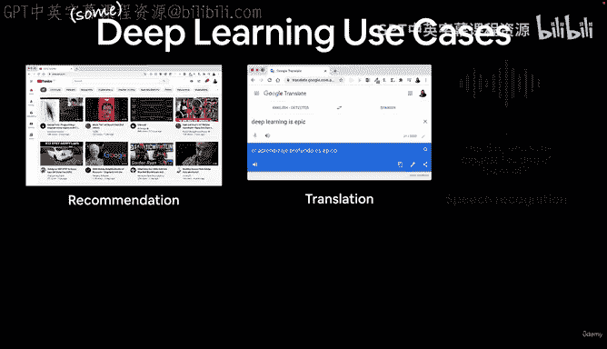
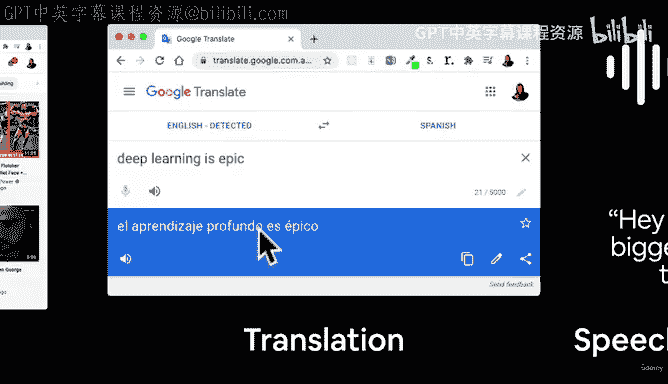
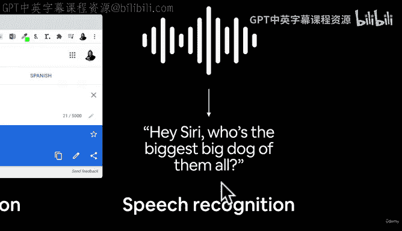
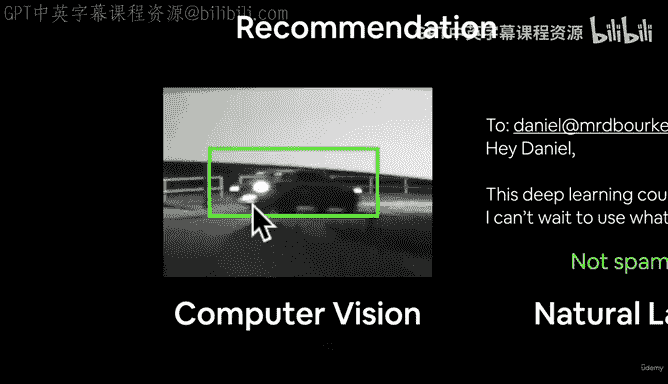
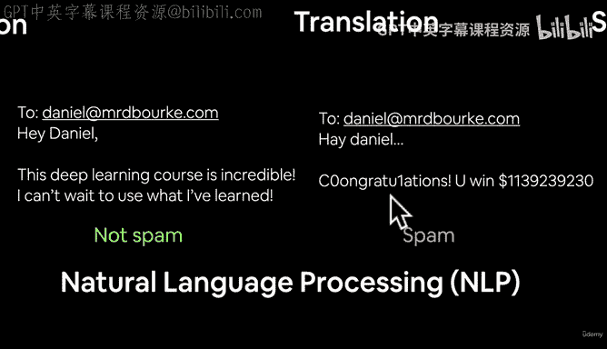
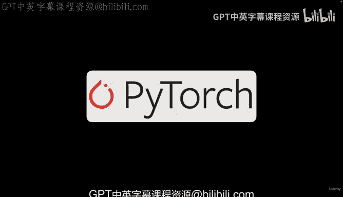

# 10：深度学习的应用领域 🚀

在本节课中，我们将探讨深度学习在实际生活中的各种应用。我们将了解这项技术如何影响我们的日常生活，并理解其背后的核心概念。

上一节我们介绍了深度学习的基础，本节中我们来看看深度学习具体能用来做什么。

## 概述

深度学习是机器学习的一个分支，它能够处理大量数据并从中学习复杂的模式。只要能将问题转化为数字并找到其中的规律，深度学习几乎可以应用于任何领域。

## 深度学习的核心原则

记住机器学习的第一原则：如果不需要，就不要使用它。但如果使用，它几乎可以应用于任何事物。

一个重要的观点是：只要你能将某物编码成数字，你就有可能构建一个机器学习算法来发现这些数字中的模式。它能否成功？这既是科学，也是艺术。

## 具体应用案例

以下是深度学习在日常生活中的一些常见应用，这些也是我亲身接触的例子。

*   **推荐系统**：例如YouTube的推荐页面，它由深度学习驱动，能够根据你的观看历史推荐视频。
*   **机器翻译**：近十年的翻译质量显著提升，这同样得益于深度学习技术。
*   **语音识别**：当你使用语音助手或点击翻译软件的发声按钮时，背后是深度学习的语音识别技术。
*   **计算机视觉**：这项技术可用于**目标检测**，例如在监控摄像头中自动识别并框出特定物体（如车辆）。
*   **自然语言处理**：用于分析非结构化文本，例如你邮箱中高效的垃圾邮件过滤器，它通过学习邮件内容模式来区分正常邮件和垃圾邮件。

## 问题类型分类

根据输入和输出的形式，我们可以将上述应用归类。

*   **序列到序列**：输入一个序列，输出另一个序列。例如，语音识别（音频波序列到文本序列）和机器翻译（一种语言序列到另一种语言序列）。
*   **分类与回归**：
    *   **分类**：预测某个事物属于哪个类别。例如，垃圾邮件检测（“垃圾邮件”或“非垃圾邮件”）。
    *   **回归**：预测一个连续数值。例如，在目标检测中预测边界框的坐标位置（像素值）。

## 总结

本节课我们一起学习了深度学习的广泛应用，从推荐系统、翻译、语音识别到计算机视觉和自然语言处理。我们还了解了这些应用背后对应的问题类型：序列到序列、分类和回归。现在我们已经为课程打下了基础，接下来，让我们开始正式探讨PyTorch。