# 11：PyTorch简介与优势 🚀

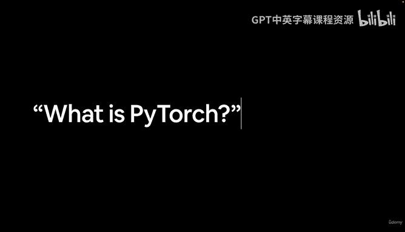

在本节课中，我们将要学习PyTorch的基础知识，了解它是什么以及为什么它在深度学习领域如此受欢迎。

---

## 什么是PyTorch？🤔

首先，我们来介绍PyTorch的基础知识。你可能会问，PyTorch是什么？当然，我们可以直接访问互联网，查看PyTorch的官方网站。

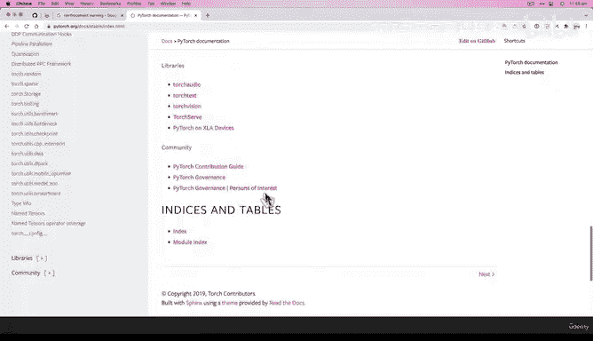

这是PyTorch的主页。本课程并不能替代主页上的所有内容。这个网站应该是你学习PyTorch的权威参考。你可以从这里开始。

你可以在网站上看到一个庞大的生态系统。这里有在本地计算机上设置PyTorch的方法、各种资源、文档、GitHub仓库、搜索功能、博客等一切内容。在学习本课程并编写PyTorch代码的过程中，这个网站应该是你访问最多的地方。你可以来这里阅读资料、查阅信息、查看示例。

但为了本课程的目的，让我们来分解一下PyTorch。

## PyTorch的核心定义

PyTorch是最流行的研究型深度学习框架。它允许你用Python编写快速的深度学习代码。如果你了解Python，就会知道它是一种非常用户友好的编程语言。PyTorch使我们能够用Python编写最先进的深度学习代码，并利用GPU进行加速。

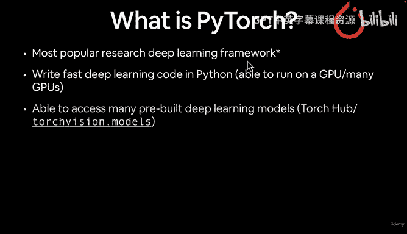

它让你能够访问TorchHub上的许多预构建深度学习模型。TorchHub是一个网站，如果你还记得，我说过迁移学习是一种利用其他深度学习模型来增强我们自己模型的方法，TorchHub就是实现这一点的资源库。Torchvision模型也是如此，我们将在整个课程中学习它。

PyTorch为机器学习的整个流程提供了一个生态系统：从数据预处理开始，将数据转换为张量。例如，如果你有一些图像，如何将它们表示为数字？然后，你可以构建模型（如神经网络）来对这些数据进行建模。最后，你甚至可以将模型部署到你的应用程序或云中。

云部署的具体方式取决于你使用的云平台，但通常都会运行某种PyTorch模型。

PyTorch最初由Facebook（现在已更名为Meta）内部设计和使用。但它现在是开源的，并被特斯拉、微软和OpenAI等公司使用。

## PyTorch的流行度 📈

当我说PyTorch是最流行的深度学习研究框架时，不要只听我的一面之词。让我们看看Papers with Code网站的趋势。如果你不确定Papers with Code是什么，它是一个追踪最新、最优秀的机器学习论文及其是否附带代码的网站。

这里还有其他一些深度学习框架：PyTorch、TensorFlow、JAX、MXNet、PaddlePaddle，以及原始的Torch。PyTorch是用Python编写的Torch的进化版本。

如果我们查看数据（截至2021年12月），PyTorch以58%的占比遥遥领先，是用于编写最先进机器学习算法代码的最受欢迎的研究型机器学习框架。

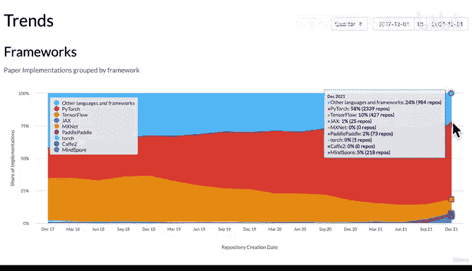

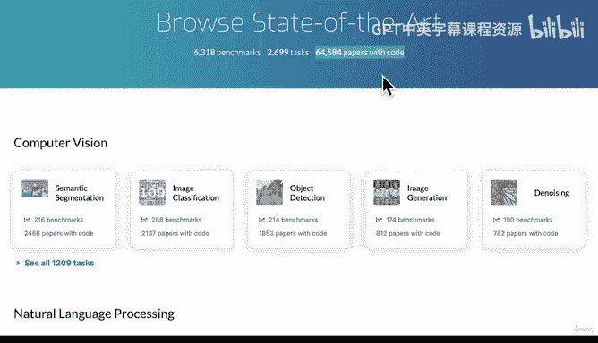

Papers with Code是一个很棒的网站，涵盖了语义分割、图像分类、目标检测、图像生成、计算机视觉、自然语言处理、医学等领域的论文。我建议你自己探索一下，这是我保持对该领域了解最喜欢的资源之一。

正如你所见，在该网站追踪的65,000篇附带代码的论文中，有58%是用PyTorch实现的。这非常酷，而这正是我们要学习的内容。

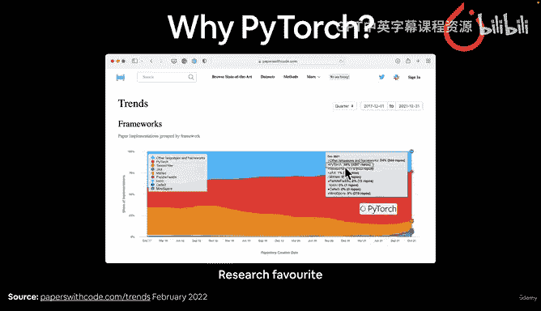

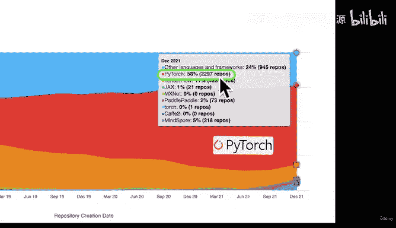

## 为什么选择PyTorch？💡

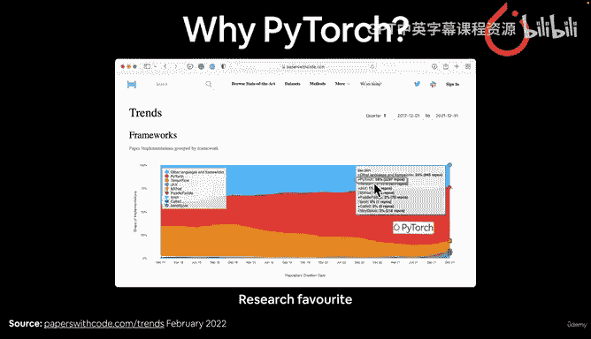

除了我们刚刚谈到的原因（它是研究人员的首选），还有更多理由。

如果一篇机器学习论文发表了优秀的研究成果，通常会附带代码，你可以访问并使用这些代码进行自己的应用或研究。

再次强调为什么选择PyTorch？这是François Chollet（另一个流行深度学习框架Keras的作者）的一条推文。他提到，借助像Colab这样的工具（我们稍后会看到Colab是什么），加上Keras、TensorFlow（我在这里补充了）和PyTorch，现在几乎任何人都可以在一天内，无需初始投资，解决那些在2014年需要一个工程师团队工作一个季度并花费2万美元硬件才能解决的问题。这突显了深度学习和机器学习工具领域已经变得多么强大。

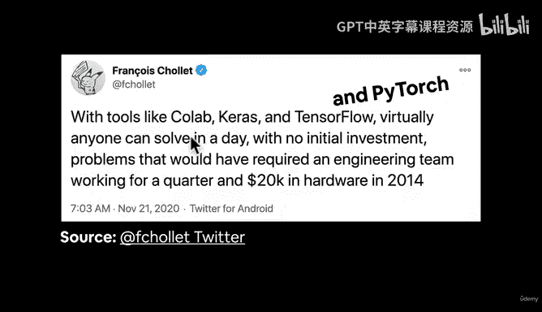

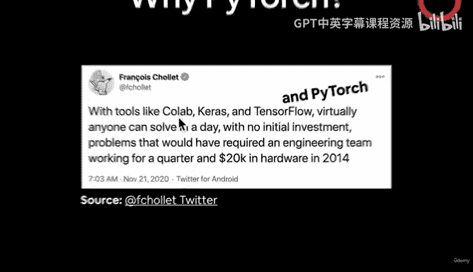

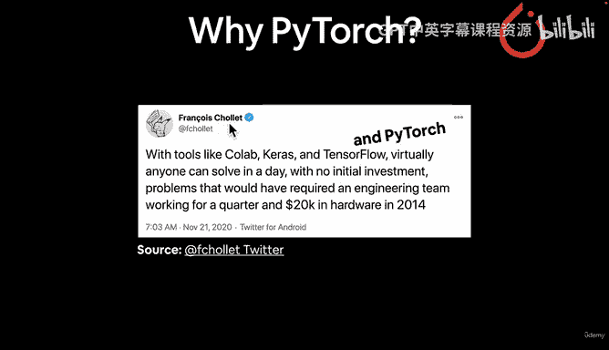

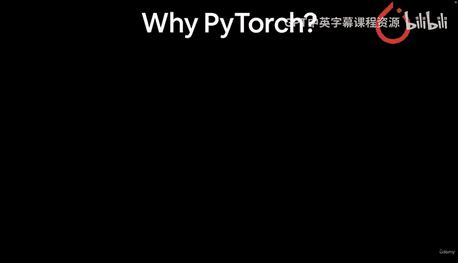

Colab、Keras和TensorFlow都非常出色，现在PyTorch也加入了这个行列。如果你想了解更多，可以在Twitter上关注François Chollet，他是机器学习领域非常杰出的声音。

如果你需要更多选择PyTorch的理由，看看这些。看看所有使用PyTorch的地方，它无处不在。

特斯拉的人工智能总监Andrej Karpathy在这里。特斯拉正在使用PyTorch为其自动驾驶的计算机视觉模型提供支持。

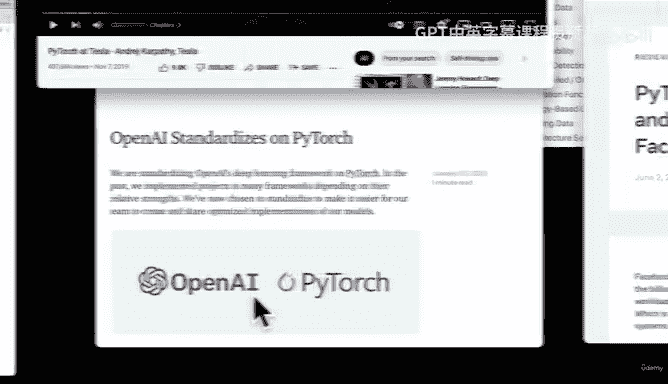

例如，像这样检测场景中情况的汽车。当然，还会有其他用于路径规划的代码。

OpenAI是世界上最大的人工智能研究机构之一（“开放”在于他们发布了许多研究方法）。他们在2020年1月的一篇博客文章中提到，OpenAI现已全面标准化使用PyTorch。

还有一个名为“Incredible PyTorch”的代码仓库，收集了大量基于PyTorch构建的不同项目。PyTorch的美妙之处在于你可以在其基础上进行构建。

PyTorch也被用于农业等领域。例如，农业机器人使用PyTorch进行目标检测，以识别哪些杂草应该喷洒肥料。

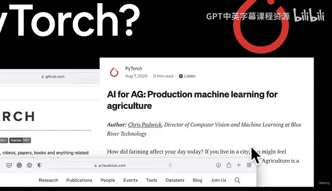

回到这里，PyTorch在Facebook（也是Meta AI）构建人工智能和机器学习的未来中扮演着核心角色。他们在内部将所有机器学习应用都基于PyTorch。

微软在PyTorch生态中也扮演着重要角色。PyTorch绝对无处不在。

## PyTorch与GPU加速 ⚡

如果这些还不足以成为你使用PyTorch的理由，那么也许你选错了课程。你已经看到了足够多的使用PyTorch的理由，我再给你一个：它能帮助你在GPU上加速运行你的机器学习代码。

我们之前简要提到过。但什么是GPU（或TPU，因为这是近年来较新的芯片）？

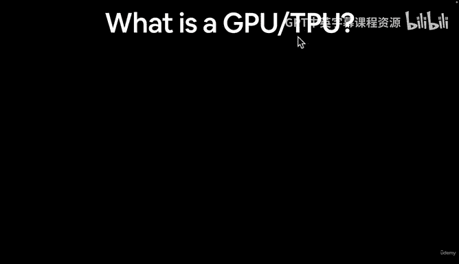

GPU是图形处理单元，最初为电子游戏设计，本质上非常擅长快速处理数字计算。如果你设计或玩过电子游戏，就会知道如今的图形渲染非常复杂，需要大量的数值计算。

PyTorch的美妙之处在于，它使你能够通过一个名为CUDA的接口来利用GPU。CUDA是一个并行计算平台和应用程序编程接口（API），它允许软件使用特定类型的图形处理单元进行通用计算。这正是我们想要的。

因此，PyTorch利用CUDA使你能在NVIDIA GPU上运行机器学习代码。当然，也有在TPU（张量处理单元）上运行PyTorch代码的能力。

但在实践中，GPU要常见得多，所以我们将重点学习如何在GPU上运行PyTorch代码。

这些芯片之所以被称为张量处理单元，是因为机器学习和深度学习大量处理张量。

---

## 总结与预告 📚

本节课中我们一起学习了PyTorch是什么，了解了它作为最流行的研究型深度学习框架的地位，以及它被特斯拉、OpenAI、Meta和微软等顶级公司广泛使用的原因。我们还探讨了PyTorch能够利用GPU（通过CUDA）加速计算的核心优势。

在下一节视频中，我们将回答一个问题：什么是张量？但在从我这里得到答案之前，我建议你先自己研究一下这个问题。打开谷歌或你喜欢的搜索引擎，输入“what is a tensor”，看看你能找到什么。我们下个视频见。

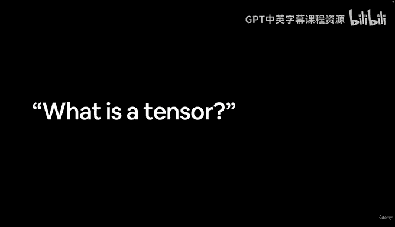

