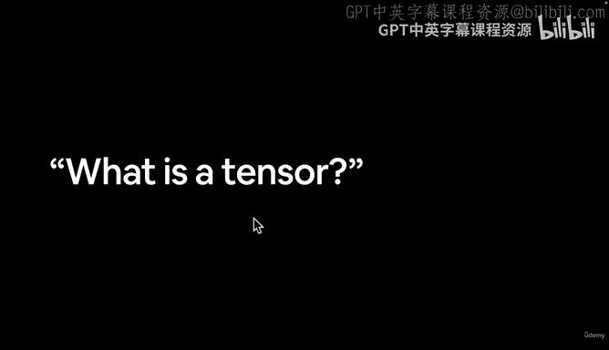
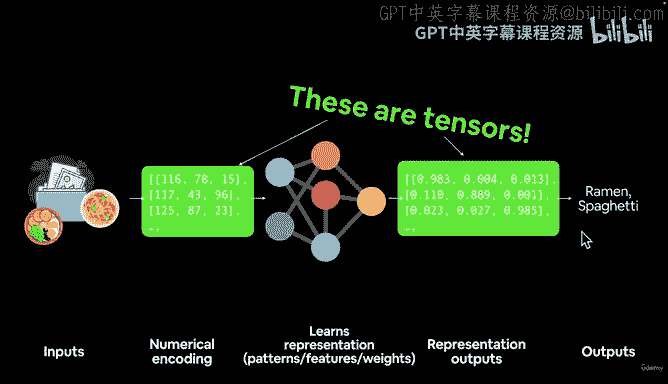
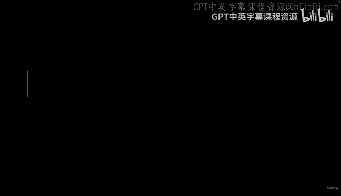

# 12：张量概念解析 🧮

在本节课中，我们将要学习深度学习的核心基础概念——张量。我们将探讨张量的定义、它在神经网络中的作用，以及为什么张量是 PyTorch 等深度学习框架的基本构建块。

---

上一节我们介绍了神经网络的基本流程，本节中我们来看看这个流程中的核心数据载体——张量。

张量几乎可以是任何数字的表示形式。在深度学习中，我们通常将输入数据（如图像、文本、音频）进行数值编码，转换成张量。这个张量随后被输入到神经网络中，神经网络对其执行数学运算，并输出另一个张量。最后，我们将输出张量转换回人类可以理解的形式。

以下是张量在深度学习流程中的核心作用：
*   **输入**：原始数据（如图像）被数值化，形成输入张量。
*   **处理**：神经网络对输入张量执行一系列数学运算。
*   **输出**：网络产生一个输出张量，其中包含了学习到的模式或结果。

为了更清晰地说明，让我们聚焦于一个具体的例子：构建一个图像分类模型。

假设我们想区分一张图片是拉面还是意大利面。流程如下：
1.  输入是图像。
2.  我们将图像转换为数字，这些数字以张量的形式表示。
3.  我们将这个数字张量（或大批量的张量）输入神经网络。
4.  神经网络对这些张量执行数学运算。
5.  网络输出一个张量。
6.  我们将这个输出张量转换为人类可以理解的分类标签（例如，“拉面”或“意大利面”）。

这个原理是普适的。无论你处理的是10张图片还是10亿张图片，核心步骤都是：将数据编码为张量形式的数值表示，用神经网络处理这些张量，再将输出的张量解码。

PyTorch 中的基本构建块是 `torch.Tensor`。我们很快就会在代码中亲手使用它。在 PyTorch 中，许多底层的数学运算都被自动处理，我们主要通过编写代码来定义和执行对张量的操作。

---

到目前为止，我们已经涵盖了许多基础知识：什么是机器学习、深度学习、神经网络，以及为什么使用 PyTorch 和 PyTorch 是什么。现在，我们明确了深度学习的根本构建块是张量。

在下一节中，我们将更具体地了解在本模块的代码实践中将要涵盖的内容。

本节课中我们一起学习了张量的核心概念。我们了解到张量是数据的数值化表示，是神经网络输入、处理和输出的基本单位。理解张量是理解深度学习工作流程的第一步。