# 13：PyTorch课程内容概览 🧠

在本节课中，我们将具体介绍基础模块中将要涵盖的代码内容。

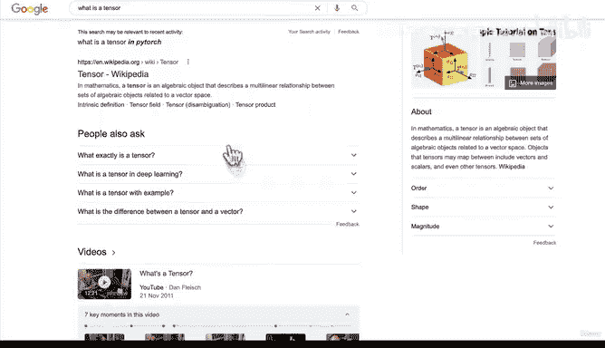

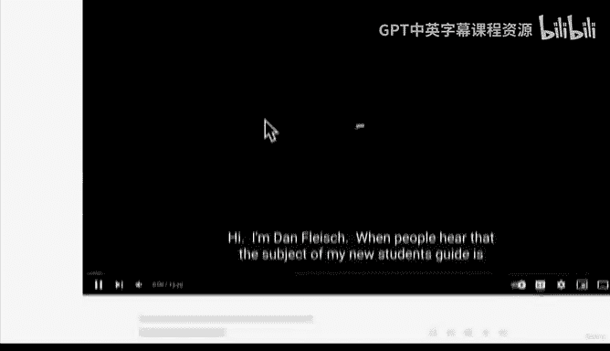

上一节我们提到了“张量”这个概念，并鼓励大家自行搜索。本节中我们来看看课程的具体学习路径和核心工作流程。

## 主动学习与搜索的重要性

在上一节，我建议大家去搜索“什么是张量”。这正是我日常作为机器学习工程师的工作方式：编写代码，遇到不明确的概念时，立即使用搜索引擎查找答案，例如搜索“PyTorch 什么是张量”或遇到的错误信息。

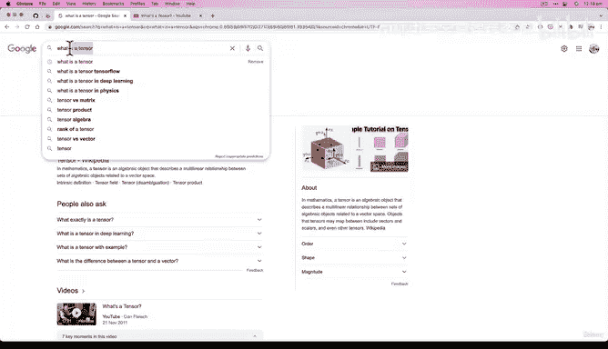

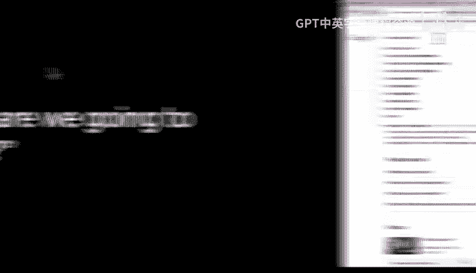

我特意演示这个过程，不仅是为了告诉你遇到问题可以搜索，更是为了鼓励你养成这个习惯。在整个课程中，你会多次看到我这样做。记住，主动搜索和解决问题是机器学习工程师的核心技能之一。

## 📚 课程学习路径参考

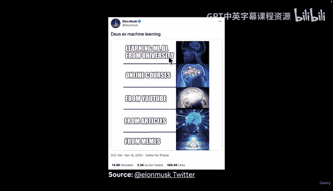

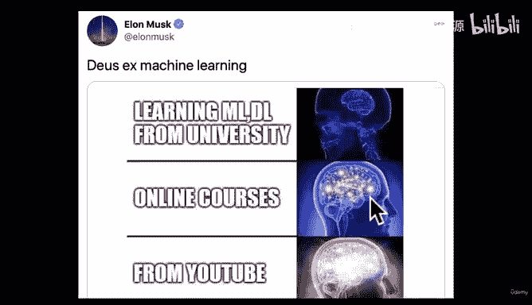

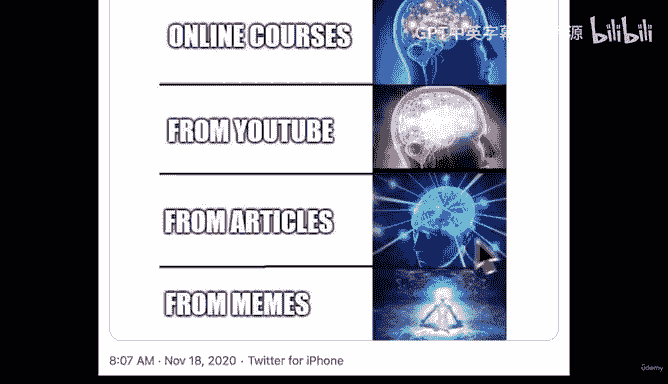

以下是根据埃隆·马斯克一条关于学习路径的推文启发的比喻，它概括了我们将要经历的学习过程：

*   **大学课程**：提供扎实的机器学习（ML）与深度学习（DL）理论基础。
*   **在线课程**：例如本课程，帮助你开始实践并扩展知识。
*   **YouTube视频**：提供直观、动态的学习体验。
*   **技术文章**：例如本课程配套的在线书 `learnpytorch.io`，所有课程材料都以在线书籍的形式提供，便于深入参考。
*   **社区与梗图**：从社区文化中汲取灵感，最终达到熟练运用的境界。

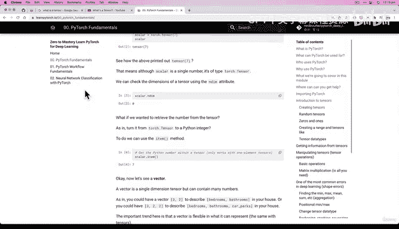

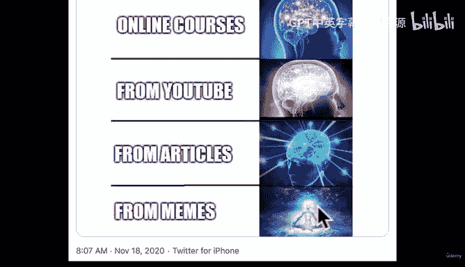

我们的课程将融合以上多种形式，提供全面的学习体验。

## 🎯 本模块核心学习目标

现在，让我们具体看看在这个基础模块中，我们将要学习哪些PyTorch核心内容：

1.  **PyTorch基础与张量操作**：我们将重点学习张量（`tensor`）及其操作。记住，神经网络的核心就是**输入张量**，对张量执行操作，并生成**输出张量**。
2.  **数据预处理**：学习如何将原始数据（如图片）转换为数值编码，即**张量**。
3.  **构建与使用预训练模型**：具体来说是构建神经网络。我们将编写代码，让模型学习我们预处理好的数据中的模式。
4.  **模型训练与预测**：让模型拟合数据，并利用学习到的模式进行预测。这正是深度学习的意义所在：**利用过去的模式预测未来**。
5.  **模型评估**：学习如何评估模型预测结果的好坏。
6.  **模型的保存与加载**：例如，将训练好的模型从开发环境导出到应用程序中。
7.  **使用模型进行自定义预测**：学习如何使用训练好的模型对我们自己的数据进行预测，这非常有趣。

机器学习兼具科学性与艺术性。它有点像精确的化学实验，也像随性的烹饪——加点这个，试试那个，看看效果如何。我喜欢把它看作一档“机器学习烹饪秀”。欢迎来到“与Daniel一起烹饪PyTorch”！

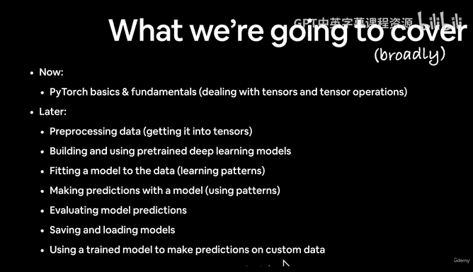

## 🔄 PyTorch核心工作流程

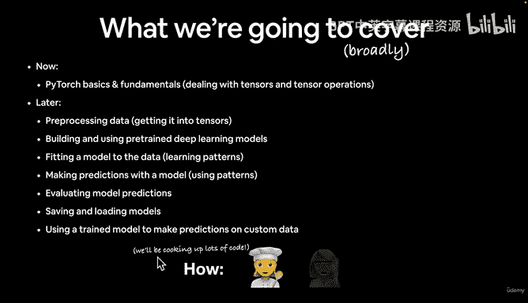

最后，我们介绍一个贯穿本课程的核心PyTorch工作流程。以下是主要步骤：

1.  **准备数据**：将数据转换为模型可处理的形式。
2.  **选择或构建模型**：根据问题选择合适的预训练模型或构建新模型。
    *   **2.1 选择损失函数与优化器**：我们很快就会详细讲解它们。
    *   **2.2 构建训练循环**：这是模型学习的核心引擎。
3.  **模型训练与预测**：让模型拟合数据并进行预测。例如，在图像分类任务中，让网络识别图片中是拉面还是意大利面。
4.  **模型评估**：评估模型的预测性能，判断其是否有效。
5.  **通过实验改进**：机器学习具有很强的实验性，需要不断尝试和调整。
6.  **保存与重载训练好的模型**：便于后续使用或部署。

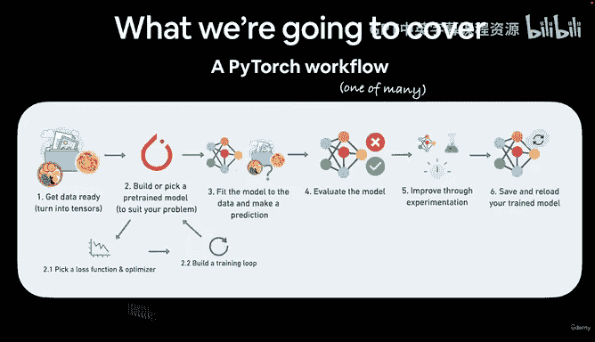

这些步骤大致按顺序排列，但在实际项目中可能会根据情况交叉进行。目前按数字顺序理解即可。

## 总结

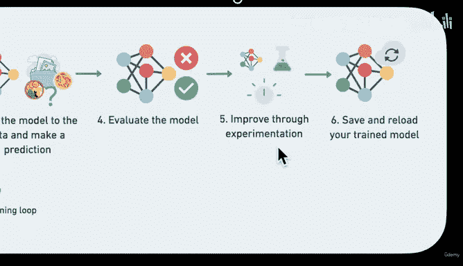

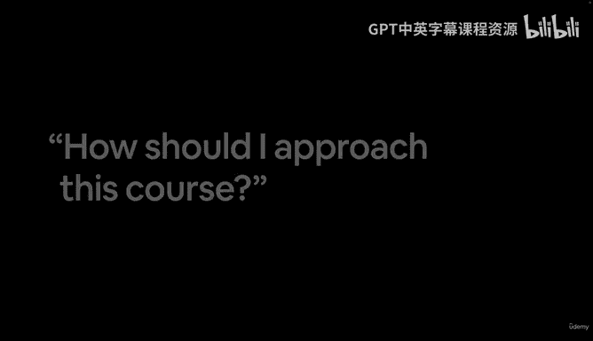

本节课中我们一起学习了PyTorch基础模块的具体学习目标，理解了主动搜索的重要性，并熟悉了贯穿课程的核心PyTorch工作流程。记住，学习过程是科学和艺术的结合。下一节课，我将介绍学习本课程的一些非常重要的方法和心态。我们下节课见。