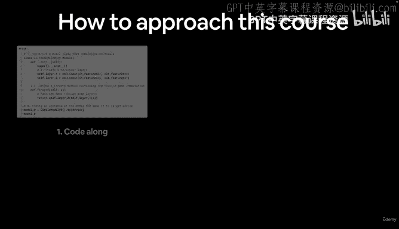
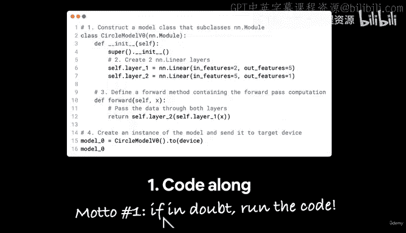
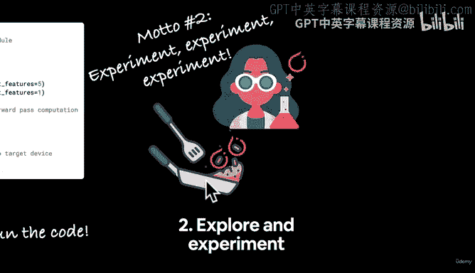
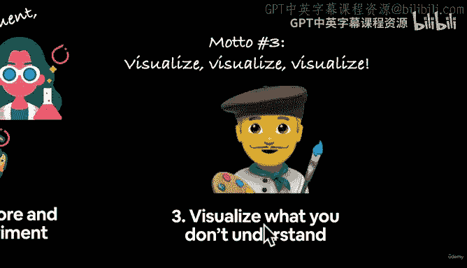
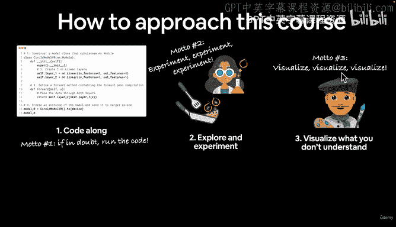
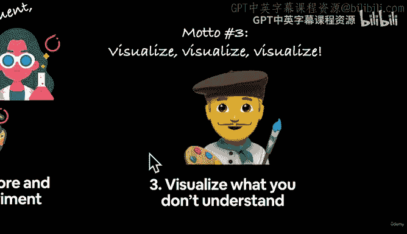
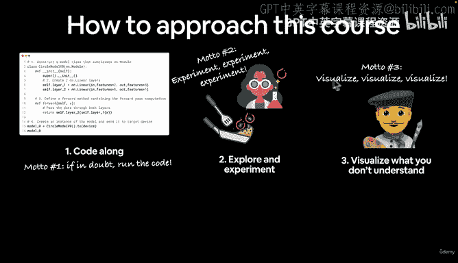
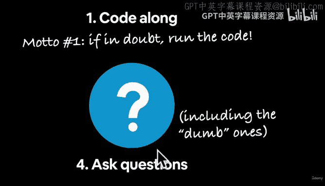
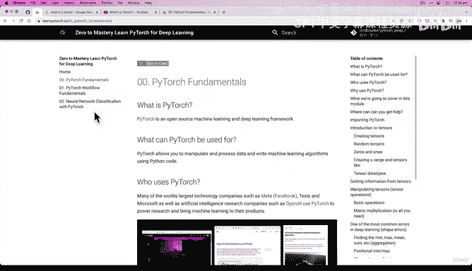
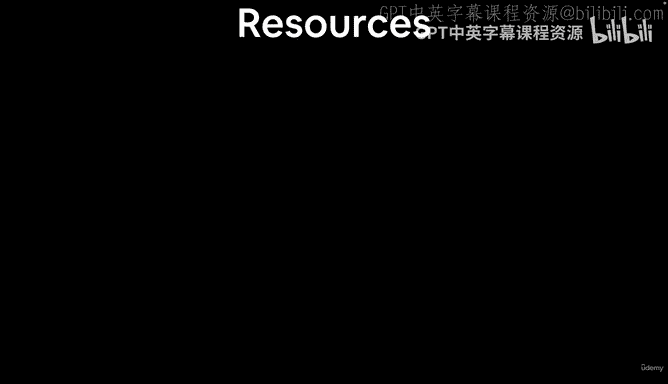

# 14：正确与错误的学习方法 🧠➡️🚀

在本节课中，我们将学习如何高效地学习这门PyTorch深度学习课程。我们将探讨一系列最佳实践，帮助你从编写代码中获得最大收益，并避免常见的思维陷阱。

---

## 概述：如何学习本课程

学习机器学习和编写机器学习代码是两件不同的事情。本课程的重点是**编写PyTorch代码**，而非深入理论。因此，我们的学习方法将围绕实践展开。

上一节我们介绍了课程的整体结构，本节中我们来看看具体的学习策略。

---

## 如何学习本课程：六个核心方法

以下是六个帮助你高效学习本课程的核心方法。

### 1. 边看边写代码

首要步骤是**跟着写代码**。本课程专注于纯粹的代码编写，我会提供额外的资源链接，帮助你理解代码背后的原理。我的教学理念是：如果我们能一起写代码、看代码如何运行，这将激发你的好奇心去探索幕后的机制。

我们的第一个座右铭是：**如有疑问，就运行代码**。写出来，运行它，看看会发生什么。

### 2. 探索与实验

带着科学家和厨师的心态来学习。像科学家一样严谨地尝试，也像厨师一样为了乐趣而尝试。**实验、实验、再实验**。

### 3. 可视化不理解的内容

这一点再怎么强调都不为过。我们目前有三个座右铭：如有疑问就运行代码、不断实验，以及**可视化、可视化、再可视化**。

因为机器学习和深度学习处理大量数据和数字。我发现，如果我能以非纯数字页面的形式将数字可视化，我往往能更好地理解它。我将链接一些优秀的额外资源，它们能将我们编写的代码转化为出色的可视化图表。

### 4. 提出问题，包括“愚蠢”的问题

实际上，**没有所谓的“愚蠢”问题**。每个人只是处于学习旅程的不同阶段。事实上，如果你有一个“愚蠢”的问题，很可能很多人也有同样的问题。

所以，请务必提问。我稍后会链接一个你可以提问的资源。请不仅向社区提问，也向谷歌、互联网或任何你能想到的地方提问，甚至向你自己提问。对代码提出问题，并通过编写代码来找出答案。

### 5. 完成练习

我为每个模块都创建了一些很棒的练习。在课程书籍版本的所有章节底部，都会有练习和课外拓展内容。

我强烈建议你不要仅仅跟着课程和我一起写代码。**请务必尝试完成练习**，因为这将拓展你的知识。我们将一起进行大量编写代码的实践，而练习将给你机会应用所学知识。当然，课外拓展内容也为你提供了深入学习的机会。

### 6. 分享你的成果

我无法充分强调，通过Github、不同代码资源或与社区分享我的工作，对我的学习帮助有多大。

所以，如果你学到了关于PyTorch的很酷的东西，我很想看到它。请通过Discord聊天或Github等方式链接给我。分享你的成果不仅是一种学习方式（因为当你分享或写作时，你也在思考如何让他人理解），也是帮助他人学习的好方法。

---

## 如何避免错误的学习方法

上面我们介绍了如何学习本课程，现在，让我们看看如何避免错误的学习方法。

我希望你避免**过度思考这个过程**。想象这是你的大脑，这是你大脑“着火”的样子。要避免让你的大脑“着火”，那不是一个好状态。我们正在使用PyTorch（火炬），所以可能会很“热”（这里玩了一下torch这个词的双关）。但要避免你的大脑“着火”。

同时，避免说“我学不会XXX”。我曾多次对自己说过这句话，然后我进行了练习。结果证明，我实际上可以学会那些东西。

让我们在上面画一条红线。哦，一条更粗的红线。好了，一条又粗又好的红线。我们把它放在那里。现在写着“避免”和划掉可能不太合理。但**不要说“我学不会”**，并防止你的大脑“着火”。

---

## 总结

本节课中我们一起学习了高效学习PyTorch课程的六个核心方法：边看边写代码、积极探索实验、将内容可视化、勇敢提出问题、认真完成练习以及主动分享成果。同时，我们也探讨了需要避免的思维陷阱，如过度思考和自我设限。记住，实践和好奇是学习深度学习的最佳伙伴。

在下一节课中，我们将在开始编码之前，介绍本课程可用的资源。