# 15：📚 重要课程资源

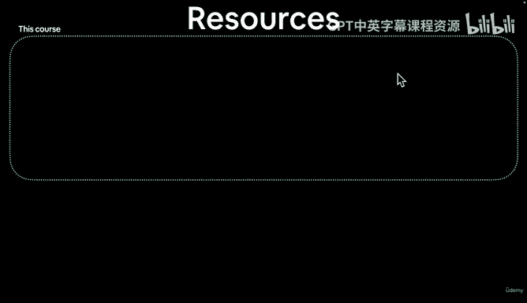

在本节课中，我们将了解学习本课程所需的核心资源。掌握这些资源的位置和使用方法，将帮助你更高效地学习和解决问题。

在深入学习本课程之前，有一些基础的资源需要你了解。这些资源对我们后续的学习至关重要。

本课程主要涉及以下三部分资源：


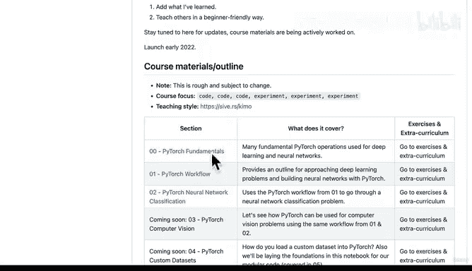


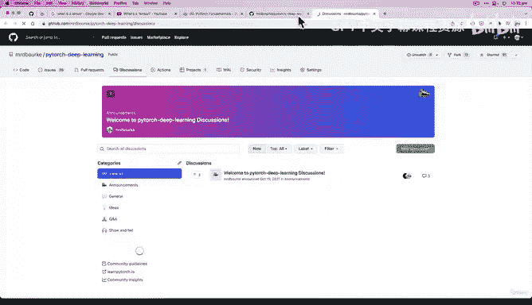

首先是GitHub代码仓库。你可以点击这个链接访问。我在浏览器中收藏了这个页面，建议你在学习过程中也这样做。这个仓库的地址是 `Mr. Deepbus/my_github_slash_pytorch_deep_learning`。在录制本视频时，它仍在不断完善中。但当你学习时，它的核心内容不会有太大变化，只是会添加更多材料。仓库中会有一个“材料大纲”部分，说明课程涵盖的内容。在录制时，有些部分标注为“即将推出”。当你观看时，这些部分很可能已经完成。练习和课外拓展的链接也会放在这里。基本上，课程所需的一切材料都会在这个GitHub仓库中。

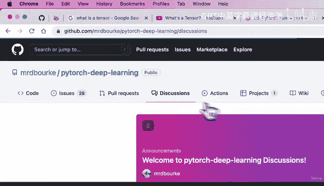


接下来，在同一个GitHub仓库（`Mr. D Burk slash pytorch deep learning`）中，如果你点击“Discussions”标签页。


这里将是课程的问答区。链接就是上面这个。如果你有问题，可以点击“New discussion”，然后选择“Q&A”类别。接着，你可以输入视频标题，例如“pytorch fundamentals”，然后描述你的问题。或者你也可以直接输入遇到的错误，例如“张量的N维是什么？”。在描述中，你可以这样写：“你好，我在视频XYZ（请填入具体视频名称）遇到了问题”，这样我或者其他同学就能帮助你。在代码部分，你可以用三个反引号包裹代码块，并标注语言为python，例如：
```python
import torch
torch.rand(2, 3) # 这将创建一个张量
```
我们稍后会看到这个。然后提交你的问题。这种格式化的代码非常有助于我们理解问题所在。提问的基本框架是：说明视频、描述问题、附上相关代码和错误信息。之后点击“Start discussion”。我或者课程社区的其他成员会在这里提供帮助。这样做的好处是所有内容都集中在一处，你还可以进行搜索。目前这里还没有内容，因为课程刚刚开始。但随着学习的深入，这里的内容会越来越多。如果你认为代码有需要改进的地方，也可以在这里提交一个新的“Issue”。你可以阅读相关说明了解更多。我已经提交了一些关于需要录制视频、创建材料的Issue。如果你觉得有可以改进的地方，请提交Issue。如果你对课程有疑问，请发起一个讨论。

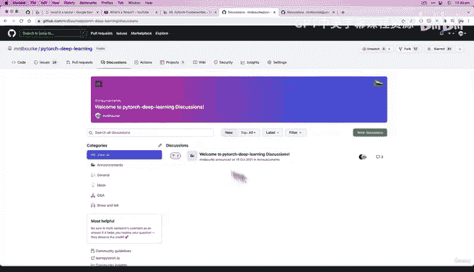
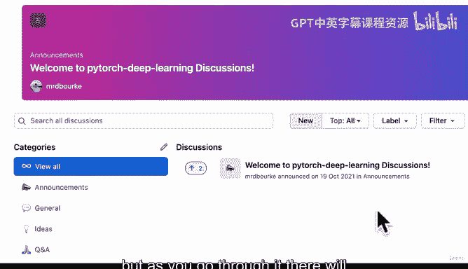
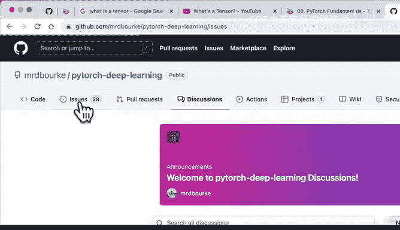
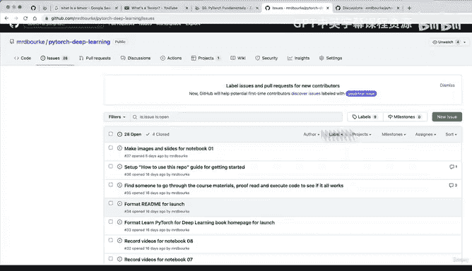

回到我们的要点，我们还有一项资源。以上就是课程材料，它们都存放在GitHub上。课程问答在GitHub仓库的“Discussions”标签页，此外还有课程的在线电子书。


这本书堪称艺术品，非常精美。它通过一些代码自动将GitHub上的所有材料转换而成。如果我们进入代码部分，点击“Note 00”，有时如果你在GitHub上使用过Jupyter笔记本，可能会加载一会儿。这里的所有材料都会自动转换成这本书。


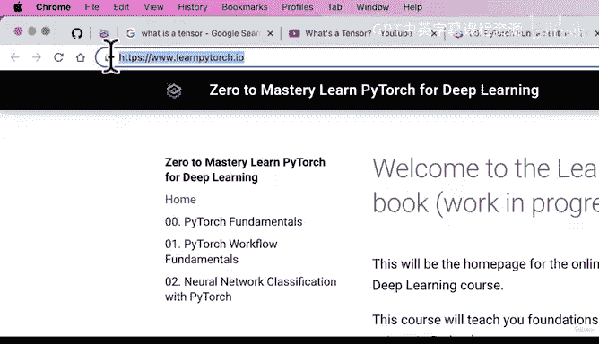
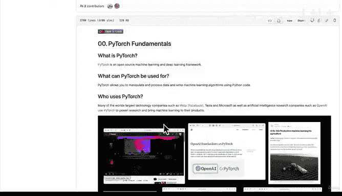


这本书的优点是它有清晰的标题，易于阅读，完全在线，包含所有图片，并且你可以在这里搜索内容，例如“PyTorch training steps”。

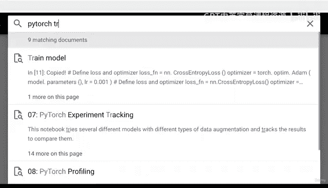


“在PyTorch中创建训练循环”。非常棒，我们稍后会看到这个。以上就是你需要了解的三大核心资源，它们专门针对本课程：GitHub上的课程材料、课程问答区、以及课程在线电子书。电子书的网址是 `learnpytorch.io`，这是一个简单易记的URL，所有材料都会在那里。


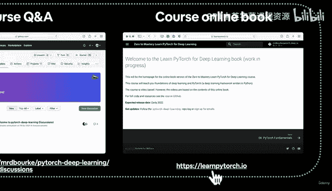

最后，针对PyTorch本身，还有两个通用资源：PyTorch官方网站和PyTorch论坛。如果你有与课程无关但关于PyTorch本身的问题，我强烈建议你访问PyTorch论坛，网址是 `discuss.pytorch.org`，链接已提供。以及PyTorch官网 `pytorch.org`。这将是你在PyTorch领域的大本营。这里有完整的文档。需要说明的是，本课程并不能替代熟悉PyTorch官方文档的过程。实际上，本课程正是基于所有PyTorch文档构建的，只是以略有不同的方式组织。因此，官网这里有大量关于PyTorch的优质资源。这是你的根据地。在课程中，你会经常看到我引用这些内容。


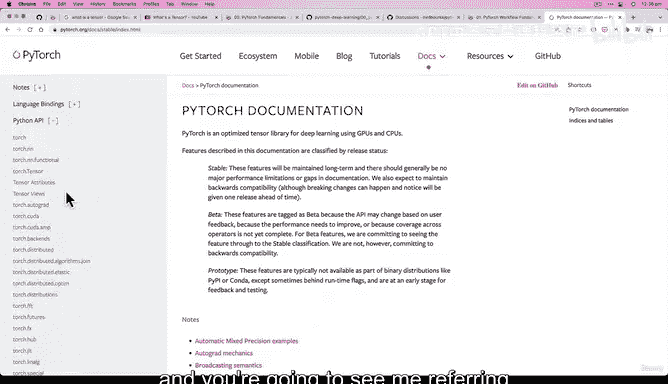

请记住这些资源：GitHub上的课程材料、课程讨论区、`learnpytorch.io`。这些是针对本课程的。而针对PyTorch通用学习（不限于本课程），则有PyTorch官网和PyTorch论坛。

综上所述，我们已经介绍了很多内容。但是，猜猜现在该做什么了？是时候写一些代码了。我们下一个视频再见。


---

**本节课总结**


在本节课中，我们一起学习了支撑本PyTorch深度学习课程的核心资源体系。我们明确了三大课程专属资源：**GitHub代码仓库**（存放所有材料与代码）、**课程问答讨论区**（在GitHub的Discussions标签页）以及**课程在线电子书**（`learnpytorch.io`）。此外，我们还介绍了两个PyTorch通用学习宝库：**PyTorch官方网站**（`pytorch.org`，含官方文档）和**PyTorch论坛**（`discuss.pytorch.org`）。熟悉并善用这些资源，将为你的学习之路提供坚实的支持。