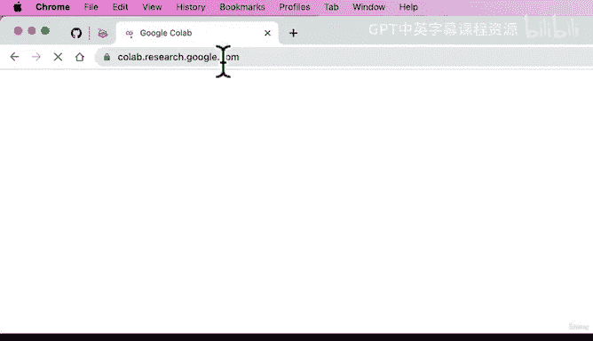
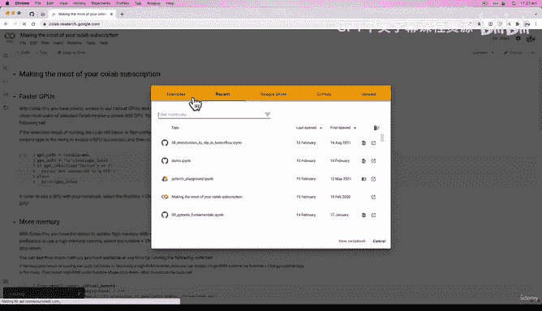
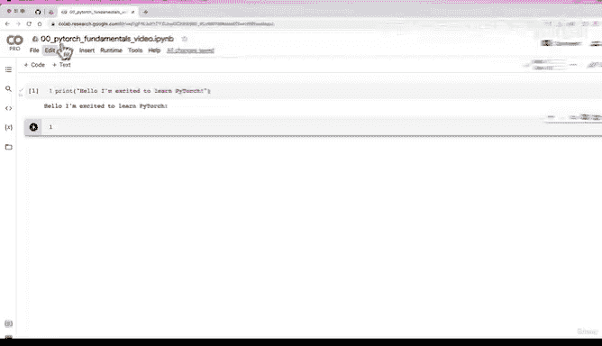
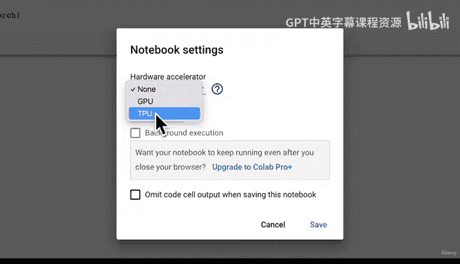
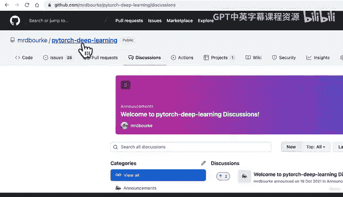
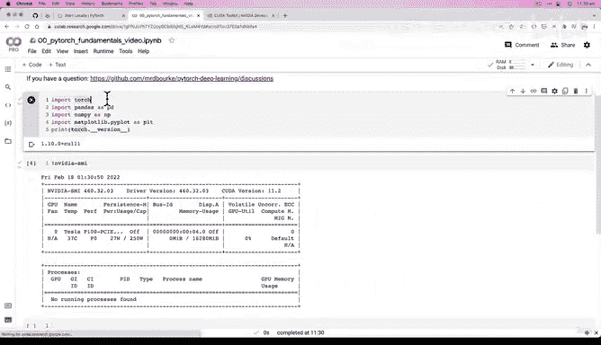

# 16：PyTorch 代码环境配置 🛠️

在本节课中，我们将学习如何配置 PyTorch 的代码环境。我们将重点介绍一个名为 Google Colab 的在线工具，它能让初学者轻松开始编写和运行 PyTorch 代码，而无需处理复杂的本地安装过程。

## 理论过渡到实践

上一节我们从理论角度介绍了 PyTorch 的基础知识。本节中，我们来看看如何开始实际编写代码。






我将介绍一个在本课程中会一直使用的主要工具：Google Colab。

我建议跟随本课程学习的方式之一，就是边看边动手编码。

## 介绍 Google Colab

以下是使用 Google Colab 的步骤：

1.  打开浏览器，访问 `colab.research.google.com`。
2.  页面加载后，你将看到 Google Colab 的界面。

如果你想全面了解 Google Colab 的功能，可以浏览其官方概述文档。但本质上，Google Colab 允许我们创建新的笔记本，这正是我们练习编写 PyTorch 代码的方式。

参考学习文档 `learnpytorch.io`，你会发现这些资料实际上就是以在线书籍格式呈现的 Colab 笔记本。这些是课程的基础材料。每个新模块我们都会开启一个新的笔记本。

## 创建你的第一个笔记本



我将在这里放大界面。

第一个模块的笔记本编号为 `00`，因为 Python 代码通常从 `00` 开始。我将这个笔记本命名为 “PyTorch Fundamentals”。为了区分，我给我的笔记本加上 “video” 标签，表明这是视频教程中使用的笔记本。

点击 “连接” 后，我们将获得一个编写 Python 代码的空间。

例如，我们可以输入：
```python
print("Hello, I'm excited to learn PyTorch.")
```
然后按下 `Shift + Enter` 来运行代码。

## Google Colab 的优势



Google Colab 的一个显著优势是它提供了免费的硬件加速器。我个人使用的是专业版，每月约 10 美元，价格可能因地区而异。我使用专业版是因为我经常使用 Colab。然而，**你完全不需要付费版本也能完成本课程**。Google Colab 提供免费版本，足以满足本课程的需求。

以下是设置硬件加速器的步骤：

1.  点击顶部菜单栏的 “运行时”。
2.  选择 “更改运行时类型”。
3.  在 “硬件加速器” 下拉菜单中，选择 “GPU”。
4.  点击 “保存”。

现在，我们编写的代码（如果以特定方式编写）将在 GPU 上运行。稍后我们会看到，对于深度学习任务，在 GPU 上运行的代码在计算时间上要快得多。

我们可以运行 `!nvidia-smi` 命令来确认是否可以访问 GPU。在我的例子中，我获得了一个 Tesla P100 GPU。付费用户通常会获得更好的 GPU，而免费用户也能获得 GPU，只是速度可能不如付费版本提供的。请记住这一点。



## 笔记本的结构与资源

Colab 笔记本主要由代码单元格和文本单元格构成。

我可以按 `Ctrl + M M` 将一个单元格从代码模式转换为文本模式，然后按 `Shift + Enter` 确认。这样我们就有了一个文本单元格。如果需要新的代码单元格，可以点击 “+ 代码” 按钮。

为了结束本视频，我们将导入 PyTorch 并检查版本。

以下是需要运行的代码：
```python
import torch
print(torch.__version__)
```
Google Colab 的另一个优点是它预装了 PyTorch 以及许多其他常用的 Python 数据科学包。

例如，我们也可以导入：
```python
import pandas as pd
import numpy as np
import matplotlib.pyplot as plt
```
对于本课程来说，Google Colab 无疑是入门的最简单方式。

## 本地运行选项

你也可以选择在本地机器上运行代码。如果你想这么做，可以参考 PyTorch 官方文档中关于本地设置的章节。但如果你想尽快开始，我强烈推荐使用 Google Colab。事实上，整个课程都可以通过 Google Colab 完成。

让我们完成这个视频，确保 PyTorch 已准备就绪。

运行代码后，输出显示我们拥有 PyTorch 1.10.0 版本。如果你的版本号远高于此（例如，几年后你观看此视频时 PyTorch 已更新到 2.11），本笔记本中的部分代码可能无法工作。但 1.10.0 版本对于我们即将进行的学习已经足够。

输出中的 `cu111` 代表 CUDA 11.1 版本。CUDA 是 NVIDIA 的开发工具包，它使我们能够在 NVIDIA GPU 上运行 PyTorch 代码，而我们在 Google Colab 中正好可以访问这些 GPU。

截至录制本视频时，最新的 PyTorch 版本是 1.10.2。要完成本课程，你至少需要 PyTorch 1.10 和 CUDA 11.3 工具包。

## 总结



本节课中，我们一起学习了如何配置 PyTorch 的编码环境。我们重点介绍了使用 Google Colab 这一在线平台，它免去了复杂的本地安装步骤，并提供了免费的 GPU 加速资源，是初学者入门深度学习的绝佳选择。现在，我们的环境已经设置完毕，准备就绪。在下一节课中，我们将开始编写一些 PyTorch 代码。