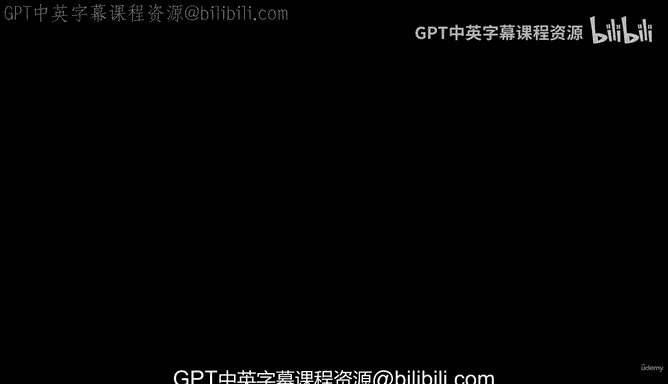
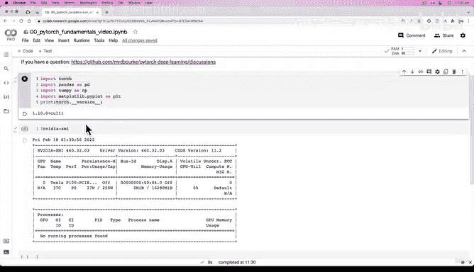
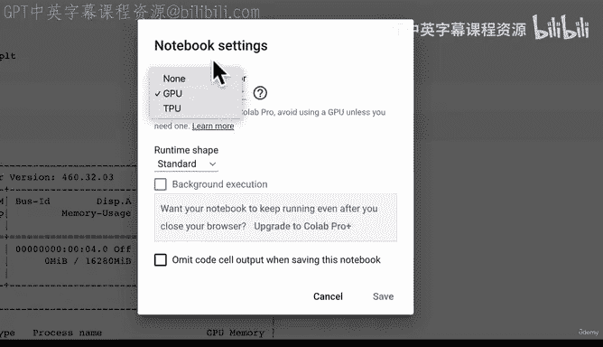
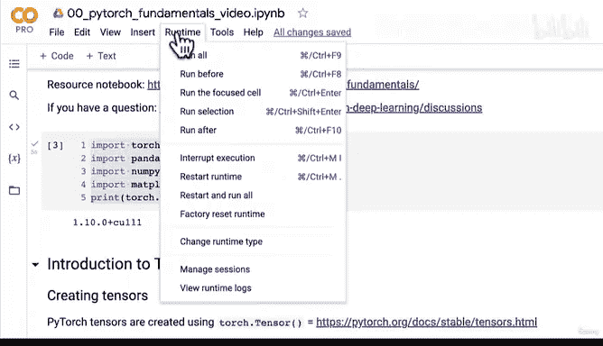
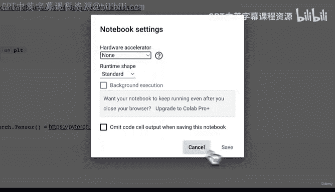
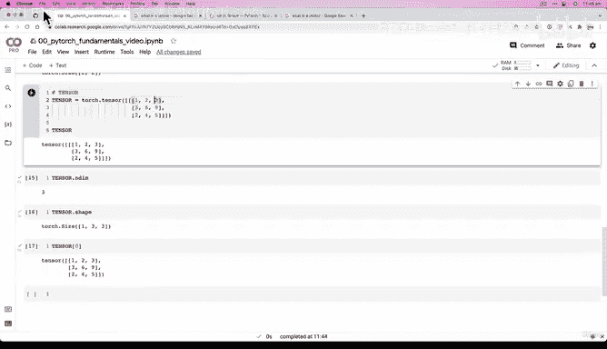
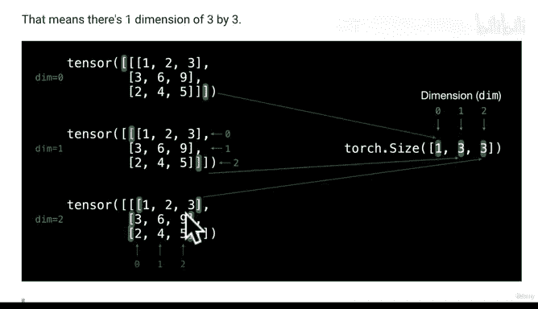
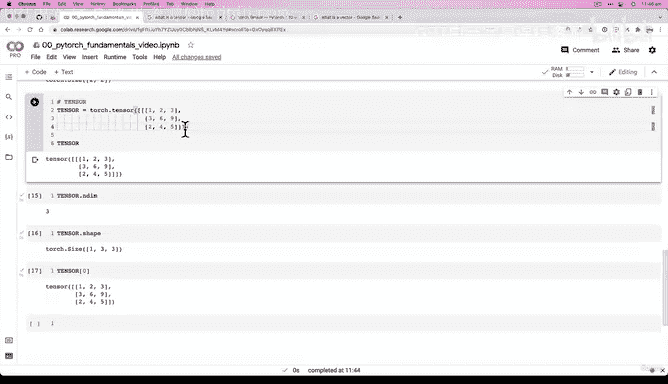

# 17：PyTorch 张量入门 🧮



在本节课中，我们将要学习PyTorch的核心数据结构——张量。我们将从最基础的标量开始，逐步了解向量、矩阵以及更高维度的张量，并学习如何创建它们以及查看其属性。





---

## 环境准备与课程学习建议

我们已经完成了环境设置，可以访问PyTorch。这里运行着一个Google Colab实例。

我们拥有一个GPU，因为我们之前通过“运行时”->“更改运行时类型”->“硬件加速器”进行了设置。你并不一定在整个笔记本中都需要GPU，但我想向你展示如何获取GPU访问权限，因为我们后续会用到它。

关于如何学习本课程，我建议采用分屏模式。例如，你可以在屏幕左侧播放我正在讲解和编写代码的视频，在屏幕右侧打开你自己的Colab笔记本窗口。你可以新建一个笔记本，随意命名，然后跟随视频编写相同的代码。如果你遇到问题，可以参考提供的参考笔记本，也可以在此提问。

---

## 张量简介

首先，我们来了解PyTorch中的张量。张量是深度学习和数据科学中的基本构建模块。

你可能已经看过“什么是张量？”的视频。在本课程中，张量是一种表示数据的方式，特别是多维的数值数据。这些数值数据可以代表其他事物。

---

## 创建张量

以下是创建不同类型张量的方法。

### 标量

标量是张量中最简单的形式。在PyTorch中，我们使用 `torch.tensor()` 来创建张量。

```python
scalar = torch.tensor(7)
```

执行 `scalar` 会返回 `tensor(7)`，并显示其数据类型为张量。

要了解 `torch.tensor` 的详细信息，可以查阅其官方文档。这是PyTorch中最常用的类之一，几乎所有PyTorch功能都基于 `torch` 模块。





现在，让我们看看标量的一些属性。标量没有维度，它只是一个单一的数字。

```python
scalar.ndim  # 返回 0
```

如果我们想从张量类型中提取出这个数字，可以使用 `.item()` 方法。

```python
scalar.item()  # 返回 7，一个普通的Python整数
```

### 向量

接下来是向量。向量通常具有大小和方向，但在我们的上下文中，向量是包含多个数字的一维张量。

```python
vector = torch.tensor([7, 7])
```

向量与标量的区别在于，向量通常包含多个数字。让我们检查它的维度。

```python
vector.ndim  # 返回 1
```

这可能会让人困惑，因为向量包含两个数字，但维度却是1。理解维度的一个方法是数方括号的对数。这里有一对方括号 `[]`，所以维度是1。

我们也可以查看向量的形状。

```python
vector.shape  # 返回 torch.Size([2])
```

`shape` 属性返回 `torch.Size([2])`，表示这个向量有2个元素。维度指的是方括号的对数，而形状指的是每个维度上的元素数量。

### 矩阵

现在，让我们升级到矩阵。矩阵是一个二维张量。

```python
matrix = torch.tensor([[7, 8],
                       [9, 10]])
```

矩阵有两个维度的方括号对。让我们检查它的属性。

```python
matrix.ndim   # 返回 2
matrix.shape  # 返回 torch.Size([2, 2])
```

`ndim` 为2，因为有两对方括号。`shape` 为 `[2, 2]`，表示这是一个2行2列的矩阵，总共有4个元素。

我们可以通过索引来访问矩阵中的元素。

```python
matrix[0]  # 返回第一行: tensor([7, 8])
matrix[1]  # 返回第二行: tensor([9, 10])
```

### 张量

最后，我们来看一个更通用的“张量”（这里指三维或更高维的张量）。我们将创建一个三维张量。

```python
tensor = torch.tensor([[[1, 2, 3],
                        [3, 6, 9],
                        [2, 5, 4]]])
```

这个张量有三对方括号。让我们检查它的维度和形状。

```python
tensor.ndim   # 返回 3
tensor.shape  # 返回 torch.Size([1, 3, 3])
```

`ndim` 为3，对应三对方括号。`shape` 为 `[1, 3, 3]`，可以这样理解：
*   最外层的 `1` 对应第一维（dim 0），表示有1个“块”。
*   中间的 `3` 对应第二维（dim 1），表示这个块有3行。
*   最内层的 `3` 对应第三维（dim 2），表示每行有3列。

为了更直观地理解，我们可以通过索引来查看：

```python
tensor[0]  # 返回第一个（也是唯一一个）三维“切片”，形状为 (3, 3)
```

在实际应用中，你很少需要手动创建包含数百万数字的张量，PyTorch会在幕后处理这些。然而，理解这些基本构建块对于构建深度学习模型至关重要。

---



## 练习建议

为了巩固理解，我建议你进行以下练习：尝试创建你自己的张量，使用任意数量的方括号和数字组合。然后，像我们上面做的那样，与张量进行交互：检查它的 `.ndim`、`.shape` 属性，并尝试使用索引来访问不同维度的元素。



---

## 总结



本节课中，我们一起学习了PyTorch张量的基础知识。我们从最简单的标量开始，逐步深入到向量、矩阵和更高维度的张量。我们学习了如何使用 `torch.tensor()` 创建它们，以及如何使用 `.ndim` 和 `.shape` 属性来理解它们的结构。记住，张量是PyTorch中表示数据的核心方式，掌握它们是进行深度学习的第一步。在下一课中，我们将继续探索张量的更多操作。