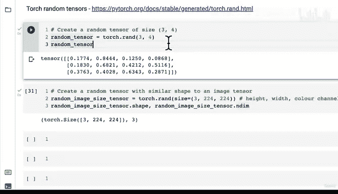

# 18：创建随机张量 🔢


在本节课中，我们将学习如何在 PyTorch 中创建随机张量。随机张量是神经网络学习过程中的基础，因为它们通常作为模型的初始参数。

## 回顾与引入

上一节我们介绍了深度学习数据表示的基本构建块——张量（`torch.Tensor`）。我们探讨了标量、向量、矩阵和张量的概念，并了解了它们在维度上的区别。

本节中，我们来看看如何创建随机张量，并理解它们在神经网络中的重要性。

## 为什么需要随机张量？

随机张量在 PyTorch 中非常重要，因为许多神经网络的学习方式是从充满随机数的张量开始，然后根据数据调整这些随机数，以更好地表示数据。

以下是神经网络学习的核心循环，可以用伪代码表示：

```python
# 神经网络学习核心循环
随机数 = 初始化随机张量()
for 数据 in 数据集:
    预测 = 模型(随机数, 数据)
    误差 = 计算误差(预测, 真实值)
    随机数 = 更新参数(随机数, 误差)
```

这个过程——从随机数开始，观察数据，更新随机数——是神经网络的核心。

## 创建随机张量

在 PyTorch 中，我们可以使用 `torch.rand()` 函数轻松创建随机张量。这个函数允许我们指定张量的大小或形状。

以下是创建随机张量的基本语法：

```python
随机张量 = torch.rand(大小)
```

其中“大小”是一个定义张量形状的元组。

## 随机张量示例

让我们通过几个例子来理解如何创建不同形状的随机张量。

### 示例 1：基本随机张量

首先，我们创建一个 3x4 的二维随机张量：

```python
随机张量 = torch.rand(3, 4)
```

这个张量有 3 行和 4 列，总共 12 个元素，每个元素都是 0 到 1 之间的随机数。

### 示例 2：不同维度的张量

我们可以创建任意维度的随机张量。例如，创建一个三维张量：

```python
三维张量 = torch.rand(1, 10, 10)
```

这个张量有 1 个“深度”维度，每个深度有 10x10 的矩阵。总元素数为 **1 × 10 × 10 = 100**。

### 示例 3：更大规模的张量

创建更大规模的随机张量同样简单：

```python
大规模张量 = torch.rand(10, 10, 10)
```

这个张量有 **10 × 10 × 10 = 1000** 个元素。PyTorch 能够高效处理包含数十万甚至数百万元素的张量。

## 创建图像形状的随机张量

在深度学习中，我们经常需要处理图像数据。图像通常表示为具有特定形状的张量。

以下是图像张量的常见表示方式：

```python
# 图像张量形状：颜色通道 × 高度 × 宽度
图像张量形状 = (颜色通道数, 高度, 宽度)
```

对于彩色图像，颜色通道通常是红、绿、蓝（RGB），所以颜色通道数为 3。

让我们创建一个模拟图像张量的随机张量：

```python
随机图像张量 = torch.rand(3, 224, 224)  # 3个颜色通道，224像素高度，224像素宽度
```

这个张量模拟了一个 224x224 像素的彩色图像。在实际应用中，图像数据会被转换为这种张量格式进行处理。

需要注意的是，有时颜色通道的位置可能不同（例如高度×宽度×颜色通道），但我们可以通过代码轻松调整这些维度。

## 关键要点

以下是本节课的核心要点：

1.  **随机张量的重要性**：神经网络通常从随机初始化的参数开始学习。
2.  **创建方法**：使用 `torch.rand(大小)` 可以创建指定形状的随机张量。
3.  **灵活性**：可以创建任意形状和维度的随机张量。
4.  **图像表示**：图像通常被表示为形状为（颜色通道，高度，宽度）的张量。

## 练习挑战

现在轮到你了！尝试创建你自己的随机张量：

1.  创建一个形状为 (5, 10, 10) 的随机张量
2.  检查它的维度和总元素数
3.  尝试创建其他形状的随机张量，观察它们的变化

## 总结



本节课中我们一起学习了如何在 PyTorch 中创建随机张量。我们了解了随机张量在神经网络初始化中的重要性，掌握了使用 `torch.rand()` 创建不同形状张量的方法，并探讨了图像数据在张量中的表示方式。

记住，几乎任何类型的数据都可以表示为张量，而随机张量是许多深度学习模型的起点。在下一节课中，我们将继续探索 PyTorch 张量的其他特性和操作。