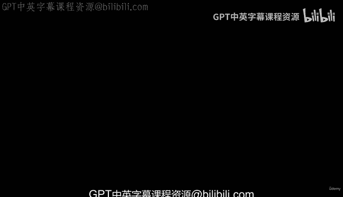
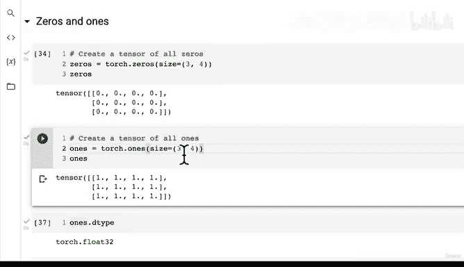

# 19：创建全零与全一张量 🧮



在本节课中，我们将学习如何在PyTorch中创建元素全为0或全为1的张量。这些张量在深度学习中常用于初始化、创建掩码或执行特定的数学运算。

上一节我们介绍了如何创建随机张量，本节中我们来看看如何创建具有特定值的张量。

## 创建全零张量

全零张量是指所有元素值都为0的张量。在深度学习中，它常被用作掩码，以屏蔽掉张量中的某些部分。

以下是创建全零张量的方法：

```python
zeros = torch.zeros(size=(3, 3))
```

**代码解释**：`torch.zeros()` 函数接受一个 `size` 参数，用于指定张量的形状。上述代码创建了一个形状为 3x3 的全零张量。

全零张量的一个关键应用是作为掩码。例如，当你将一个张量与全零张量相乘时，结果张量的所有元素都会变为0。这在需要忽略模型中某些特定数据时非常有用。

## 创建全一张量

全一张量是指所有元素值都为1的张量。其创建方式与全零张量类似。

以下是创建全一张量的方法：

```python
ones = torch.ones(size=(3, 4))
```

**代码解释**：`torch.ones()` 函数同样接受 `size` 参数。上述代码创建了一个形状为 3x4 的全一张量。

在创建这些张量时，还有一个重要的参数是 `dtype`，它代表数据类型。默认情况下，PyTorch创建的张量数据类型是 `torch.float32`，即32位浮点数。除非你显式指定其他类型，否则所有通过PyTorch方法创建的张量默认都是此类型。

## 实践练习

为了巩固理解，建议你尝试以下练习：

*   创建一个任意形状的全零张量。
*   创建一个任意形状的全一张量。

通过动手实践，你可以更直观地感受这些张量的特性和用途。



本节课中我们一起学习了如何使用 `torch.zeros()` 和 `torch.ones()` 函数来创建全零和全一张量，并了解了它们在深度学习中的基本应用，例如作为掩码。虽然随机张量更为常见，但全零和全一张量也是你会在实际项目中遇到的重要工具。下一节，我们将学习如何创建具有特定数值范围的张量。