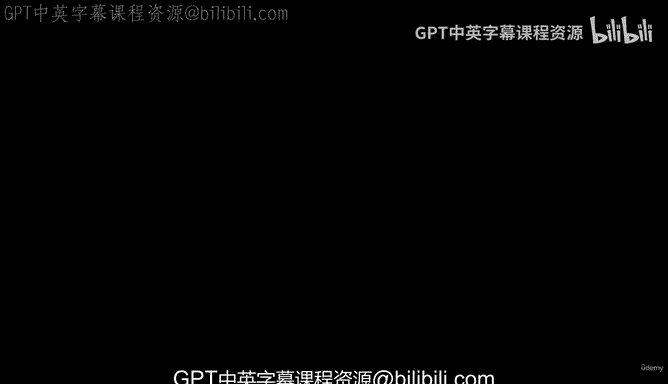
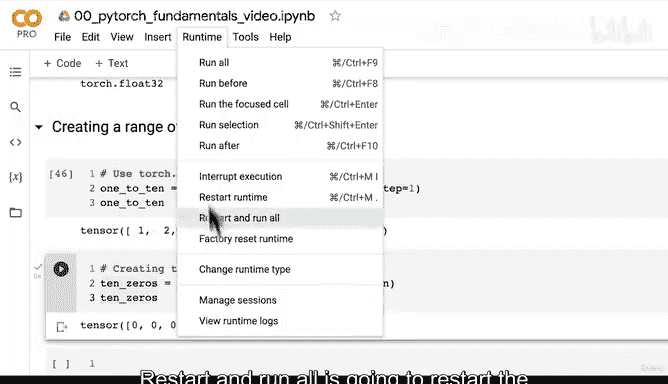
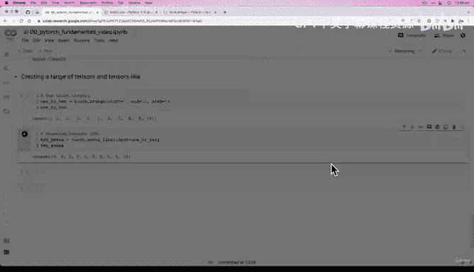
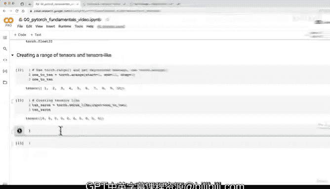

# 20：创建范围张量与相似张量 📊



在本节课中，我们将学习如何使用PyTorch创建具有特定数值范围的张量，以及如何创建与现有张量形状相同的新张量。这是构建和初始化神经网络层时非常实用的技能。

上一节我们介绍了如何创建全零和全一张量。本节中，我们来看看如何创建数值序列张量以及复制张量的形状。

## 创建范围张量

`torch.range()` 函数在过去用于创建数值序列张量，但在新版本的PyTorch中已被弃用。现在，我们应该使用 `torch.arange()` 函数。

以下是 `torch.arange()` 的基本用法：

```python
# 创建一个从0到9的张量（默认起始值为0）
torch.arange(10)
# 输出：tensor([0, 1, 2, 3, 4, 5, 6, 7, 8, 9])

# 创建一个从1到10的张量
torch.arange(start=1, end=11)
# 输出：tensor([1, 2, 3, 4, 5, 6, 7, 8, 9, 10])

# 创建一个从0到1000，步长为77的张量
torch.arange(start=0, end=1000, step=77)
# 输出：tensor([0, 77, 154, 231, 308, 385, 462, 539, 616, 693, 770, 847, 924])
```

**公式**：`torch.arange(start, end, step)` 生成一个从 `start` 开始，到 `end-1` 结束，以 `step` 为步长的一维张量。

## 创建相似张量

有时，我们希望创建一个与现有张量形状相同但内容不同的新张量（例如全零）。PyTorch提供了 `torch.zeros_like()` 和 `torch.ones_like()` 等方法来实现。

以下是创建相似张量的步骤：

1.  首先，创建一个示例张量。
2.  然后，使用 `_like` 方法创建形状相同的新张量。

```python
# 1. 创建一个示例张量
example_tensor = torch.arange(1, 11)  # 形状为 [10]
print(example_tensor.shape)  # 输出：torch.Size([10])

# 2. 创建一个形状与 example_tensor 相同的全零张量
zeros_like_tensor = torch.zeros_like(input=example_tensor)
print(zeros_like_tensor)
# 输出：tensor([0, 0, 0, 0, 0, 0, 0, 0, 0, 0])
```

**核心概念**：`torch.zeros_like(input)` 返回一个与 `input` 张量形状和数据类型完全相同，但所有元素都为零的新张量。

## 实践练习





为了巩固理解，请尝试完成以下练习：

*   使用 `torch.arange()` 创建一个从50到100（包含100）、步长为5的张量。
*   使用 `torch.ones_like()` 创建一个与你刚创建的范围张量形状相同的全一张量。

如果在练习中遇到代码长时间运行或无响应的情况，可以尝试在Google Colab中点击 **Runtime -> Restart runtime** 来重启计算内核，这通常能解决临时性问题。

## 总结

本节课中我们一起学习了两个创建张量的重要方法：
1.  **`torch.arange()`**：用于创建具有特定数值范围的序列张量。
2.  **`torch.zeros_like()` / `torch.ones_like()`**：用于创建与给定张量形状相同的全零或全一张量。



记住，`torch.range()` 已是弃用函数，在新代码中应使用 `torch.arange()`。掌握这些张量创建方法，将为后续定义模型参数和数据处理打下坚实基础。