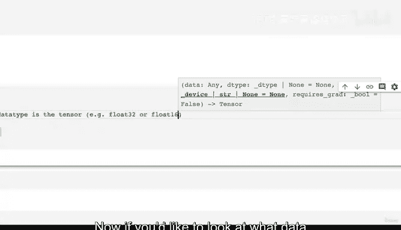
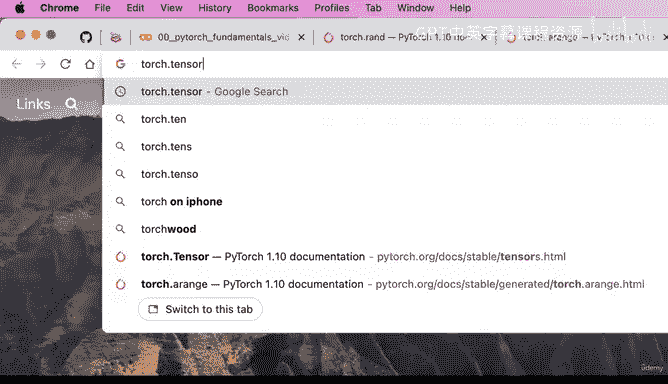
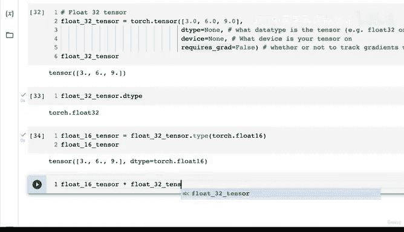

# 21：张量数据类型详解 🔢


在本节课中，我们将要学习PyTorch中一个非常核心的概念：张量的数据类型。理解数据类型对于避免常见的深度学习编程错误至关重要。

---

## 概述：张量数据类型的重要性

欢迎回来。现在，让我们深入探讨一个非常重要的主题：张量的数据类型。

我们之前已经简要地提到过这一点。现在，让我们创建一个张量来开始。

```python
float_32_tensor = torch.tensor([3, 6, 9], dtype=None)
```

我们创建了一个名为`float_32_tensor`的张量，并传入数字`[3, 6, 9]`。我们将`dtype`参数设置为`None`，看看会发生什么。结果是`float32`张量。即使我们指定为`None`，默认的数据类型也是`float32`。这是因为PyTorch的默认数据类型是`float32`。

如果我们想将其更改为其他类型呢？我们可以这样写：

```python
float_16_tensor = torch.tensor([3, 6, 9], dtype=torch.float16)
```



现在，我们得到了一个`float16`张量。创建张量时还有另一个非常重要的参数，那就是`device`。我们稍后会看到它是什么。最后还有一个同样重要的参数是`requires_grad`，我们可以将其设置为`False`或`True`。目前我们将其设为`False`。



因此，创建张量时最重要的三个参数是：
*   **`dtype`**：张量的数据类型，例如`float32`或`float16`。
*   **`device`**：张量所在的设备（CPU或GPU）。
*   **`requires_grad`**：是否跟踪张量操作的梯度。

再次强调，你并不总是需要在创建张量时输入这些参数，因为PyTorch会在幕后为你完成很多张量创建工作。

---

## 可用的数据类型

如果你想了解PyTorch张量有哪些可用的数据类型，我们可以查看`torch.tensor`的文档。在文档顶部，除非文档有变化，否则首先出现的就是“数据类型”。数据类型在创建张量时是如此重要，以至于它是文档中首先出现的内容。

我们有以下类型：32位浮点数、64位浮点数、16位浮点数、32位复数等。你最常与之交互的很可能是32位浮点数和16位浮点数。

那么，这些数字到底意味着什么呢？它们与计算中的精度有关。

---

## 理解计算精度

在计算机科学中，数值量的精度是衡量该量被表达细节程度的一个指标。这通常以比特（bits）来衡量，有时也以十进制数字来衡量。它与数学中的精度相关，后者描述了用于表达一个值的数字位数。

对我们来说，精度是数值量的一个度量，衡量了该量被表达的细节程度。

我不会深入探讨计算机科学的背景以及计算机如何表示数字。你从这里获得的重要启示是：单精度浮点数通常称为`float32`，这意味着一个数字在计算机内存中包含32个比特。同样，`float16`则使用16个比特。

这意味着：
*   `float32`是**单精度**。
*   `float16`是**半精度**。

默认是`float32`，这意味着它将在计算机内存中占用一定的空间。你可能会想，为什么我要使用默认值以外的类型呢？原因在于，如果你愿意牺牲一些数字表示的细节（即用16比特而非32比特来表示），那么占用内存更少的数字可以计算得更快。这就是32位和16位之间的主要区别。如果你需要更高的精度，则可以使用64位。

请记住这一点：单精度是32位，半精度是16位。这些数字代表了一个数字在内存中存储的细节量。

---

## 深度学习中三个常见错误

关于张量数据类型的内容很多。我在这里花了很多时间，因为我想强调一个要点。

**注意：张量数据类型是你在使用PyTorch和深度学习时会遇到的三大错误之一。**

这三大错误是：
1.  **张量的数据类型不正确**。
2.  **张量的形状不正确**（我们之前已经看到过一些形状的例子）。
3.  **张量不在正确的设备上**。

在本例中，如果我们有一个`float16`张量，并尝试与一个`float32`张量进行计算，就可能会遇到一些错误。这就是张量数据类型不正确的情况。因此，了解这里的`dtype`参数非常重要。

而张量形状不正确的问题，在我们讲到矩阵乘法时会看到。如果一个张量是某种形状，另一个张量是另一种形状，并且这些形状不匹配，我们就会遇到形状错误。

这完美地过渡到了`device`参数。`device`默认为`None`，即CPU。这就是我们使用Google Colab的原因，因为它使我们能够访问GPU。正如我之前所说，GPU使我们能够进行更快的计算。我们可以将其更改为`cuda`。我们稍后会看到如何编写设备无关的代码。但是，如果你尝试在两个不在同一设备上的张量之间进行操作（例如，一个张量在GPU上用于快速计算，另一个在CPU上），PyTorch会报错。

最后，`requires_grad`参数表示你是否希望PyTorch在张量进行某些数值计算时跟踪其梯度。我们还没有介绍梯度是什么。

这些内容可能有点密集，但既然我们在讨论数据类型，我认为有必要将这些重要参数一并提出。确实，如果只讨论数据类型而不讨论形状或设备问题，那将是不完整的。

---

## 如何转换张量数据类型

现在，我们有一个`float32`张量。我们如何改变这个张量的数据类型呢？让我们创建一个`float16`张量。

我们看到可以显式地写入`float16`，或者我们可以这样做：

```python
float_16_tensor = float_32_tensor.type(torch.float16)
# 或者使用 .half()
float_16_tensor = float_32_tensor.half()
```

这两种方式是相同的。让我们检查一下`float_16_tensor`。很好，我们已经将`float32`张量转换成了`float16`。这是解决你遇到的“张量数据类型不正确”问题的方法之一。

关于计算精度，如果你想了解更多，我在这里提供一个链接。这全是关于计算机如何存储数字的。

---

## 实践与总结

本节课中，我们一起学习了PyTorch张量的数据类型、计算精度的概念，以及深度学习中常见的三大错误（数据类型、形状和设备）。我们还学习了如何使用`.type()`或`.half()`方法来转换张量的数据类型。

现在，请尝试创建一些张量，查阅`torch.tensor`的文档，了解更多关于`dtype`、`device`和`requires_grad`的信息。创建一些不同数据类型的张量，随意尝试，看看是否能遇到一些错误。例如，尝试将`float16`张量与`float32`张量相乘，看看会发生什么。



我们下个视频再见。