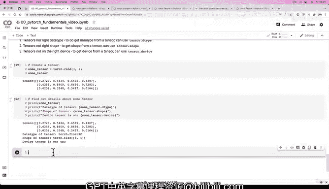

# 22：获取张量属性 📊


在本节课中，我们将学习如何从 PyTorch 张量中获取关键信息，包括其形状、数据类型和所在设备。掌握这些属性对于诊断和解决深度学习模型开发中的常见错误至关重要。

## 回顾与引入

上一节我们介绍了张量的数据类型，以及创建张量时的一些常见参数。我们留了一个挑战：创建不同数据类型的张量，并观察一个 `float16` 张量与一个 `float32` 张量相乘会发生什么。结果是，操作成功了。

然而，这引出了 PyTorch 和深度学习中的一个常见注意事项：有时即使张量数据类型不同，某些操作也不会报错。但在训练大型神经网络时，你可能会在其他操作中遇到数据类型问题。关键在于要意识到，当张量数据类型不匹配时，某些操作确实会引发错误。

让我们尝试另一个类型，例如 `int32`。

```python
int_32_tensor = torch.tensor([3, 6, 9], dtype=torch.int32)
```

然后尝试将其与一个浮点数张量相乘，看看会发生什么。

```python
float_32_tensor * int_32_tensor
```

操作同样成功了。即使尝试 `int64` 或 `long` 类型，许多操作也能正常进行。这表明 PyTorch 在某些情况下比我们想象的更健壮。但请记住，在训练模型时，我们仍可能因张量数据类型不正确而遇到错误。如果 PyTorch 抛出数据类型错误，我们现在至少知道如何更改或设置数据类型。

## 获取张量信息

基于我们将要面对的神经网络和深度学习中的三大常见错误，我们需要从张量中获取三类核心信息。

以下是需要检查的三个关键方面：
*   **形状**：张量的维度结构。
*   **数据类型**：张量中元素的类型（如 `float32`, `int64`）。
*   **设备**：张量所在的硬件（CPU 或 GPU）。

让我们具体看看如何获取这些信息。

要获取张量的数据类型，可以使用 `.dtype` 属性。

```python
tensor.dtype
```

要获取张量的形状，可以使用 `.shape` 属性。

```python
tensor.shape
```

要获取张量所在的设备，可以使用 `.device` 属性。

```python
tensor.device
```

## 实践操作

现在，让我们创建一个张量并实践获取这些属性。

```python
import torch

# 创建一个随机张量
some_tensor = torch.rand(3, 4)
print(some_tensor)
```

接下来，我们获取并打印该张量的详细信息。

```python
# 获取并打印张量的数据类型、形状和设备
print(f"Datatype of tensor: {some_tensor.dtype}")
print(f"Shape of tensor: {some_tensor.shape}")
print(f"Device tensor is on: {some_tensor.device}")
```

运行上述代码，你会看到类似以下输出：
*   数据类型是 `torch.float32`，因为这是我们未指定时的默认类型。
*   形状是 `(3, 4)`，这与我们创建时传入的参数一致。
*   设备是 `cpu`，这也是默认设备，除非我们显式指定将其放在 GPU 上。

> **注意**：`.shape` 是一个属性，而 `.size()` 是一个方法，两者通常返回相同的结果。你可以根据习惯使用，但需注意语法上的区别（`tensor.shape` 对比 `tensor.size()`）。

## 总结与挑战

本节课我们一起学习了如何获取 PyTorch 张量的三个核心属性：**形状**、**数据类型**和**设备**。这些是诊断“张量形状错误”、“张量数据类型错误”和“张量设备错误”的基础。

现在，请尝试以下挑战来巩固所学：
1.  创建一个随机张量，但将其数据类型设置为 `float16` 而非默认的 `float32`。
2.  （额外挑战）研究如何将 PyTorch 张量移动到 GPU 设备上（我们将在后续课程详细讨论）。



尝试完成这些练习，我们下节课再见！