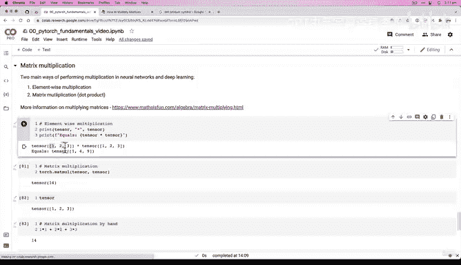

# 24：矩阵乘法（第一部分）📚

在本节课中，我们将要学习深度学习中两种主要的乘法运算：逐元素乘法和矩阵乘法。我们将重点探讨矩阵乘法的核心概念、它与逐元素乘法的区别，并通过PyTorch代码进行实践。


---

## 矩阵乘法 🧮

上一节我们介绍了一些基础的张量运算，如加法、减法和逐元素乘法。本节中，我们来看看深度学习中另一种至关重要的运算：矩阵乘法。

在深度学习中，主要有两种执行乘法的方式：
1.  逐元素乘法
2.  矩阵乘法

矩阵乘法（也称为点积）可能是你在神经网络内部最常遇到的张量运算。

---

## 逐元素乘法与矩阵乘法的区别 🔍

为了理解矩阵乘法，我们首先需要明确它与逐元素乘法的区别。

逐元素乘法意味着将两个张量中对应位置的元素相乘。例如，对于一个矩阵 `[2, 0, 1, -9]` 乘以标量 `2`，结果是 `[8, 0, 2, -18]`。

而矩阵乘法（点积）则涉及更复杂的计算规则。例如，计算矩阵 `[[1, 2, 3], [4, 5, 6]]` 与 `[[7, 8], [9, 10], [11, 12]]` 的乘积时，结果矩阵的第一个元素 `58` 是这样得到的：
`1*7 + 2*9 + 3*11 = 58`

以下是两种乘法在PyTorch中的实现：

```python
import torch

# 创建一个张量
tensor = torch.tensor([1, 2, 3])

# 1. 逐元素乘法
elementwise_result = tensor * tensor
print(f"逐元素乘法结果: {elementwise_result}")
# 输出: tensor([1, 4, 9])

# 2. 矩阵乘法（点积）
# PyTorch使用 torch.matmul() 进行矩阵乘法
matrix_result = torch.matmul(tensor, tensor)
print(f"矩阵乘法结果: {matrix_result}")
# 输出: tensor(14)
```

为什么矩阵乘法的结果是 `14` 而不是 `[1, 4, 9]` 呢？让我们手动计算一下：
`1*1 + 2*2 + 3*3 = 14`
可以看到，矩阵乘法在相乘之后还进行了求和操作，这是它与逐元素乘法的核心区别。

---

## 性能对比：手动循环 vs PyTorch优化函数 ⚡

我们可以尝试用`for`循环手动实现矩阵乘法，并与PyTorch内置的优化函数进行性能对比。

```python
import time

# 手动实现矩阵乘法（点积）
value = 0
start_time = time.time()
for i in range(len(tensor)):
    value += tensor[i] * tensor[i]
manual_time = time.time() - start_time
print(f"手动循环结果: {value}, 耗时: {manual_time:.6f} 秒")

# 使用PyTorch的torch.matmul()
start_time = time.time()
torch_result = torch.matmul(tensor, tensor)
torch_time = time.time() - start_time
print(f"PyTorch matmul结果: {torch_result}, 耗时: {torch_time:.6f} 秒")
```

即使对于只有三个元素的张量，PyTorch的向量化实现（`torch.matmul`）通常也比手写循环快得多。向量化是一种编程范式，它利用底层优化来一次性处理整个数组，而不是逐个元素循环，这在处理大型张量（如百万级元素）时能带来巨大的速度提升。

---

## 总结 📝

本节课中我们一起学习了：
*   **逐元素乘法**与**矩阵乘法（点积）** 的核心区别在于，矩阵乘法在元素相乘后还会进行求和。
*   矩阵乘法是神经网络中的基础且关键的操作。
*   在PyTorch中，应优先使用 `torch.matmul()` 等优化函数，而不是手动编写循环，以获得最佳性能。
*   向量化计算能显著提升运算效率，尤其是在处理大规模数据时。



在下一节中，我们将探讨适用于更大规模矩阵乘法的规则。