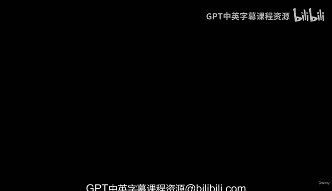
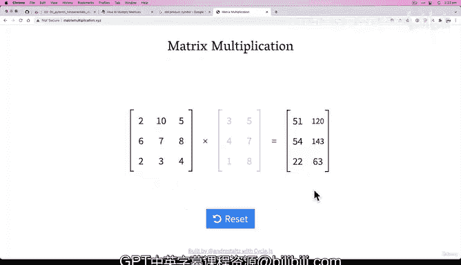

# 25：矩阵乘法（第二部分）：两大核心规则 🔢



在本节课中，我们将要学习矩阵乘法的两大核心规则。上一节我们介绍了矩阵乘法的基本概念和PyTorch的实现方式，本节中我们来看看执行矩阵乘法时必须满足的两个关键条件，否则会导致深度学习中最常见的错误之一。

## 概述

矩阵乘法是神经网络中最常见的运算之一。虽然我们尚未深入探讨其应用，但理解其规则至关重要。PyTorch提供了高效的矩阵乘法实现，通常比自己手动编写的代码更快、更简洁。然而，如果不遵守特定规则，就会遇到形状错误。

## 核心规则

执行矩阵乘法时，必须满足以下两大核心规则，否则程序将报错。

### 规则一：内部维度必须匹配

第一个规则是，进行乘法运算的两个矩阵，其内部维度必须相同。

以下是内部维度的具体含义：

*   假设我们有两个张量，形状分别为 `(3, 2)` 和 `(3, 2)`。这里的内部维度指的是第一个张量的第二维（2）和第二个张量的第一维（3）。由于 `2` 不等于 `3`，它们不匹配，因此无法相乘。
*   如果两个张量的形状是 `(2, 3)` 和 `(3, 2)`，那么内部维度（第一个张量的第二维 `3` 和第二个张量的第一维 `3`）是匹配的，因此可以相乘。

在PyTorch中，如果内部维度不匹配，你会遇到类似下面的错误：
```python
RuntimeError: mat1 and mat2 shapes cannot be multiplied (axb and cxd)
```
这表示矩阵1和矩阵2的形状无法相乘，因为它违反了规则一。

### 规则二：结果矩阵的形状由外部维度决定

第二个规则是，矩阵乘法结果矩阵的形状，由两个原始矩阵的外部维度决定。

让我们通过例子来理解：

*   以形状为 `(2, 3)` 和 `(3, 2)` 的两个矩阵为例。内部维度 `3` 匹配。结果矩阵的形状将是第一个矩阵的第一维（`2`）和第二个矩阵的第二维（`2`），即 `(2, 2)`。
*   如果我们将顺序调换，用形状为 `(3, 2)` 的矩阵乘以形状为 `(2, 3)` 的矩阵。内部维度 `2` 匹配。结果矩阵的形状将是第一个矩阵的第一维（`3`）和第二个矩阵的第二维（`3`），即 `(3, 3)`。

这个规则是普适的。只要内部维度匹配，你可以使用任意数字，结果矩阵的形状总是由外部维度决定。

## 实践与挑战

为了加深理解，我推荐你访问一个非常实用的网站：**matrixmultiplication.xyz**。

在进入下一节之前，你的挑战是：

*   访问该网站。
*   随意输入一些数字作为矩阵的维度（例如2，10，5，6等）。
*   观察当你点击“乘”时会发生什么。
*   特别注意内部维度匹配与不匹配时的情况，以及结果矩阵的形状如何由外部维度决定。

在下一个视频中，我们将用PyTorch代码复现类似的操作，并更具体地探讨形状错误。

## 总结

本节课中我们一起学习了矩阵乘法的两大核心规则：
1.  **内部维度必须匹配**：这是矩阵乘法能够进行的前提。
2.  **结果形状由外部维度决定**：这决定了输出张量的形状。



理解并牢记这两条规则，是避免深度学习中最常见的形状错误的关键。下一节，我们将应用这些规则解决更具体的问题。