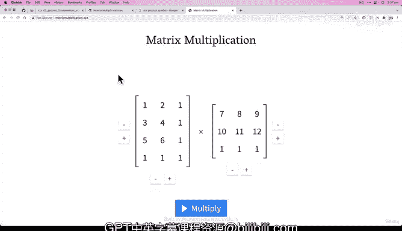

# 26：矩阵乘法（第三部分）与张量形状错误处理 🔧


在本节课中，我们将深入学习矩阵乘法，并探讨如何处理深度学习中最常见的错误之一：张量形状错误。我们将通过实际代码演示，理解矩阵乘法的核心规则，并学习如何使用转置操作来调整张量形状以满足这些规则。

## 概述 📋

上一节我们介绍了矩阵乘法的两条核心规则，并看到了当这些规则（特别是内维必须匹配）不满足时会发生错误。本节中，我们将通过创建具体的张量，实际触发这些形状错误，并学习如何使用转置操作来解决它们。

## 创建用于矩阵乘法的张量

首先，我们创建两个张量，用于后续的矩阵乘法操作。

```python
import torch

# 创建张量A，形状为(3, 2)
tensor_A = torch.tensor([[1, 2],
                         [3, 4],
                         [5, 6]])

# 创建张量B，形状为(3, 2)
tensor_B = torch.tensor([[7, 8],
                         [9, 10],
                         [11, 12]])
```

## 尝试矩阵乘法并触发错误

现在，我们尝试对这两个张量进行矩阵乘法。

```python
# 尝试矩阵乘法
# torch.mm 是 torch.matmul 的别名，用于更简洁的代码
try:
    output = torch.mm(tensor_A, tensor_B)
except Exception as e:
    print(f"错误信息: {e}")
```

运行上述代码会触发错误：`mat1 and mat2 shapes cannot be multiplied (3x2 and 3x2)`。这是因为张量A的形状是(3, 2)，张量B的形状也是(3, 2)，它们的内维（2和3）不匹配，违反了矩阵乘法的第一条核心规则。

## 检查张量形状

让我们检查两个张量的形状，以确认问题所在。

```python
print(f"张量A的形状: {tensor_A.shape}")
print(f"张量B的形状: {tensor_B.shape}")
```

输出将显示两个张量的形状都是`torch.Size([3, 2])`。

## 使用转置操作调整形状

为了解决形状不匹配的问题，我们可以使用转置操作来调整其中一个张量的形状。转置操作会交换张量的维度。

```python
# 对张量B进行转置
tensor_B_transposed = tensor_B.T
print(f"转置后的张量B:\n{tensor_B_transposed}")
print(f"转置后张量B的形状: {tensor_B_transposed.shape}")
```

转置操作将张量B的形状从(3, 2)变为(2, 3)。现在，张量A的形状是(3, 2)，转置后的张量B形状是(2, 3)，它们的内维（2和2）匹配了。

## 成功进行矩阵乘法

现在，我们可以成功地对张量A和转置后的张量B进行矩阵乘法。

```python
# 进行矩阵乘法
output = torch.matmul(tensor_A, tensor_B_transposed)
print(f"矩阵乘法结果:\n{output}")
print(f"输出张量的形状: {output.shape}")
```

输出张量的形状将是(3, 3)，这符合矩阵乘法的第二条规则：输出矩阵的形状由外维决定。

## 完整代码示例与规则回顾

以下是完整的代码示例，结合了形状检查和规则验证。

```python
import torch

# 1. 创建张量
tensor_A = torch.tensor([[1, 2],
                         [3, 4],
                         [5, 6]])
tensor_B = torch.tensor([[7, 8],
                         [9, 10],
                         [11, 12]])

# 2. 打印原始形状
print("原始形状:")
print(f"tensor_A.shape: {tensor_A.shape}")
print(f"tensor_B.shape: {tensor_B.shape}")

# 3. 转置张量B并打印新形状
tensor_B_transposed = tensor_B.T
print(f"\n转置后张量B的形状: {tensor_B_transposed.shape}")

# 4. 验证规则：内维必须匹配
# tensor_A.shape = (3, 2)
# tensor_B_transposed.shape = (2, 3)
# 内维: 2 和 2 -> 匹配 ✓
print("\n规则验证: 内维匹配检查")
print(f"tensor_A 的第二个维度: {tensor_A.shape[1]}")
print(f"tensor_B_transposed 的第一个维度: {tensor_B_transposed.shape[0]}")
print("内维匹配" if tensor_A.shape[1] == tensor_B_transposed.shape[0] else "内维不匹配")

# 5. 执行矩阵乘法
output = torch.matmul(tensor_A, tensor_B_transposed)
print(f"\n矩阵乘法输出:\n{output}")
print(f"输出形状: {output.shape}")

# 6. 验证规则：输出形状由外维决定
# 外维: 3 和 3 -> 输出形状应为 (3, 3)
print("\n规则验证: 输出形状检查")
print(f"预期输出形状: ({tensor_A.shape[0]}, {tensor_B_transposed.shape[1]})")
print(f"实际输出形状: {output.shape}")
print("输出形状符合预期" if output.shape == (tensor_A.shape[0], tensor_B_transposed.shape[1]) else "输出形状不符合预期")
```

## 可视化理解

为了更直观地理解矩阵乘法，我们可以使用在线工具（如 [matrixmultiplication.xyz](http://matrixmultiplication.xyz)）来可视化这个过程。

以下是手动计算第一个输出元素的过程，对应于在线工具的可视化步骤：

1.  输出张量位置 `[0,0]` 的元素计算：
    *   取张量A的第一行 `[1, 2]`
    *   取转置后张量B的第一列 `[7, 10]`
    *   计算点积：`1*7 + 2*10 = 7 + 20 = 27`

这个结果与我们代码输出中的第一个元素 `27` 一致。

## 练习与挑战

为了巩固理解，请尝试以下练习：

以下是你可以进行的操作练习：

1.  尝试转置张量A而不是张量B，然后进行矩阵乘法。
2.  创建不同形状的张量，故意制造形状错误，观察错误信息。
3.  使用 `torch.mm` 和 `torch.matmul`，确认它们的功能相同。
4.  在在线矩阵乘法可视化工具中重现本节的例子。

## 总结 🎯



本节课中我们一起学习了如何处理矩阵乘法中的张量形状错误。我们回顾了矩阵乘法的核心规则，特别是**内维必须匹配**这一关键条件。通过使用转置操作，我们能够调整张量形状以满足矩阵乘法的要求。记住，在深度学习中，矩阵乘法是最常见的操作之一，因此熟练掌握形状处理和错误调试至关重要。在下一节课中，我们将继续探索PyTorch中更多的张量操作。