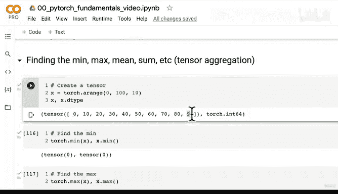

# 27：张量聚合：极值、均值与求和 📊


在本节课中，我们将学习张量聚合操作。这些操作包括寻找张量中的最小值、最大值、平均值和总和。张量聚合是数据分析和神经网络中的基础步骤，它能将大量数据浓缩为少数几个关键数值。

上一节我们介绍了矩阵乘法，本节中我们来看看如何对张量进行聚合操作。

## 张量聚合简介

张量聚合是指从通常包含大量数值的张量中，提取出少量汇总数值的过程。例如，从一个包含9个元素的张量中找出最小值，就是将9个元素聚合为1个元素。

## 创建示例张量

首先，我们创建一个张量用于演示。

```python
import torch
x = torch.arange(start=0, end=100, step=10)
```

## 寻找最小值与最大值

以下是寻找张量最小值和最大值的方法。

```python
# 使用 torch 函数
min_value_torch = torch.min(x)
max_value_torch = torch.max(x)

# 使用张量方法
min_value_method = x.min()
max_value_method = x.max()
```

两种方式功能相同，你可以根据个人编码风格选择使用。

## 计算平均值

接下来，我们尝试计算张量的平均值。

```python
# 尝试计算平均值
try:
    mean_value = torch.mean(x)
except Exception as e:
    print(f"错误信息: {e}")
```

执行上述代码会遇到一个常见错误：`Mean input data type should be either floating point or complex dtypes. Got Long instead.`

这是因为 `torch.mean()` 函数要求输入张量的数据类型为浮点数（如 `float32`）或复数类型，而我们创建的 `x` 是 `torch.int64`（Long）类型。

**注意**：`torch.mean()` 函数需要一个 `float32` 类型的张量。

为了解决这个问题，我们需要在计算前转换张量的数据类型。

```python
# 将张量转换为 float32 类型后再计算平均值
mean_value = torch.mean(x.type(torch.float32))
# 或者使用张量方法
mean_value_alt = x.type(torch.float32).mean()
```

## 计算总和

最后，我们来计算张量的总和。

```python
# 使用 torch 函数
sum_value_torch = torch.sum(x)
# 使用张量方法
sum_value_method = x.sum()
```

同样，两种方式都是有效的。

## 本节总结

本节课中我们一起学习了张量的基本聚合操作：
1.  使用 `torch.min()` 或 `.min()` 方法寻找**最小值**。
2.  使用 `torch.max()` 或 `.max()` 方法寻找**最大值**。
3.  使用 `torch.mean()` 或 `.mean()` 方法计算**平均值**，但需注意输入张量必须是浮点类型。
4.  使用 `torch.sum()` 或 `.sum()` 方法计算**总和**。

我们再次遇到了PyTorch中两个主要错误类型之一：**数据类型错误**（另一个是形状错误）。处理数据时，时刻留意张量的 `dtype` 属性至关重要。



在下一节视频中，我们将探讨如何寻找极值所在的**位置**（索引），即 `argmin` 和 `argmax` 操作。你可以提前尝试使用 `torch.argmin()` 和 `torch.argmax()` 方法来解决这个问题。