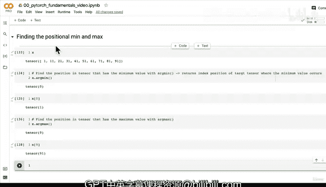

# 28：定位张量极值位置 📚


在本节课中，我们将学习如何在PyTorch张量中定位最小值和最大值的位置。我们将介绍`torch.argmin()`和`torch.argmax()`函数，并理解它们在深度学习中的实际应用。

## 回顾与引入

上一节我们学习了张量聚合操作，掌握了如何寻找张量的最小值、最大值、平均值和总和。同时，我们也遇到了PyTorch和深度学习中的一个常见问题：数据类型错误。我们通过将张量转换为正确的数据类型（例如，`torch.mean()`需要`torch.float32`类型）解决了这个问题。

本节中，我们将探讨如何不仅找到极值，还能找到这些极值在张量中的具体位置。

## 定位最小值的位置

以下是使用`torch.argmin()`函数定位最小值索引的步骤：

1.  **理解`argmin`的含义**：`argmin`代表“参数最小值”，它返回的是张量中**最小值所在位置的索引**，而不是最小值本身。
2.  **查看示例张量**：假设我们有一个张量`x`。
    ```python
    import torch
    x = torch.arange(1, 11)  # 创建张量 [1, 2, 3, ..., 10]
    ```
3.  **应用`argmin`函数**：对张量`x`调用`torch.argmin()`。
    ```python
    min_index = torch.argmin(x)
    print(min_index)  # 输出: tensor(0)
    ```
4.  **验证结果**：索引`0`对应张量`x`的第一个元素，其值为`1`，这确实是该张量的最小值。
    ```python
    print(x[min_index])  # 输出: tensor(1)
    ```

**核心概念**：`torch.argmin()`返回的是目标张量中最小值首次出现处的**索引位置**。

## 定位最大值的位置

定位最大值位置的逻辑与最小值类似，我们使用`torch.argmax()`函数。

以下是具体操作：

1.  **理解`argmax`的含义**：`argmax`代表“参数最大值”，它返回张量中**最大值所在位置的索引**。
2.  **对同一张量应用`argmax`**：继续使用上面的张量`x`。
    ```python
    max_index = torch.argmax(x)
    print(max_index)  # 输出: tensor(9)
    ```
3.  **验证结果**：索引`9`对应张量`x`的第十个元素（因为索引从0开始），其值为`10`，即该张量的最大值。
    ```python
    print(x[max_index])  # 输出: tensor(10)
    ```

**核心概念**：`torch.argmax()`返回的是目标张量中最大值首次出现处的**索引位置**。

## 为何需要定位极值位置？

你可能会问，既然`torch.min()`和`torch.max()`可以直接给出极值，为什么还需要`argmin`和`argmax`呢？

关键在于应用场景的不同：
*   当你只关心**最小值或最大值是多少**时，使用`min()`/`max()`。
*   当你关心的是极值**出现在哪个位置**时，使用`argmin()`/`argmax()`。

这在深度学习中尤为重要。例如，在后续学习分类模型和Softmax激活函数时，模型的输出通常是一个概率分布。`torch.argmax()`可以快速告诉我们哪个类别的预测概率最高，从而确定模型的预测结果。记住这个函数，它在未来会非常有用。

## 总结

本节课中我们一起学习了PyTorch中两个重要的函数：
1.  **`torch.argmin()`**：用于定位张量中最小值所在的索引位置。
2.  **`torch.argmax()`**：用于定位张量中最大值所在的索引位置。

我们理解了它们与`torch.min()`/`torch.max()`的区别，并初步了解了`argmax`在后续深度学习任务（如分类）中的关键作用。掌握如何定位数据的位置，是进行更复杂张量操作和模型理解的基础。



下节课我们将继续探索PyTorch的其他功能。