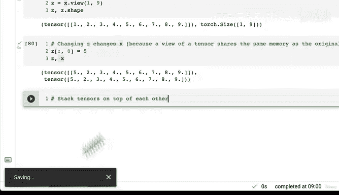
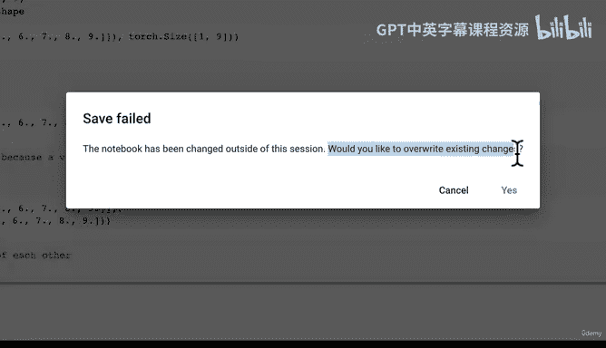
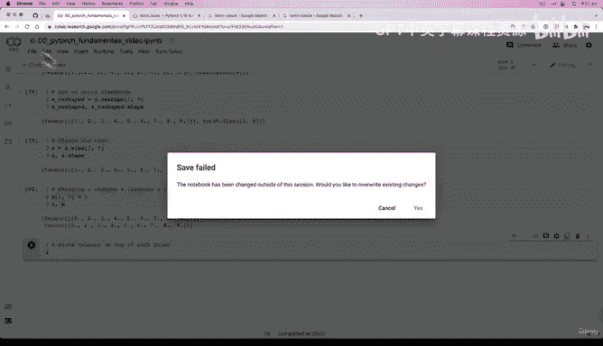
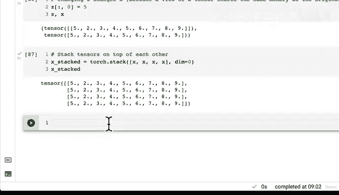
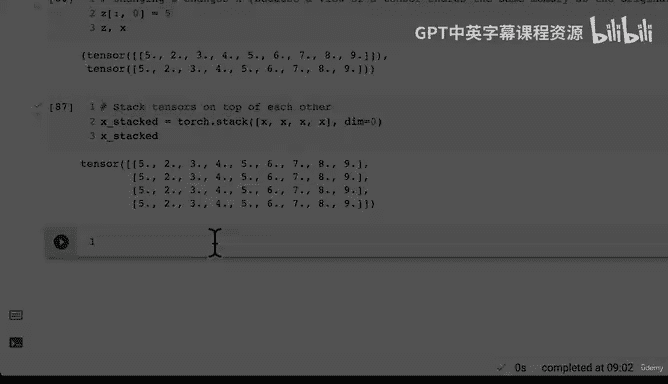

# 29：张量重塑、视图与堆叠 📚


在本节课中，我们将学习PyTorch中几种关键的张量操作：重塑（reshape）、视图（view）、堆叠（stack）、压缩（squeeze）和反压缩（unsqueeze）。这些操作对于调整张量的形状和维度至关重要，是解决机器学习中常见形状不匹配问题的核心工具。

---

## 恢复工作环境 🔄

上一节我们介绍了张量的基础操作。本节中我们来看看如何在实际编码中恢复工作状态。在使用Google Colab等在线环境时，如果断开连接一段时间，运行时状态可能会被重置。为了恢复之前的工作，我们可以执行“全部运行”操作，重新执行所有代码单元格。

```python
# 示例：重新运行所有单元格以恢复状态
# 在Colab中，选择“运行时” -> “全部运行”
```

---

## 张量重塑（Reshape）与视图（View） 🔧

重塑操作可以改变张量的形状，但新形状必须与原始张量的元素总数兼容。视图操作则返回一个与原始张量共享内存的新张量视图，形状可以不同。

以下是重塑操作的关键点：
*   **兼容性**：新形状的维度乘积必须等于原始张量的元素总数。例如，一个包含9个元素的张量可以重塑为`(1, 9)`或`(3, 3)`，但不能重塑为`(2, 5)`。
*   **代码示例**：
    ```python
    import torch
    x = torch.arange(1, 10)  # 创建张量，值为1到9
    print(f"原始张量 x: {x}")
    print(f"原始形状 x.shape: {x.shape}")

    # 重塑为 (1, 9)
    x_reshaped = x.reshape(1, 9)
    print(f"重塑后 x_reshaped: {x_reshaped}")
    print(f"重塑后形状: {x_reshaped.shape}")

    # 尝试不兼容的形状会引发错误
    # x.reshape(2, 5)  # 这将导致错误
    ```

视图操作与重塑类似，但存在一个关键区别：
*   **内存共享**：视图返回的张量与原始张量共享同一块内存。修改视图会直接影响原始张量。
*   **代码示例**：
    ```python
    z = x.view(1, 9)  # 创建x的一个视图
    print(f"视图 z: {z}")
    z[0, 0] = 5       # 修改视图的第一个元素
    print(f"修改后视图 z: {z}")
    print(f"原始张量 x 也随之改变: {x}")  # x的第一个元素也变成了5
    ```

---

## 张量堆叠（Stack） 📦

堆叠操作可以将多个张量沿着一个新的维度组合起来。`torch.stack`函数允许我们指定组合的维度。

以下是堆叠操作的核心概念：
*   **默认维度**：`torch.stack`默认在维度0（最外层）进行堆叠。
*   **维度参数**：通过`dim`参数可以改变堆叠的维度，从而改变输出张量的结构。
*   **代码示例**：
    ```python
    # 创建多个相同形状的张量
    x = torch.arange(1, 10)
    # 在维度0堆叠（垂直堆叠）
    stacked_0 = torch.stack([x, x, x, x], dim=0)
    print(f"dim=0 堆叠结果形状: {stacked_0.shape}")
    print(f"dim=0 堆叠结果:\n{stacked_0}")

    # 在维度1堆叠（水平堆叠）
    stacked_1 = torch.stack([x, x, x, x], dim=1)
    print(f"\ndim=1 堆叠结果形状: {stacked_1.shape}")
    print(f"dim=1 堆叠结果:\n{stacked_1}")
    ```

此外，PyTorch还提供了便捷函数：
*   `torch.vstack`：垂直堆叠（类似于`dim=0`）。
*   `torch.hstack`：水平堆叠（类似于`dim=1`）。

---

## 张量压缩（Squeeze）与反压缩（Unsqueeze） 🧽

压缩操作可以移除张量中所有大小为1的维度，而反压缩操作则可以在指定位置添加一个大小为1的维度。这些操作对于调整张量以符合特定函数或模型的输入要求非常有用。

以下是操作的简要说明：
*   **`torch.squeeze()`**：移除所有大小为1的维度。
    ```python
    # 假设有一个形状为 (1, 3, 1, 5) 的张量
    # 使用 squeeze() 后，形状变为 (3, 5)
    ```
*   **`torch.unsqueeze(dim)`**：在指定的`dim`位置添加一个维度。
    ```python
    # 假设有一个形状为 (3, 4) 的张量
    # 使用 unsqueeze(dim=0) 后，形状变为 (1, 3, 4)
    # 使用 unsqueeze(dim=1) 后，形状变为 (3, 1, 4)
    ```

建议您查阅官方文档并尝试使用这些函数，以加深理解。

---



## 张量置换（Permute） 🔀





置换操作可以返回一个张量视图，其维度顺序被重新排列。这相当于同时进行多次转置操作。

*   **功能**：按照指定的新顺序重新排列张量的维度。
*   **代码示例**：
    ```python
    # 假设有一个形状为 (2, 3, 4) 的张量
    original_tensor = torch.randn(2, 3, 4)
    # 将维度顺序从 (0, 1, 2) 改为 (2, 0, 1)
    permuted_tensor = original_tensor.permute(2, 0, 1)
    print(f"原始形状: {original_tensor.shape}")
    print(f"置换后形状: {permuted_tensor.shape}")  # 变为 (4, 2, 3)
    ```

---

## 总结 📝

本节课中我们一起学习了PyTorch中几种核心的张量形状操作：
1.  **重塑（`reshape`）与视图（`view`）**：用于改变张量形状，视图共享内存。
2.  **堆叠（`stack`）**：用于沿新维度组合多个张量。
3.  **压缩（`squeeze`）与反压缩（`unsqueeze`）**：用于移除或添加大小为1的维度。
4.  **置换（`permute`）**：用于重新排列张量的维度顺序。





掌握这些操作是构建和调试深度学习模型的基础，能有效解决张量形状不匹配的问题。建议您多加练习，并在实际项目中灵活运用。