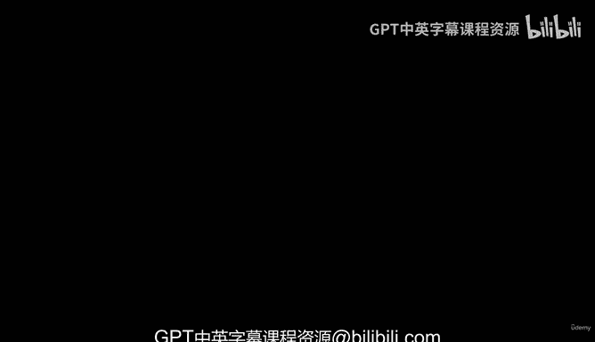
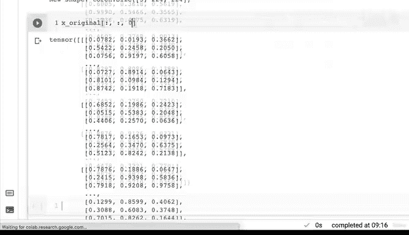

# 30：张量压缩、解压缩与置换 🧮



在本节课中，我们将学习PyTorch中三个重要的张量操作：`squeeze`、`unsqueeze`和`permute`。这些操作能帮助我们改变张量的维度，以适应不同的模型输入要求或数据处理流程。

## 张量压缩（Squeeze） 📦

上一节我们介绍了张量的基础操作，本节中我们来看看如何压缩张量。`torch.squeeze()`方法用于移除张量中所有大小为1的维度。

**公式**：`y = torch.squeeze(x)`

以下是具体操作步骤：

1.  创建一个包含单一维度的张量
2.  检查原始张量的形状
3.  应用`squeeze`方法
4.  观察压缩后的张量形状

```python
import torch

# 创建示例张量
x_reshaped = torch.tensor([[[1, 2, 3, 4, 5, 6, 7, 8, 9]]])
print("原始张量形状:", x_reshaped.shape)  # torch.Size([1, 1, 9])

# 压缩张量
x_squeezed = x_reshaped.squeeze()
print("压缩后形状:", x_squeezed.shape)    # torch.Size([9])
```

## 张量解压缩（Unsqueeze） 📈

现在我们已经学会了压缩张量，接下来看看如何反向操作。`torch.unsqueeze()`方法用于在指定维度添加一个大小为1的维度。

**公式**：`y = torch.unsqueeze(x, dim=d)`

以下是具体操作步骤：

1.  从压缩后的张量开始
2.  在指定维度添加新维度
3.  观察维度变化

```python
# 从压缩张量开始
print("压缩张量形状:", x_squeezed.shape)  # torch.Size([9])

# 在第0维度添加维度
x_unsqueezed_0 = x_squeezed.unsqueeze(dim=0)
print("在第0维度解压缩后形状:", x_unsqueezed_0.shape)  # torch.Size([1, 9])

# 在第1维度添加维度
x_unsqueezed_1 = x_squeezed.unsqueeze(dim=1)
print("在第1维度解压缩后形状:", x_unsqueezed_1.shape)  # torch.Size([9, 1])
```

## 张量维度置换（Permute） 🔄

理解了维度的压缩与解压缩后，我们来看看如何重新排列张量的维度顺序。`torch.permute()`方法用于按照指定顺序重新排列张量的维度。

**公式**：`y = x.permute(dim_order)`

以下是具体操作步骤：

1.  创建一个模拟图像数据的张量
2.  使用`permute`重新排列维度顺序
3.  验证维度置换是否正确

```python
# 创建模拟图像张量 (高度, 宽度, 颜色通道)
x_original = torch.rand(size=(224, 224, 3))  # 高度=224, 宽度=224, 颜色通道=3
print("原始形状 (高度, 宽度, 颜色通道):", x_original.shape)

# 将颜色通道维度移到最前面
x_permuted = x_original.permute(2, 0, 1)  # 新顺序: 颜色通道, 高度, 宽度
print("置换后形状 (颜色通道, 高度, 宽度):", x_permuted.shape)
```

**重要提示**：`permute`创建的是原始张量的视图（view），这意味着它们共享相同的内存。修改其中一个张量的值会影响另一个。

```python
# 验证内存共享
x_original[0, 0, 0] = 999
print("修改后原始张量值:", x_original[0, 0, 0])
print("置换张量对应值:", x_permuted[0, 0, 0])  # 应该也是999
```

## 总结 📝

本节课中我们一起学习了PyTorch中三个关键的张量维度操作：



1.  **`squeeze`**：移除所有大小为1的维度，简化张量结构
2.  **`unsqueeze`**：在指定位置添加大小为1的维度，扩展张量结构
3.  **`permute`**：重新排列维度顺序，常用于调整数据格式以适应模型输入

这些操作在深度学习数据处理中非常实用，特别是在准备图像、文本或其他多维数据时。通过实践这些方法，你将能更灵活地操控张量维度，为构建和训练神经网络模型打下坚实基础。