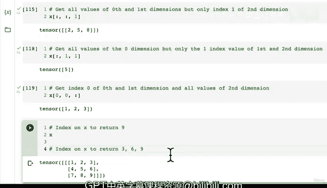

# 31：张量数据索引 🔢


在本节课中，我们将要学习如何在PyTorch张量中使用索引技术来选择和提取数据。索引是处理多维数据时的核心操作，掌握它对于后续的深度学习模型构建至关重要。

上一节我们介绍了张量的挤压、解压和维度重排操作，这些操作帮助我们解决张量形状和维度不匹配的问题。本节中我们来看看如何使用索引从张量中精确地选取我们需要的数值。

## 创建示例张量

首先，我们创建一个简单的三维张量作为练习对象。

```python
import torch

# 创建一个形状为 (1, 3, 3) 的三维张量
x = torch.arange(1, 10).reshape(1, 3, 3)
print(x)
print(x.shape)
```

代码执行后，我们会得到一个包含数字1到9的张量，其形状为 `torch.Size([1, 3, 3])`。这表示它有一个外层（维度0），包含一个中间层（维度1），而每个中间层又包含三个内层元素（维度2）。

## 基础索引操作

PyTorch的索引语法与NumPy非常相似。索引从0开始，通过方括号 `[]` 指定每个维度的位置。

以下是索引的基本规则：
*   `x[0]`：选取维度0的第一个（也是唯一一个）元素，返回一个形状为 `(3, 3)` 的张量。
*   `x[0, 0]`：先选取维度0的第一个元素，再从其结果中选取维度1的第一个元素，返回一个形状为 `(3,)` 的一维张量，即 `[1, 2, 3]`。
*   `x[0, 0, 0]`：依次在三个维度上选取第一个元素，返回标量值 `1`。

我们可以通过改变索引值来获取不同的元素。例如，`x[0, 1, 1]` 会返回数字 `5`。

## 使用冒号进行切片

除了指定具体索引，我们还可以使用冒号 `:` 来选取某个维度的所有元素。

以下是使用冒号索引的几种常见方式：

*   **获取所有外层数据，但只取内层的第一个元素**：`x[:, :, 0]`
    这行代码会返回一个形状为 `(1, 3)` 的张量，其值为 `[[1, 4, 7]]`。它选取了所有维度0和维度1的数据，但只取每个最内层列表的第一个元素。

*   **获取特定位置的外层和中间层数据，以及所有内层数据**：`x[0, 0, :]`
    这等价于 `x[0, 0]`，会返回 `[1, 2, 3]`。它明确指定了要获取维度2的所有元素。

*   **更复杂的组合**：`x[0, :, 1]`
    这行代码选取了维度0的第一个元素，维度1的所有元素，以及维度2的索引为1的元素。结果会返回 `[2, 5, 8]`。

## 实践挑战

为了巩固理解，请尝试对上面创建的张量 `x` 进行索引操作，完成以下两个挑战：

1.  **挑战一**：通过索引获取数字 `9`。
2.  **挑战二**：通过一次索引操作获取数字 `3`, `6`, `9`。

你可以尝试不同的索引组合，例如 `x[0, 2, 2]` 或 `x[0, :, 2]`，看看它们分别返回什么结果。

---



本节课中我们一起学习了PyTorch张量的数据索引。我们了解了如何使用数字进行精确索引，以及如何使用冒号 `:` 对某个维度进行全切片。这些操作是数据预处理和模型调试中提取特定信息的强大工具。请务必通过实践挑战来加深印象，我们下节课再见！