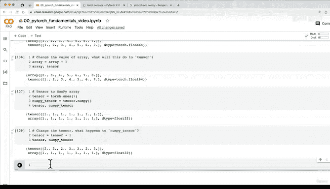

# 32：PyTorch张量与NumPy 🔄


在本节课中，我们将学习如何在PyTorch张量和NumPy数组之间进行转换。这是深度学习工作流中一个非常常见的操作，因为数据通常以NumPy数组的形式开始，而PyTorch模型则需要张量作为输入。

---

## 回顾与挑战

上一节我们介绍了张量的索引操作。我留下了一个挑战：如何从张量 `x` 中索引出数字 `9` 以及序列 `[3, 6, 9]`。

以下是我的解决方案。请注意，解决这类问题有多种方法。

因为 `x` 的形状是 `(1, 3, 3)`。要选择 `9`，我们需要：
*   `0`：选择第一个外层括号内的所有元素。
*   `2`：选择底部这个元素。
*   最后的 `2`：选择这个底部元素的第二个维度。

要选择 `[3, 6, 9]`，我们需要：
*   第一个维度的所有元素。
*   第零个维度的所有元素。
*   第一个维度的所有元素。
*   然后选择 `2`，即 `[3, 6, 9]` 这个集合。

我建议你通过练习来掌握索引：创建一个任意形状的张量，然后尝试编写不同的索引语句来选择你指定的数字。

---

## PyTorch张量与NumPy

现在，让我们进入本节课的核心内容：PyTorch张量与NumPy。

NumPy是一个极其流行的科学计算Python库。实际上，安装PyTorch时通常需要NumPy。由于这种紧密关系，PyTorch内置了与NumPy交互的功能。

在实际工作中，你的数据可能最初以NumPy数组（`ndarray`）的形式存在。但如果你想利用PyTorch的深度学习能力，就需要将其转换为PyTorch张量。

PyTorch为此提供了 `torch.from_numpy()` 方法，它接收一个NumPy数组并将其转换为PyTorch张量。

反之，如果你有一个PyTorch张量，并希望使用某些NumPy方法，你可以使用 `.numpy()` 方法将其转换回NumPy数组。

---

### NumPy数组转PyTorch张量

让我们通过代码来实践。首先，我们导入必要的库并创建一个NumPy数组。

```python
import torch
import numpy as np

# 创建一个NumPy数组
array = np.arange(1.0, 9.0)
print(f"NumPy数组: {array}")
print(f"数组数据类型: {array.dtype}")

# 将NumPy数组转换为PyTorch张量
tensor = torch.from_numpy(array)
print(f"PyTorch张量: {tensor}")
print(f"张量数据类型: {tensor.dtype}")
```

运行上述代码，你会发现张量的数据类型是 `torch.float64`。这是因为NumPy的默认数据类型是 `float64`，而 `torch.from_numpy()` 方法会保留原始数组的数据类型。

需要注意的是，PyTorch的默认张量数据类型是 `torch.float32`。如果你在后续计算中遇到数据类型不匹配的问题，可能需要在转换后手动调整数据类型。

```python
# 将张量数据类型转换为float32
tensor = tensor.type(torch.float32)
print(f"转换后的张量数据类型: {tensor.dtype}")
```

**重要提示**：通过 `torch.from_numpy()` 创建的张量是原始数组数据的一个新副本。修改原始NumPy数组不会影响已创建的张量。

```python
# 修改原始NumPy数组
array = array + 1
print(f"修改后的数组: {array}")
print(f"张量（未改变）: {tensor}")
```

---

### PyTorch张量转NumPy数组

接下来，我们看看如何将PyTorch张量转换回NumPy数组。

```python
# 创建一个PyTorch张量
tensor = torch.ones(7)
print(f"PyTorch张量: {tensor}")
print(f"张量数据类型: {tensor.dtype}")

# 将张量转换为NumPy数组
numpy_tensor = tensor.numpy()
print(f"NumPy数组: {numpy_tensor}")
print(f"数组数据类型: {numpy_tensor.dtype}")
```

转换后的NumPy数组会继承原始张量的数据类型。由于我们创建的张量默认是 `float32`，所以转换后的数组也是 `float32`。

同样，这种转换也会创建数据的副本。修改原始张量不会影响已转换的NumPy数组。

```python
# 修改原始张量
tensor = tensor + 1
print(f"修改后的张量: {tensor}")
print(f"NumPy数组（未改变）: {numpy_tensor}")
```

---

## 总结

在本节课中，我们一起学习了PyTorch张量与NumPy数组之间的相互转换：

1.  **从NumPy到PyTorch**：使用 `torch.from_numpy(array)`。转换后的张量会保留NumPy数组的数据类型（默认为`float64`），请注意这可能与PyTorch的默认`float32`不同。
2.  **从PyTorch到NumPy**：在张量上调用 `.numpy()` 方法。转换后的数组会继承张量的数据类型。
3.  **内存独立性**：这两种转换都会创建数据的**新副本**。修改原始对象（无论是数组还是张量）不会影响已转换的对象。

掌握这两种数据结构之间的转换对于构建深度学习流水线至关重要，因为它允许你灵活地利用NumPy进行数据预处理，再使用PyTorch进行模型训练。



在下一节课中，我们将探讨深度学习中的一个重要概念：**可复现性**。