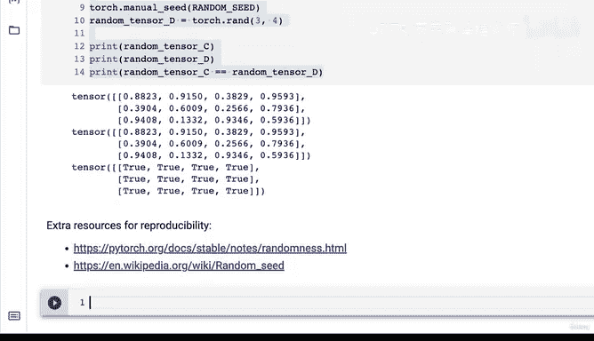

# 33：PyTorch可复现性（消除随机性）🎯


在本节课中，我们将要学习PyTorch中一个非常重要的概念——可复现性。我们将探讨如何控制神经网络中的随机性，确保实验的结果可以被他人精确地复现。

## 概述

神经网络的学习过程始于随机数。简而言之，其学习流程是：**从随机数开始 -> 执行张量运算 -> 更新随机数，使其更好地表示数据 -> 不断重复此过程**。然而，在进行可复现的实验时，我们有时希望减少这种随机性。

## 随机性的挑战

到目前为止，每当我们创建一个随机张量，例如使用 `torch.rand(3, 3)`，每次运行代码都会得到一组全新的随机数。这意味着，如果你将笔记本分享给朋友，他们运行代码时得到的结果很可能与你不同。

## 解决方案：随机种子

为了减少神经网络和PyTorch中的随机性，我们引入了**随机种子**的概念。其核心作用是“调味”随机性。由于计算机本质上是确定性的，它们会重复执行相同的步骤，因此我们使用的“随机”实际上是**伪随机**或**生成随机**。随机种子正是用来控制这种伪随机性的。

### 实践：无种子的随机张量

让我们先看看没有设置随机种子时的情况。以下是创建两个随机张量并比较的代码：

```python
import torch

# 创建两个随机张量
random_tensor_A = torch.rand(3, 4)
random_tensor_B = torch.rand(3, 4)

print(“随机张量 A:”, random_tensor_A)
print(“随机张量 B:”, random_tensor_B)
print(“A 和 B 是否相等:”, random_tensor_A.eq(random_tensor_B).any())
```

运行上述代码，你会得到两个充满随机值的张量。虽然理论上存在数值相等的可能性，但概率极低。这意味着每次运行，你和他人的结果都可能不同。

上一节我们看到了随机性带来的不确定性，本节中我们来看看如何使用随机种子来创造“可复现的随机”。


### 实践：使用随机种子

设置随机种子可以让我们获得可复现的“随机”结果。以下是具体步骤：

```python
import torch

# 设置随机种子为42（这是一个常用值，代表“宇宙的答案”）
torch.manual_seed(42)

# 创建随机张量C
random_tensor_C = torch.rand(3, 4)

# 重要：在调用下一个随机方法前，需要重新设置种子
torch.manual_seed(42)

# 创建随机张量D
random_tensor_D = torch.rand(3, 4)

print(“随机张量 C:”, random_tensor_C)
print(“随机张量 D:”, random_tensor_D)
print(“C 和 D 是否相等:”, random_tensor_C.eq(random_tensor_D).any())
```

现在，这两个张量虽然看起来仍然是随机的，但其数值是确定且可复现的。任何使用相同随机种子（42）运行这段代码的人，都将得到与你完全相同的“随机”张量C和D。

**关键点**：在笔记本环境中，`torch.manual_seed()` 通常只对其后紧接着的一个代码块有效。如果你需要连续创建多个随机张量，必须在每次调用随机方法前重新设置种子。另一种常见做法是在一个代码单元格的开头设置一次种子，然后执行该单元格内的所有代码。

## 核心概念与资源

为了深入理解可复现性，以下是你应该了解的核心概念和推荐资源：

*   **伪随机数生成器**：计算机通过确定性算法生成的、看似随机的数字序列。随机种子是这个算法的起始输入值。
*   **PyTorch可复现性文档**：这是关于此主题的权威指南。即使你现在不能完全理解其中的所有代码，也请务必知道这份资源的存在。
*   **随机种子（通用概念）**：随机种子并非PyTorch独有，它在NumPy等众多科学计算库中同样适用，是一个通用的计算机科学概念。

## 总结



本节课中我们一起学习了PyTorch的可复现性。我们了解到神经网络学习始于随机性，但通过设置 **`torch.manual_seed()`**，我们可以控制这种随机性，确保实验过程与结果能够被精确地复现，这对于分享研究、调试代码和确保实验一致性至关重要。记住，可复现性是机器学习和深度学习研究中一个非常重要的主题。