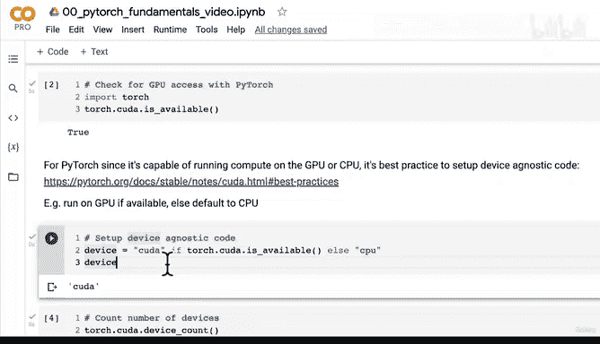

#  34：PyTorch GPU 访问方式详解 🚀


在本节课中，我们将学习如何在 PyTorch 中访问和使用 GPU 来加速计算。我们将介绍获取 GPU 的不同方式，如何检查 PyTorch 是否能访问 GPU，以及如何编写“设备无关”的代码，以确保你的代码能在有 GPU 时使用 GPU，没有时则自动回退到 CPU。

## 概述：为何使用 GPU？

GPU 能够显著加速数值计算。这得益于 NVIDIA 的 CUDA 编程接口、相应的硬件以及 PyTorch 在后台的协同工作。

上一节我们介绍了张量的基础操作，本节中我们来看看如何利用 GPU 来加速这些计算。

## 1. 获取 GPU 的几种方式

有多种方式可以获取用于深度学习的 GPU 计算资源。以下是三种主要途径：

*   **使用 Google Colab 获取免费 GPU**：这是最简单且免费的方式。Colab 提供免费的 GPU 运行时，Colab Pro 和 Pro+ 则提供更快的 GPU 和更长的运行时间。本课程完全可以在免费版本上完成。
*   **使用自己的 GPU**：这需要自行购买硬件并进行一些设置。你可以参考 Tim Dettmers 的博客文章来了解如何选择适合深度学习的 GPU。
*   **使用云计算服务**：例如 Google Cloud Platform (GCP)、Amazon Web Services (AWS) 或 Microsoft Azure。这些服务允许你在云端租用配备 GPU 的计算机。

对于初学者，建议从 Google Colab 开始。我的个人工作流是：在 Colab 中进行小规模实验和学习，如果需要运行大型实验，则使用自己的深度学习主机或云计算服务。

## 2. 在 Google Colab 中设置 GPU

在 Google Colab 中启用 GPU 非常简单。以下是具体步骤：

1.  在笔记本中，点击菜单栏的 **“运行时”**。
2.  选择 **“更改运行时类型”**。
3.  在 **“硬件加速器”** 下拉菜单中，选择 **“GPU”**。
4.  点击 **“保存”**。这会重启运行时并连接到一个配备 GPU 的 Google 计算实例。

保存后，你可以运行 `!nvidia-smi` 命令来查看分配的 GPU 信息（例如 Tesla P100 或 K80）。

## 3. 检查 PyTorch 的 GPU 访问权限

连接 GPU 后，需要确认 PyTorch 能否识别并使用它。Google Colab 的另一个优势是它已为我们配置好了 PyTorch 与 NVIDIA GPU 之间的连接。

我们可以使用以下代码进行检查：

```python
import torch
torch.cuda.is_available()
```

如果返回 `True`，则表明 PyTorch 可以访问 GPU。`cuda` 是 NVIDIA 的编程接口，它使得我们能够利用 GPU 进行数值计算。

## 4. 设置设备无关的代码

这是一个重要的 PyTorch 概念。由于你的代码可能在不同环境（有时有 GPU，有时没有）下运行，最佳实践是编写“设备无关”的代码。这意味着代码会自动在有 GPU 时使用 GPU，否则使用 CPU。

我们可以通过设置一个 `device` 变量来实现这一点：

```python
device = "cuda" if torch.cuda.is_available() else "cpu"
print(f"Using device: {device}")
```

这段代码的逻辑是：如果 `torch.cuda.is_available()` 为真（即 GPU 可用），则将设备设置为 `"cuda"`；否则，设置为 `"cpu"`。在后续的代码中，我们可以将张量和模型移动到 `device` 变量所指定的设备上。

你还可以通过 `torch.cuda.device_count()` 来查看可用的 GPU 数量。这对于需要在多个 GPU 上分配大型模型或数据集的场景非常有用。

PyTorch 官方文档的“最佳实践”部分也推荐设置设备参数来编写设备无关的代码。其核心思想是：让代码能够灵活地在 GPU 或 CPU 上运行。

## 总结

本节课中我们一起学习了 PyTorch 中 GPU 访问的核心知识。我们了解了获取 GPU 资源的三种主要途径，掌握了在 Google Colab 中启用 GPU 的方法，学会了使用 `torch.cuda.is_available()` 检查 GPU 访问权限，并理解了编写“设备无关”代码 (`device = "cuda" if torch.cuda.is_available() else "cpu"`) 的重要性及其实现方式。




在下一节课中，我们将具体学习如何将 PyTorch 张量和模型对象移动到指定的设备（GPU 或 CPU）上进行计算。