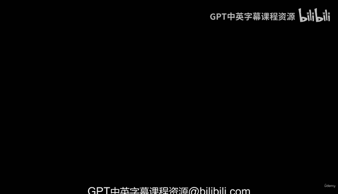
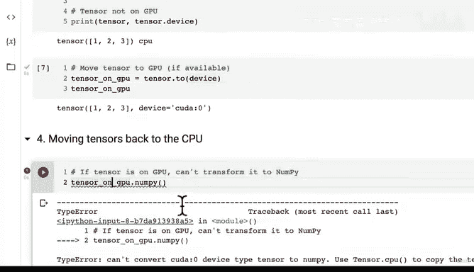

#  35：设备无关代码与 GPU 张量迁移 🚀



在本节课中，我们将学习如何编写设备无关的代码，以及如何将张量和模型在 CPU 与 GPU 之间进行迁移。掌握这些知识对于高效利用硬件资源、加速深度学习模型训练至关重要。

## 概述

上一节我们探讨了获取 GPU 资源的不同方式。现在，我们将具体学习如何利用 GPU 进行计算。核心在于将张量和模型放置到 GPU 上，因为 GPU 能显著加速数值计算，特别是我们即将频繁进行的张量运算。更快的计算意味着我们能更快地在数据中发现模式，进行更多实验，从而为手头的问题找到最佳模型。

## 将张量移至 GPU

首先，我们创建一个默认在 CPU 上的张量。

```python
import torch

# 创建一个在 CPU 上的张量
tensor = torch.tensor([1, 2, 3], device=‘cpu’)
print(tensor)
```

即使不指定 `device` 参数，张量默认也创建在 CPU 上。为了利用 GPU 加速，我们需要将其移至目标设备。

以下是移动张量到 GPU 的步骤：

1.  **检查 GPU 可用性**：我们之前已经设置了 `device` 变量，它根据环境自动指向 ‘cuda’（GPU）或 ‘cpu’。
2.  **使用 `.to()` 方法**：这是 PyTorch 中移动张量（和模型）的核心方法。

```python
# 将张量移动到目标设备（GPU 如果可用）
tensor_on_gpu = tensor.to(device)
print(tensor_on_gpu)
```

执行后，输出会显示张量现在位于 `cuda:0` 设备上。这里的 `0` 是 GPU 的索引号。当我们使用单个 GPU 时，索引始终为 0。这种设备无关代码的优点是，无论实际有没有 GPU，这段代码都不会报错，它会自动适配可用设备。

## 将张量移回 CPU

有时我们需要将张量移回 CPU，例如当需要使用 NumPy 库时，因为 NumPy 无法直接处理 GPU 上的张量。

如果我们尝试直接转换 GPU 上的张量为 NumPy 数组，会遇到错误。设备不匹配是 PyTorch 深度学习中常见的三大错误之一（另外两个是形状错误和数据类型错误）。

```python
# 错误示例：尝试直接转换 GPU 张量为 NumPy
# numpy_array = tensor_on_gpu.numpy() # 这会引发错误
```

要解决这个问题，我们必须先将张量复制回主机内存（CPU）。

以下是修复步骤：

1.  **使用 `.cpu()` 方法**：将 GPU 张量移回 CPU。
2.  **再进行转换**：然后即可安全地转换为 NumPy 数组。

```python
# 正确步骤：先移回 CPU，再转换为 NumPy
tensor_back_on_cpu = tensor_on_gpu.cpu()
numpy_array = tensor_back_on_cpu.numpy()
print(numpy_array)
```

需要注意的是，调用 `.cpu()` 方法会返回一个在 CPU 上的新张量副本，原始的 GPU 张量保持不变。

## 总结

本节课我们一起学习了 PyTorch 中设备无关编程的核心操作。我们了解了为何要将计算移至 GPU 以获得速度提升，掌握了使用 `.to(device)` 方法将张量和模型（后续课程会涉及）移至目标设备，并学会了在需要时使用 `.cpu()` 方法将张量安全移回 CPU 以进行后续处理（如使用 NumPy）。这些是使用 PyTorch 进行 GPU 加速计算的基础。虽然还有多 GPU 等高级主题，但掌握这些基础已足够我们开始构建和训练模型。



## 练习建议

为了巩固所学，建议你进行以下练习：
*   在 Google Colab 中获取 GPU 访问权限，验证其可用性。
*   编写设备无关的代码，创建一些示例张量，并尝试将它们设置到不同的设备上。
*   故意制造一些错误，例如尝试对 GPU 上的张量进行 NumPy 运算，观察错误信息，然后练习如何正确地将这些张量移回 CPU 并成功转换。

通过动手实践，你将能更牢固地掌握这些关键概念。