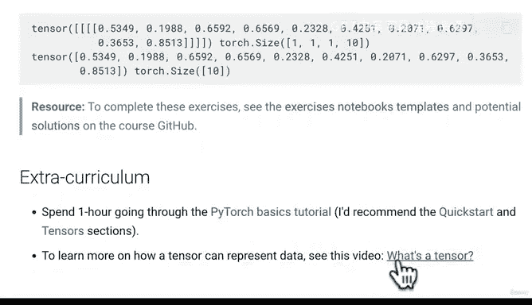

# 36：PyTorch基础练习与拓展 📚


在本节课中，我们将回顾PyTorch基础部分的学习内容，并介绍如何通过练习和拓展资料来巩固所学知识。课程结尾会提供练习模板和解决方案的获取方式。

---

## 回顾与鼓励

上一节我们介绍了PyTorch的基础知识，现在你应该为自己感到自豪。我们已经学习了许多PyTorch的核心概念，这些将成为后续课程的基础模块。

在进入下一部分之前，我鼓励你通过练习和拓展课程来实践所学内容。

## 练习内容介绍

以下是基于已学内容设置的一些练习：

1.  **阅读文档**：我们经常参考PyTorch官方文档，熟悉文档对学习至关重要。
2.  **创建随机张量**：创建一个形状为 `(7, 7)` 的随机张量。
3.  **矩阵乘法**：对上述张量与另一个随机张量执行矩阵乘法。

这些练习都基于我们已覆盖的知识点。我鼓励你参考相关笔记或视频中的代码来完成。

## 如何完成练习

你可以通过以下方式完成练习：

1.  在Colab或本地新建一个笔记本。
2.  导入PyTorch库：`import torch`。
3.  根据练习要求编写代码。

例如，创建随机张量的代码如下：

```python
import torch
random_tensor = torch.rand(7, 7)
```

部分练习较为简单，部分会随着课程深入而变得更复杂。

## 练习模板与解决方案

如果你需要练习模板，可以访问课程GitHub仓库。在“extras/exercises”文件夹中，我提供了每个模块的练习模板。

例如，“PyTorch基础练习”模板中已经列出了所有练习的标题。你可以将模板链接复制到Google Colab中打开并开始练习。

每个课程模块的结尾都包含练习和拓展资料。练习以代码为主，拓展资料通常为阅读材料。

如果你在练习中遇到困难，可以先尝试独立解决，再参考已编写的代码。如果需要查看示例解决方案，可以访问“extras/solutions”文件夹。

但请记住，我鼓励你先尝试自己完成练习，至少尝试后再查看解决方案。

## 拓展学习建议

为了进一步巩固知识，建议你：

1.  花一小时阅读PyTorch官方教程，特别是“快速入门”和“张量”部分。
2.  观看视频《什么是张量？》，深入了解张量如何表示数据。

完成PyTorch基础部分是一个巨大的成就。我们下一节再见！

---



本节课中我们一起学习了如何通过练习和拓展资料来巩固PyTorch基础知识，并掌握了获取练习模板和解决方案的方法。