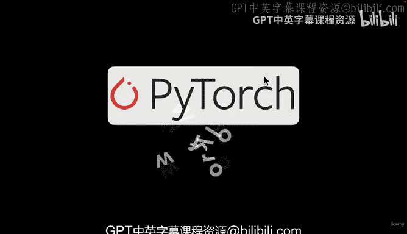
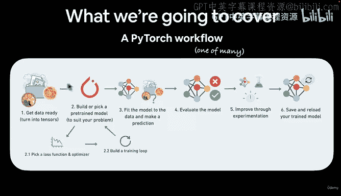
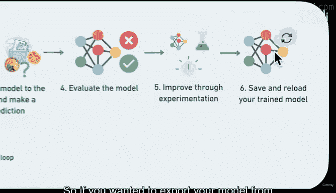
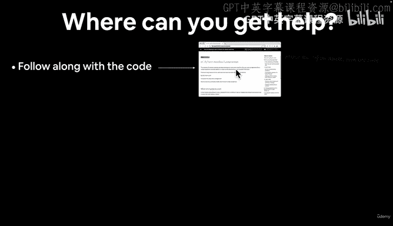
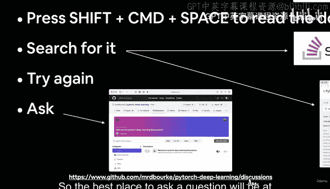
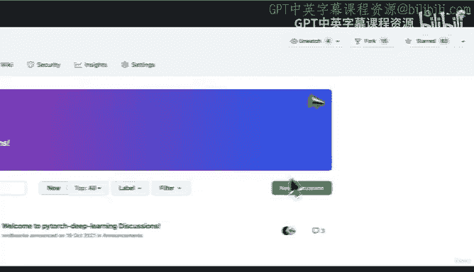
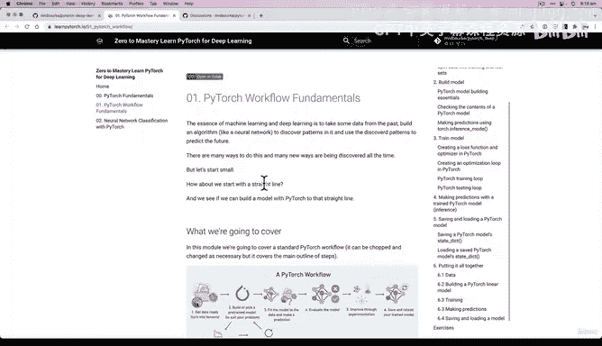

# 37：PyTorch工作流程与求助渠道 📚

在本节课中，我们将学习PyTorch深度学习的基本工作流程，并了解在学习过程中遇到问题时可以寻求帮助的渠道。

---

上一节我们介绍了PyTorch的基础知识，本节中我们来看看构建一个深度学习项目的典型步骤。

PyTorch工作流程是一个通用框架。当你深入深度学习领域时，会发现有多种方法可以实现目标，但以下是一个大致的核心流程：

以下是PyTorch工作流程的主要步骤：
1.  **准备数据**：获取并整理数据。
2.  **数据张量化**：将数据转换为张量（`tensor`），因为张量几乎可以表示任何类型的数据。
3.  **选择或构建模型**：选择一个预训练模型或从头开始构建自己的模型。
4.  **选择损失函数和优化器**：定义模型如何衡量错误（损失函数）以及如何更新自身以减少错误（优化器）。
5.  **构建训练循环**：编写代码来迭代训练数据，让模型学习。
6.  **模型拟合**：通过训练循环，使模型适应我们的数据以进行预测。
7.  **模型评估**：学习如何评估训练好的模型的性能。
8.  **实验与改进**：通过实验调整参数，尝试改进模型。
9.  **保存与加载模型**：保存训练好的模型，以便从笔记本中导出并在其他地方使用。

---

了解了工作流程后，学习过程中难免会遇到问题。以下是遇到困难时可以采取的求助步骤。

以下是获取帮助的有效途径：
1.  **动手实践**：最好的学习方式是跟随代码一起编写和运行。首要原则是：如有疑问，就运行代码。亲自尝试、犯错、再尝试，直到成功。
2.  **查阅文档字符串**：使用 `Shift + Command + Space`（Mac）或 `Ctrl`（Windows/Colab）查看函数文档，了解其用法。
3.  **搜索问题**：如果仍然卡住，尝试搜索问题。你可能会找到诸如 **Stack Overflow** 或 **PyTorch官方文档** 等资源，这些将是整个课程中最重要的参考依据。
4.  **再次尝试**：不要轻易放弃，多次尝试是学习的一部分。
5.  **提问**：如果以上方法都无法解决问题，可以在课程专属的 **GitHub讨论区**（`github.com/mrdbourke/pytorch-deep-learning/discussions`）提问。提问时，请注明视频编号和正在运行的代码，以便他人参考并提供帮助。

---

此外，本课程还提供了配套的书面材料作为参考。

不要忘记，本课程有对应的书籍版本（`learnpytorch.io`）。视频内容正是基于这些章节制作的。这些材料可以作为你自主学习的参考资料，但我们的课程重点将放在一起编写代码上。

---

说到编写代码，让我们开始实践吧。下一节我们将在Google Colab中相见，一起动手编码。

---

本节课中我们一起学习了PyTorch深度学习项目的基本工作流程，涵盖了从数据准备到模型保存的完整步骤。同时，我们也明确了在学习过程中遇到困难时，可以通过动手实践、查阅文档、搜索资源和社区提问等多种渠道来解决问题。现在，我们已经为接下来的实战编码做好了准备。